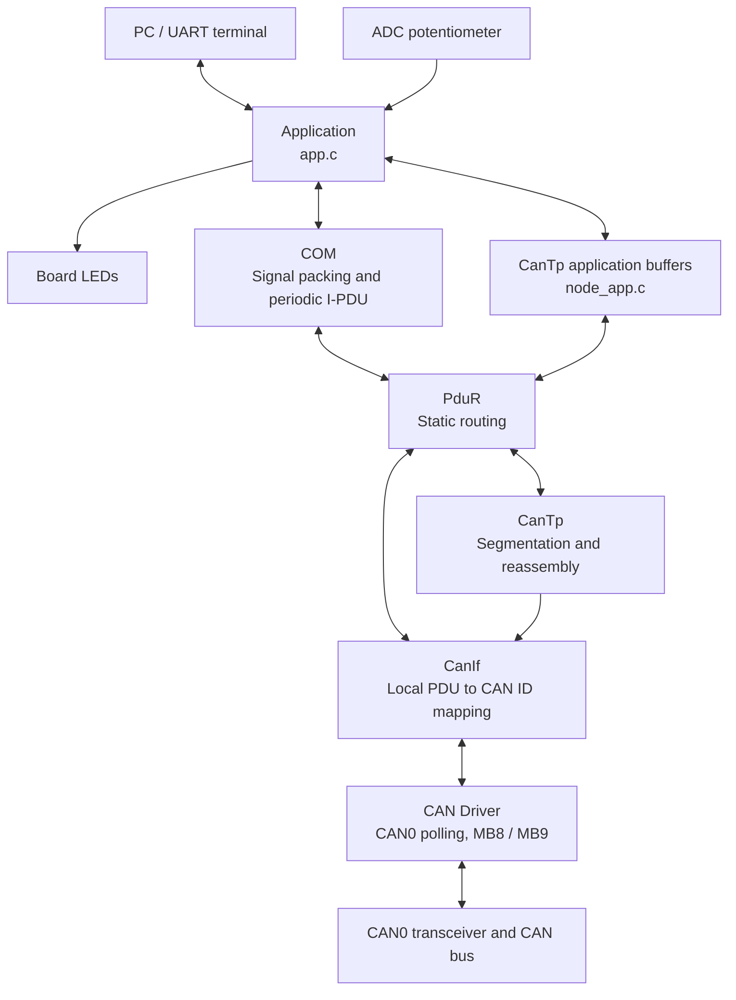
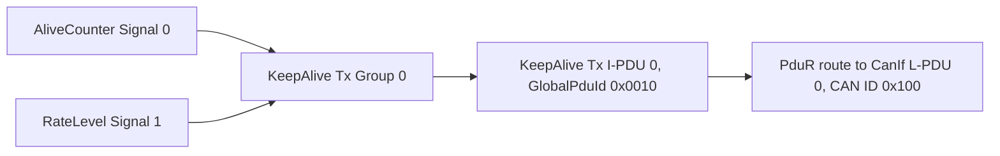
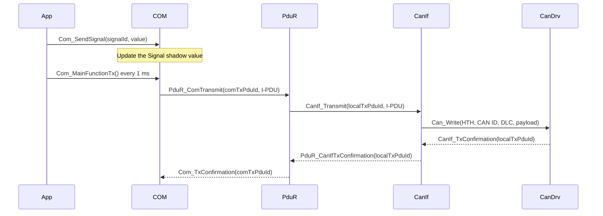
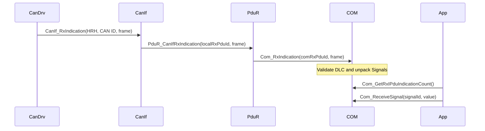
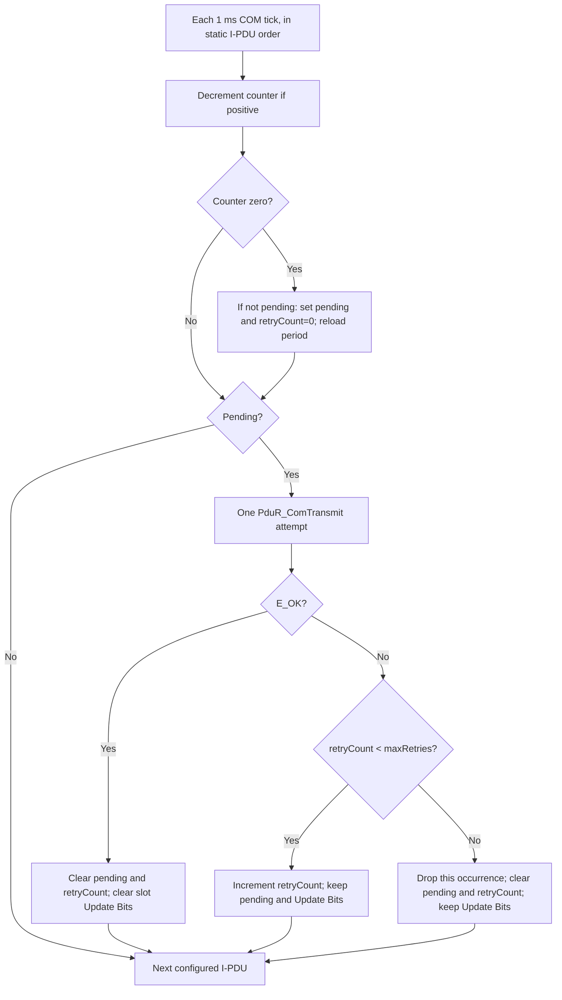
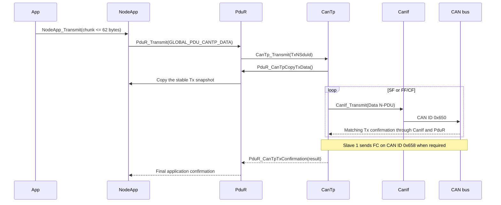
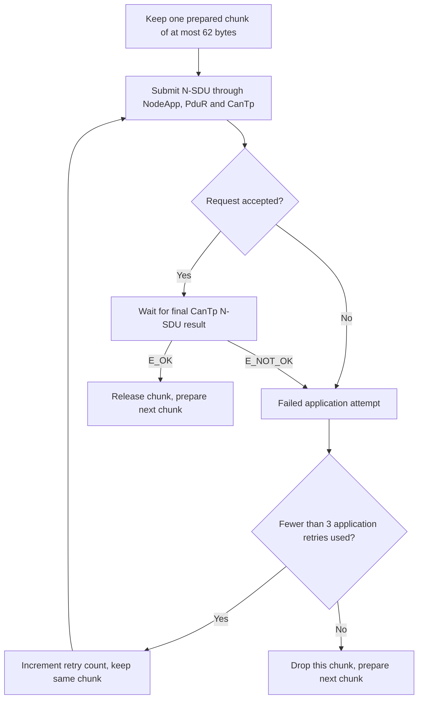

# CAN Communication Stack Architecture

## 1. Purpose and Scope

This project implements a polling-based CAN communication stack for the
S32K144. The same codebase supports three ECUs whose roles are selected at
build time:

- **Master**: samples the ADC, transmits KeepAlive messages, monitors both
  Slaves, and sends large UART input through CanTp.
- **Slave 1**: receives KeepAlive messages, reports its status, receives CanTp
  data, and forwards the reassembled data to UART.
- **Slave 2**: receives KeepAlive messages and reports its status. It does not
  participate in the CanTp data flow.

The stack provides two independent communication paths on the same CAN bus:

1. **COM Signal** transports periodic KeepAlive and Slave Status data in fixed
   eight-byte CAN frames.
2. **CanTp** transports N-SDUs up to 62 bytes using SF, FF, CF, FC, timers,
   retries, and flow control.

## 2. High-Level Architecture



COM and CanTp share CanIf and the CAN Driver. COM uses the static PduR route
tables. CanTp uses PduR at the application boundary, transmits N-PDUs through
CanIf, and receives them through the CanIf -> PduR -> CanTp callback path.

## 3. Layers and Responsibilities

| Layer | Main files | Responsibility |
| --- | --- | --- |
| Entry point | `src/main.c` | Calls `System_Init()` once and `System_RunTask()` continuously |
| System integration | `system/System.c`, `system/System.h` | Initializes the system, applies the system error policy, and runs the 1 ms scheduler |
| Application | `app/app.c`, `app/app.h` | Owns ECU roles, ADC, LEDs, UART, liveness, COM usage, and UART-to-CanTp chunking |
| CanTp application adapter | `app/node_app.c`, `app/node_app.h` | Preserves the Tx N-SDU, manages two Rx slots, and implements PduR-facing callbacks |
| COM | `drivers/can/com/` | Stores Signals, packs eight-byte I-PDUs, schedules periodic Tx, and decodes Rx I-PDUs |
| PduR | `drivers/can/pdur/` | Routes COM to CanIf and the application to CanTp without modifying payloads |
| CanTp | `drivers/can/cantp/` | Segments and reassembles N-SDUs and handles flow control, sequence numbers, retries, and timeouts |
| CanIf | `drivers/can/canif/` | Maps local L-PDUs to CAN IDs and HTHs, and maps HRH/CAN ID pairs back to local L-PDUs |
| CAN Driver | `drivers/can/can_driver/` | Controls CAN0, Tx MB8, Rx MB9, and polling-based Tx/Rx callbacks |
| Shared CAN types | `drivers/can/common/` | Defines common PDU types and Global PDU IDs |
| BSP and peripherals | `bsp/`, `drivers/adc/`, `drivers/uart/`, `drivers/systick/` | Provides board setup, ADC, UART, and the 1 ms time base |
| Middleware | `middlewares/ring_buffer.c` | Provides bounded byte queues for UART Rx and Tx |

Upper layers call lower-layer APIs. Asynchronous results travel upward through
callbacks. Static communication data belongs in `*_Cfg.c/h` files instead of
the application.

## 4. System Initialization

`System_Init()` initializes the project in this order:

```text
disable_WDOG / init_MCU
    -> App_HardwareInit
    -> Can_Init
    -> CanIf_Init
    -> PduR_Init
    -> CanTp_Init
    -> Com_Init
    -> App_Init
    -> SystemCoreClockUpdate
    -> Driver_SysTick_Init(1000 Hz)
```

Each initialization function validates the configuration or resources owned
by its module. If any step fails, `System_Fail()` stores the reason in
`g_SystemStatus` and stops the scheduler for debugger inspection.

## 5. One-Millisecond Scheduler

After initialization, `System_RunTask()` processes every pending tick in this
order:

```text
Can_MainFunction_Write()
Can_MainFunction_Read()
CanTp_MainFunction()
App_MainFunction(tick)
Com_MainFunctionTx()
```

The order serves these purposes:

1. Release completed Tx mailboxes and dispatch confirmations.
2. Receive new CAN0 frames and dispatch Rx callbacks.
3. Process CanTp confirmations, retries, timeouts, and STmin.
4. Process application ADC, liveness, UART, and N-SDU work.
5. Retry due COM I-PDUs after lower-layer Tx resources have been released.

The scheduler does not use an RTOS. The main communication APIs are
non-blocking, and CAN Tx/Rx progress is completed by later polling calls.

## 6. PDU Namespaces and Mapping

The project separates three identifier types:

- **Global PDU ID**: a stack-wide logical identifier declared in
  `drivers/can/common/CanStack_Cfg.h`.
- **Local PDU ID**: an identifier whose meaning is limited to COM, PduR,
  CanTp, or CanIf. Each module has its own namespace.
- **CAN ID**: the 11-bit identifier transmitted on the bus, configured in
  `drivers/can/canif/CanIf_Cfg.c`.

| Purpose | Global PDU | COM I-PDU | CanTp handle | CanIf L-PDU | CAN ID | DLC |
| --- | ---: | --- | --- | ---: | ---: | ---: |
| Master KeepAlive | `0x0010` | Tx `0`, Rx `1` | - | Tx/Rx `0` | `0x100` | 8 |
| Slave 1 Status | `0x0011` | Tx `2`, Rx `3` | - | Tx/Rx `1` | `0x201` | 8 |
| Slave 2 Status | `0x0012` | Tx `4`, Rx `5` | - | Tx/Rx `2` | `0x202` | 8 |
| CanTp Data | `0x0020` | - | N-SDU `0`, Data N-PDU `0` | Tx/Rx `3` | `0x650` | 8 |
| CanTp Flow Control | - | - | FC N-PDU `1` | Tx/Rx `4` | `0x658` | 8 |

Flow Control is internal to CanTp and therefore has no application-facing
Global PDU ID.

## 7. COM Signal Path

### 7.1 Signal, Group, and I-PDU Model

The Part 1 configuration uses `Signal -> exactly one Signal Group -> exactly
one I-PDU`. Conversely, each I-PDU contains exactly one group. A Signal is the
update unit, its group is the packing unit, and the I-PDU is the periodic
scheduling and transmission unit. Tx and Rx have separate local objects even
when they represent the same logical message and share a `GlobalPduId`.



| Signals (local IDs) | Group (local ID) | I-PDU (local ID) | Global PDU ID | Slot positions |
| --- | ---: | ---: | ---: | --- |
| Tx AliveCounter `0`, RateLevel `1` | Tx KeepAlive `0` | Tx KeepAlive `0` | `0x0010` | bits `0..7`, `8..15` |
| Rx AliveCounter `2`, RateLevel `3` | Rx KeepAlive `1` | Rx KeepAlive `1` | `0x0010` | bits `0..7`, `8..15` |
| Tx Slave 1 Status `4` | Tx Status 1 `2` | Tx Status 1 `2` | `0x0011` | bits `0..7` |
| Rx Slave 1 Status `5` | Rx Status 1 `3` | Rx Status 1 `3` | `0x0011` | bits `0..7` |
| Tx Slave 2 Status `6` | Tx Status 2 `4` | Tx Status 2 `4` | `0x0012` | bits `0..7` |
| Rx Slave 2 Status `7` | Rx Status 2 `5` | Rx Status 2 `5` | `0x0012` | bits `0..7` |

`Com_Cfg.c` owns these associations, slot positions, I-PDU lengths, periods,
initial offsets, and retry limits. `PduR_Cfg.c` owns the cross-layer routes;
`CanIf_Cfg.c` owns the CAN IDs and HTH/HRH references. The runtime enables
only the Tx I-PDU assigned to the compiled board role.
All application Signals use `uint8` values: `AliveCounter` is `0..127`,
`RateLevel` is `0..6`, and Slave Status is `0..1`.

### 7.2 Signal Slots and Wire Format

Every COM I-PDU has DLC 8:

```text
KeepAlive:      [(AliveCounter << 1) | U][(RateLevel << 1) | U][00][00][00][00][00][00]
Slave 1 Status: [(Status << 1) | U][00][00][00][00][00][00][00]
Slave 2 Status: [(Status << 1) | U][00][00][00][00][00][00][00]
```

- Bit 0 of each occupied Signal Slot is its Update Bit (`U`); bits 1..7 hold
  the Signal payload. `Com_SendSignal()` sets `U = 1`, and COM clears it only
  after the lower layer accepts the I-PDU. A later periodic frame can carry
  the same payload with `U = 0`.
- Every slot starts on a byte boundary and is eight bits long in the current
  configuration. The general Part 1 rule is `startBit % 8 == 0`,
  `slotLength % 8 == 0`, and `payloadBits = slotLength - 1`; slots cannot
  overlap or extend beyond the I-PDU. For an eight-bit slot,
  `wireByte = (value << 1) | U`, `value = wireByte >> 1`, and
  `U = wireByte & 1`.
- `AliveCounter` retains the application type `uint8`, but its valid range is
  `0..127` and it wraps from 127 to 0.
- `RateLevel` is in the range `0..6`.
- `Status = 0` means `NORMAL`.
- `Status = 1` means `MASTER_LOST`.

COM schedules KeepAlive every 10 ms and each Slave Status every 500 ms. The
application enables only the Tx I-PDU owned by the selected firmware role.

### 7.3 Tx Sequence



`Com_SendSignal()` updates only the Signal value. `Com_MainFunctionTx()` decides
when to transmit the I-PDU according to its period and pending/retry state.

### 7.4 Rx Sequence



CanIf filters frames by HRH and CAN ID. PduR uses its Rx route table to select
the COM I-PDU. The application reads the latest snapshot through the COM APIs.

### 7.5 Periodic Tx and Bounded Retry

Each enabled Tx I-PDU has a runtime `counter`, `pending` flag, and
`retryCount`. Its configuration provides `periodTicks`, `initialOffsetTicks`,
and `maxRetries`. KeepAlive uses `10 / 1 / 3` ticks; each Slave Status uses
`500 / 1 / 3` ticks. One tick is 1 ms. On enabling an I-PDU, COM initializes
the counter to its offset and clears pending/retry state.



With `maxRetries = 3`, an occurrence gets one initial attempt and at most
three later retries, one attempt per 1 ms COM tick. A nominal period arriving
while `pending = 1` is coalesced; it does not create a queue of occurrences.
Dropping an occurrence does not disable the I-PDU: the next nominal period can
send again. `PduR_ComTransmit() == E_OK` means the lower layer accepted the
request, so COM clears Update Bits at that point; the later CAN Tx confirmation
only increments COM's confirmation count.

### 7.6 End-to-End Trace with GlobalPduId

For a KeepAlive update of `AliveCounter = 1` and `RateLevel = 6`, both with
`U = 1`, the first two CAN data bytes are `03 0D`. The remaining six bytes
are zero. The configured direct binding gives the same logical identity at
every layer without serializing `GlobalPduId` in those eight bytes:

```text
Tx on Master:
App -> Com_SendSignal(0, 1) and Com_SendSignal(1, 6)
    -> Group 0 -> COM Tx I-PDU 0 [GlobalPduId 0x0010]
    -> PduR Tx route 0 -> CanIf Tx L-PDU 0
    -> CAN ID 0x100, HTH 0 -> CAN0 / MB8 -> data 03 0D 00 00 00 00 00 00

Rx on either Slave:
CAN0 / MB9 -> HRH 1 + CAN ID 0x100 -> CanIf Rx L-PDU 0
    -> PduR Rx route 0 [GlobalPduId 0x0010] -> COM Rx I-PDU 1
    -> Group 1 -> Rx Signals 2 and 3 -> decoded values 1 and 6
```

The Tx and Rx I-PDU numbers are module-local handles, not the global ID. The
one-to-one `GlobalPduId <-> CanIf L-PDU <-> CAN ID` mapping identifies this
message as `0x0010` in configuration and traces. Status follows the same path
with `0x0011 <-> 0x201` or `0x0012 <-> 0x202`. A trace can recover the global
identity from the configured `HRH + CAN ID` Rx mapping; it is not a payload
header.

## 8. CanTp Path

### 8.1 Wire Format and Timing

CanTp supports one bidirectional connection with N-SDU lengths from 1 to 62
bytes:

```text
SF: [0x00][Length][up to 6 data bytes]
FF: [0x10][Length][6 data bytes]
CF: [0x20 | SN][up to 7 data bytes]
FC: [0x30 | FS][BS][STmin][padding]
```

The active timing profile is:

| Parameter | Value |
| --- | ---: |
| Block Size | 4 CFs |
| STmin | 5 ms |
| N_As / N_Ar / N_Bs / N_Cr | 100 ms |
| Maximum retries | 3 |
| Padding byte | `0x00` |

CanTp commits its offset, sequence number, and block counter only after the
matching Tx confirmation. Duplicate or late frames, invalid lengths, sequence
number errors, timeouts, and exhausted retries are handled according to the
active state and recorded through debugger-visible abort information.

### 8.2 Tx and Rx Sequence



On reception, CanTp reserves a NodeApp Rx slot, reassembles the complete N-SDU
in its internal buffer, copies the N-SDU into the reserved slot, and then sends
the final Rx indication. The application consumes only slots in the `READY`
state.

### 8.3 CanTp Tx State Machine (Six States)

These are the six values of `CanTp_TxStateType` in `Cantp_Types.h`. `PREPARE`
is transient when a request is first accepted. Later CF preparation calls
`CanTp_PrepareDataFrame()` directly, which enters `REQUEST_TX`.

```mermaid
stateDiagram-v2
    [*] --> TX_IDLE
    TX_IDLE --> TX_PREPARE: Accept N-SDU; copy Tx snapshot once
    TX_PREPARE --> TX_REQUEST_TX: Prepare immutable SF or FF
    TX_PREPARE --> TX_IDLE: Copy failure; report E_NOT_OK
    TX_REQUEST_TX --> TX_REQUEST_TX: CanIf rejects; retry on next tick, up to 3
    TX_REQUEST_TX --> TX_WAIT_CONFIRM: CanIf accepts; mark pending, start N_As
    TX_REQUEST_TX --> TX_IDLE: Fourth rejection; abort N-SDU
    TX_WAIT_CONFIRM --> TX_IDLE: Final Data confirmed; commit and complete
    TX_WAIT_CONFIRM --> TX_WAIT_FC: FF or fourth CF confirmed; start N_Bs
    TX_WAIT_CONFIRM --> TX_WAIT_STMIN: CF confirmed; block quota remains
    TX_WAIT_CONFIRM --> TX_IDLE: N_As timeout; abort, retain pending Data lock
    TX_WAIT_FC --> TX_REQUEST_TX: Valid CTS; first CF has no prior CF STmin gate
    TX_WAIT_FC --> TX_WAIT_STMIN: Valid CTS; prior CF STmin still gates next CF
    TX_WAIT_FC --> TX_IDLE: Invalid FC, OVFLW or N_Bs timeout; abort
    TX_WAIT_STMIN --> TX_REQUEST_TX: CTS permission and STmin satisfied
```

`txOffset`, `nextSN`, and `blockCount` change only after the matching Data
TxConfirmation, never when CanIf merely accepts a frame. STmin is measured
from the preceding CF's local confirmation. After N_As abort, a late Data
confirmation releases `txPduPending` without committing data or reporting a
second result; a new N-SDU remains blocked until that release.

### 8.4 CanTp Rx State Machine (Three States)

```mermaid
stateDiagram-v2
    [*] --> RX_IDLE
    RX_IDLE --> RX_IDLE: Valid SF; reserve, copy complete N-SDU, publish READY
    RX_IDLE --> RX_IDLE: Invalid frame or no room; discard or send standalone OVFLW
    RX_IDLE --> RX_FC_PENDING: Valid FF; reserve slot, append 6 bytes, prepare CTS
    RX_FC_PENDING --> RX_FC_PENDING: FC request rejected; retry on next tick
    RX_FC_PENDING --> RX_WAIT_CF: CTS confirmed; start N_Cr
    RX_FC_PENDING --> RX_IDLE: FC retry exhausted or N_Ar timeout; abort
    RX_WAIT_CF --> RX_WAIT_CF: Valid CF; append bytes, next CF expected
    RX_WAIT_CF --> RX_FC_PENDING: Fourth CF and data remains; prepare next CTS
    RX_WAIT_CF --> RX_IDLE: Final CF; copy once, publish READY, notify E_OK
    RX_WAIT_CF --> RX_IDLE: Wrong SN or N_Cr timeout; abort and release slot
    RX_WAIT_CF --> RX_IDLE: New valid SF with FC resource idle; replace old session
    RX_WAIT_CF --> RX_FC_PENDING: New valid FF with FC resource idle; replace old session
```

`fcRequestActive` and `fcTxPending` protect the FC frame independently of the
three Rx states. An `RX_IDLE` receiver can therefore still be sending a
standalone OVFLW. `N_Cr` begins after local CTS confirmation and pauses while
a new CTS is pending. A failed session releases its reserved slot, not older
`READY` slots; the application never receives a partial N-SDU.

### 8.5 Segmented 62-Byte Trace: FF, Two FC, Eight CF

The T03 payload is `00..3D` (62 bytes). The FF carries six bytes and eight
CFs carry seven bytes each: `6 + 8 * 7 = 62`. `BS = 4` requires CTS after the
FF and after CF4. All 11 CAN frames have DLC 8; Data uses CAN ID `0x650` and
FC uses `0x658`.

```mermaid
sequenceDiagram
    participant A as Master CanTp Tx
    participant Bus as CanIf / CanDrv / CAN
    participant B as Slave 1 CanTp Rx
    participant Q as NodeApp Rx queue
    A->>Bus: FF 10 3E 00 01 02 03 04 05
    Bus-->>A: Data confirmation; txOffset=6, WAIT_FC
    Bus->>B: FF received; reserve slot, receivedLength=6
    B->>Q: StartOfReception(62), reserve
    B->>Bus: FC1 30 04 05 00 00 00 00 00
    Bus-->>B: FC confirmation; start N_Cr
    Bus->>A: CTS1 received; permit CF1..CF4
    A->>Bus: CF1 21 06 07 08 09 0A 0B 0C
    Bus-->>A: Confirm; txOffset=13, start STmin
    Bus->>B: CF1; receivedLength=13
    A->>Bus: CF2 22 0D 0E 0F 10 11 12 13
    Bus-->>A: Confirm; txOffset=20, start STmin
    Bus->>B: CF2; receivedLength=20
    A->>Bus: CF3 23 14 15 16 17 18 19 1A
    Bus-->>A: Confirm; txOffset=27, start STmin
    Bus->>B: CF3; receivedLength=27
    A->>Bus: CF4 24 1B 1C 1D 1E 1F 20 21
    Bus-->>A: Confirm; txOffset=34, WAIT_FC
    Bus->>B: CF4; receivedLength=34, next CTS
    B->>Bus: FC2 30 04 05 00 00 00 00 00
    Bus-->>B: FC confirmation; restart N_Cr
    Bus->>A: CTS2 received; permit CF5..CF8
    Note over A,B: CF5 also waits at least 5 ms after CF4 local confirmation
    A->>Bus: CF5 25 22 23 24 25 26 27 28
    Bus-->>A: Confirm; txOffset=41, start STmin
    Bus->>B: CF5; receivedLength=41
    A->>Bus: CF6 26 29 2A 2B 2C 2D 2E 2F
    Bus-->>A: Confirm; txOffset=48, start STmin
    Bus->>B: CF6; receivedLength=48
    A->>Bus: CF7 27 30 31 32 33 34 35 36
    Bus-->>A: Confirm; txOffset=55, start STmin
    Bus->>B: CF7; receivedLength=55
    A->>Bus: CF8 28 37 38 39 3A 3B 3C 3D
    Bus-->>A: Confirm; txOffset=62, one final Tx E_OK
    Bus->>B: CF8; receivedLength=62
    B->>Q: CopyRxData(62) once; RESERVED to READY
    B-->>Q: One final Rx E_OK
    Note over A,B: No third FC; no application-level ACK
```

The drawing groups each frame's local confirmation and peer reception for
readability; it does not guarantee their order across ECUs. Every consecutive
CF request must satisfy `next request - previous CF local confirmation >= 5
ms`, including CF4 to CF5. Sender completion is local and independent of the
receiver's `READY` transition.

## 9. Application Roles

The firmware role is selected through `APP_BOARD_ROLE` in `app/app.h` or a
build define. The current fallback value is `APP_ROLE_SLAVE1`. The role cannot
change at runtime.

| Role | Tx | Rx | Peripherals and behavior |
| --- | --- | --- | --- |
| Master | KeepAlive `0x100`, CanTp Data `0x650` | Status `0x201/0x202`, FC `0x658` | Samples ADC0_SE12, drives the blue LED, accepts an image through UART, and monitors Slave online/offline state |
| Slave 1 | Status `0x201`, FC `0x658` | KeepAlive `0x100`, CanTp Data `0x650` | Blinks the LED from RateLevel, monitors the Master, and writes received N-SDUs to UART |
| Slave 2 | Status `0x202` | KeepAlive `0x100` | Blinks the LED and monitors the Master; CanTp Data reception is disabled |

The application maps the 12-bit ADC range to seven levels:

| Level | AliveCounter update period | Full LED cycle |
| ---: | ---: | ---: |
| 0 | 500 ms | 1500 ms |
| 1 | 200 ms | 1000 ms |
| 2 | 100 ms | 800 ms |
| 3 | 50 ms | 600 ms |
| 4 | 20 ms | 400 ms |
| 5 | 10 ms | 300 ms |
| 6 | 5 ms | 200 ms |

A Slave refreshes its watchdog only when `AliveCounter` changes. After 2000 ms
without a new counter, it reports `MASTER_LOST`. The Master marks a Slave
offline after 2000 ms without a Status I-PDU and marks it online as soon as a
valid Status I-PDU is received again.

## 10. Data Ownership and Memory

- `PduInfoType` contains only a pointer and length. Each layer must respect the
  pointer lifetime of synchronous calls and callbacks.
- CanIf translates the metadata, and the CAN Driver writes the Tx payload into
  the message buffer before returning. The caller's pointer is not retained.
- NodeApp preserves one stable Tx snapshot until the final CanTp confirmation.
- NodeApp provides two 64-byte Rx slots. A valid N-SDU is limited to 62 bytes.
- The application allows only one active image and one active CanTp chunk.
- The UART Rx ring is configured for 17 KiB, and the UART Tx ring is configured
  for 256 bytes. The ring buffer never overwrites unread bytes.
- UART image input starts with a little-endian `uint16` length followed by
  exactly the declared number of payload bytes.

### 10.1 PC UART Framing and Pacing

The PC sends one binary stream, `[uint16 image length, little endian][raw
image bytes]`, to the Master UART at 115200 8N1. The first two bytes are the
length header; UART block boundaries are not part of the image protocol.
The PC sender must provide a configurable pause between blocks as required by
the application assignment. The current PC test setting is **at most 256 bytes
per UART block, then a 50 ms pause before the next block**. This setting belongs
to the PC sender, not to a firmware delay or CAN flow-control handshake.

The 17 KiB Master UART Rx ring buffers bursts but provides no backpressure to
the PC. It must not be interpreted as permission to stream images continuously
at arbitrary speed: CAN transport, retries, and other scheduler work can drain
it more slowly than the PC fills it. `g_AppUartRxOverflows` counts bytes that
could not enter the ring. If it increases, the input stream has lost bytes;
reduce the host block size or increase its pause, then resend the image.
The 256-byte/50-ms setting is a current test setting, not a proven throughput
guarantee for all image lengths, bus loads, or retry patterns.

### 10.2 Application Retry per Image Chunk

The Master pops at most 62 image bytes into `App_ImageChunk` and retains that
exact chunk until its CanTp N-SDU result is resolved. For each chunk, the App
allows **one initial `App_SendLargeMessage()` attempt plus at most three
application retries** (`APP_IMAGE_MAX_RETRIES = 3`). A rejected application
request or a final CanTp `E_NOT_OK` counts as a failed attempt. On final
`E_OK`, the App releases the chunk and prepares the next one. After the fourth
failed attempt, it increments `g_AppImageChunksDropped`, discards only that
chunk, and continues with the remaining bytes of the current image.



This is separate from CanTp's bounded retry of an individual **8-byte CAN
Data or FC frame**. An App retry submits the whole chunk as a new N-SDU;
CanTp frame retries do not consume `APP_IMAGE_MAX_RETRIES`. After a CanTp
N_As abort with a Data frame still awaiting late local confirmation, a new
App submission may be rejected until that frame resource is released. The
transfer is best effort: there is no application-level ACK or recovery of a
chunk dropped after retry exhaustion. The deterministic App retry fixture is
`tests/board_demo/test_uart_cantp_echo_timeout.c`.

## 11. CAN Driver and Hardware

The CAN Driver supports one controller:

| Property | Configuration |
| --- | --- |
| Controller | CAN0 |
| Baud rate | 500 kbit/s |
| Frame type | Classical CAN with standard 11-bit IDs |
| Tx hardware object | HTH `0`, Message Buffer 8 |
| Rx hardware object | HRH `1`, Message Buffer 9 |
| Service model | Polling |

In the Part 1 configuration model, each hardware object has a unique
`CanObjectId` in a common HTH/HRH namespace and references exactly one
controller. Thus an HTH or HRH resolves both its hardware object and its
controller, even when one CanDrv instance defines several controllers. This
project's active configuration contains only CAN0; the table above describes
implemented hardware, not a second-controller implementation.

The driver has one active Tx mailbox and no software Tx queue. When the mailbox
is busy, the upper layer receives a busy/failure result and retries according
to the COM or CanTp policy.

## 12. Configuration and Change Guide

| Change | Primary files |
| --- | --- |
| Firmware role | `app/app.h` or the `APP_BOARD_ROLE` build define |
| Integration-test switches | `system/System_Cfg.h` |
| CAN IDs and local CanIf handles | `drivers/can/canif/CanIf_Cfg.c/h` |
| Global PDU IDs | `drivers/can/common/CanStack_Cfg.h` |
| COM Signal layout, I-PDUs, and periods | `drivers/can/com/Com_Cfg.c/h` |
| COM and CanTp routes | `drivers/can/pdur/PduR_Cfg.c/h` |
| CanTp BS, STmin, timers, retries, and wire format | `drivers/can/cantp/Cantp_Cfg.h` |
| CAN controller and hardware objects | `drivers/can/can_driver/Can_Cfg.c/h` |
| ADC, LED, UART, and liveness policy | `app/app.c` |
| PC UART block size and inter-block pause | PC sender; current test setting is 256 bytes and 50 ms |
| Application image-chunk retry limit | `APP_IMAGE_MAX_RETRIES` in `app/app.h`; state in `app/app.c` |
| Scheduler and initialization order | `system/System.c` |
| Program entry point | `src/main.c` |

When changing a CAN ID or local handle, update every related configuration
table and run the mapping tests to prevent route mismatches among CanIf, PduR,
and CanTp.
