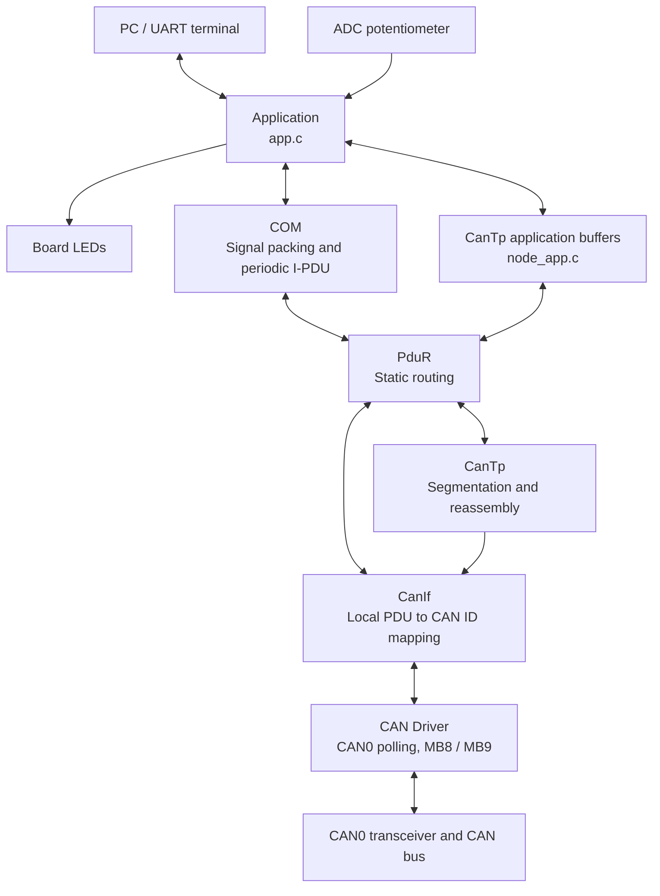
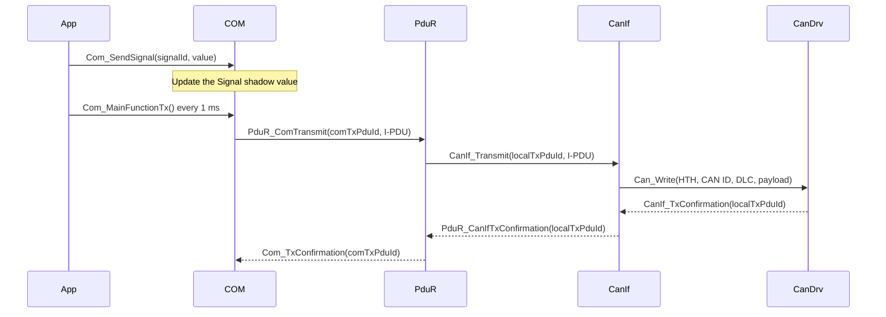
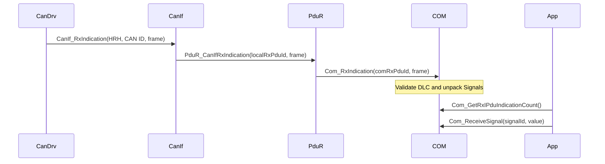
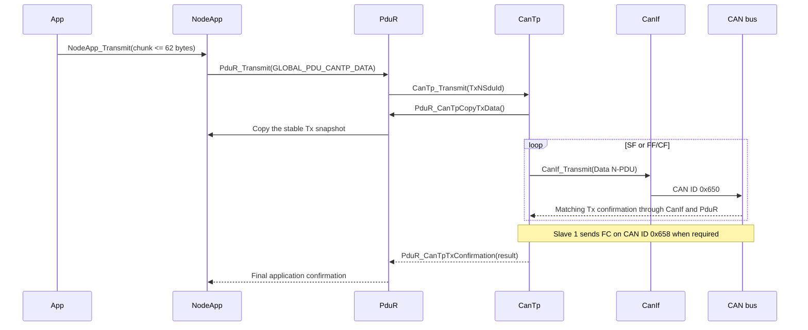

# CAN Communication Stack Architecture

## 1. Purpose and Scope

This project implements a polling-based CAN communication stack for the
S32K144. The same codebase supports three ECUs whose roles are selected at
build time:

- **Master**: samples the ADC, transmits KeepAlive messages, monitors both
  Slaves, and sends large UART input through CanTp.
- **Slave 1**: receives KeepAlive messages, reports its status, receives CanTp
  data, and forwards the reassembled data to UART.
- **Slave 2**: receives KeepAlive messages and reports its status. It does not
  participate in the CanTp data flow.

The stack provides two independent communication paths on the same CAN bus:

1. **COM Signal** transports periodic KeepAlive and Slave Status data in fixed
   eight-byte CAN frames.
2. **CanTp** transports N-SDUs up to 62 bytes using SF, FF, CF, FC, timers,
   retries, and flow control.

## 2. High-Level Architecture



COM and CanTp share CanIf and the CAN Driver. COM uses the static PduR route
tables. CanTp uses PduR at the application boundary, transmits N-PDUs through
CanIf, and receives them through the CanIf -> PduR -> CanTp callback path.

## 3. Layers and Responsibilities

| Layer | Main files | Responsibility |
| --- | --- | --- |
| Entry point | `src/main.c` | Calls `System_Init()` once and `System_RunTask()` continuously |
| System integration | `system/System.c`, `system/System.h` | Initializes the system, applies the system error policy, and runs the 1 ms scheduler |
| Application | `app/app.c`, `app/app.h` | Owns ECU roles, ADC, LEDs, UART, liveness, COM usage, and UART-to-CanTp chunking |
| CanTp application adapter | `app/node_app.c`, `app/node_app.h` | Preserves the Tx N-SDU, manages two Rx slots, and implements PduR-facing callbacks |
| COM | `drivers/can/com/` | Stores Signals, packs eight-byte I-PDUs, schedules periodic Tx, and decodes Rx I-PDUs |
| PduR | `drivers/can/pdur/` | Routes COM to CanIf and the application to CanTp without modifying payloads |
| CanTp | `drivers/can/cantp/` | Segments and reassembles N-SDUs and handles flow control, sequence numbers, retries, and timeouts |
| CanIf | `drivers/can/canif/` | Maps local L-PDUs to CAN IDs and HTHs, and maps HRH/CAN ID pairs back to local L-PDUs |
| CAN Driver | `drivers/can/can_driver/` | Controls CAN0, Tx MB8, Rx MB9, and polling-based Tx/Rx callbacks |
| Shared CAN types | `drivers/can/common/` | Defines common PDU types and Global PDU IDs |
| BSP and peripherals | `bsp/`, `drivers/adc/`, `drivers/uart/`, `drivers/systick/` | Provides board setup, ADC, UART, and the 1 ms time base |
| Middleware | `middlewares/ring_buffer.c` | Provides bounded byte queues for UART Rx and Tx |

Upper layers call lower-layer APIs. Asynchronous results travel upward through
callbacks. Static communication data belongs in `*_Cfg.c/h` files instead of
the application.

## 4. System Initialization

`System_Init()` initializes the project in this order:

```text
disable_WDOG / init_MCU
    -> App_HardwareInit
    -> Can_Init
    -> CanIf_Init
    -> PduR_Init
    -> CanTp_Init
    -> Com_Init
    -> App_Init
    -> SystemCoreClockUpdate
    -> Driver_SysTick_Init(1000 Hz)
```

Each initialization function validates the configuration or resources owned
by its module. If any step fails, `System_Fail()` stores the reason in
`g_SystemStatus` and stops the scheduler for debugger inspection.

## 5. One-Millisecond Scheduler

After initialization, `System_RunTask()` processes every pending tick in this
order:

```text
Can_MainFunction_Write()
Can_MainFunction_Read()
CanTp_MainFunction()
App_MainFunction(tick)
Com_MainFunctionTx()
```

The order serves these purposes:

1. Release completed Tx mailboxes and dispatch confirmations.
2. Receive new CAN0 frames and dispatch Rx callbacks.
3. Process CanTp confirmations, retries, timeouts, and STmin.
4. Process application ADC, liveness, UART, and N-SDU work.
5. Retry due COM I-PDUs after lower-layer Tx resources have been released.

The scheduler does not use an RTOS. The main communication APIs are
non-blocking, and CAN Tx/Rx progress is completed by later polling calls.

## 6. PDU Namespaces and Mapping

The project separates three identifier types:

- **Global PDU ID**: a stack-wide logical identifier declared in
  `drivers/can/common/CanStack_Cfg.h`.
- **Local PDU ID**: an identifier whose meaning is limited to COM, PduR,
  CanTp, or CanIf. Each module has its own namespace.
- **CAN ID**: the 11-bit identifier transmitted on the bus, configured in
  `drivers/can/canif/CanIf_Cfg.c`.

| Purpose | Global PDU | COM I-PDU | CanTp handle | CanIf L-PDU | CAN ID | DLC |
| --- | ---: | --- | --- | ---: | ---: | ---: |
| Master KeepAlive | `0x0010` | Tx `0`, Rx `1` | - | Tx/Rx `0` | `0x100` | 8 |
| Slave 1 Status | `0x0011` | Tx `2`, Rx `3` | - | Tx/Rx `1` | `0x201` | 8 |
| Slave 2 Status | `0x0012` | Tx `4`, Rx `5` | - | Tx/Rx `2` | `0x202` | 8 |
| CanTp Data | `0x0020` | - | N-SDU `0`, Data N-PDU `0` | Tx/Rx `3` | `0x650` | 8 |
| CanTp Flow Control | - | - | FC N-PDU `1` | Tx/Rx `4` | `0x658` | 8 |

Flow Control is internal to CanTp and therefore has no application-facing
Global PDU ID.

## 7. COM Signal Path

### 7.1 Wire Format

Every COM I-PDU has DLC 8:

```text
KeepAlive:      [(AliveCounter << 1) | U][(RateLevel << 1) | U][00][00][00][00][00][00]
Slave 1 Status: [(Status << 1) | U][00][00][00][00][00][00][00]
Slave 2 Status: [(Status << 1) | U][00][00][00][00][00][00][00]
```

- Bit 0 of each occupied Signal Slot is its Update Bit (`U`); bits 1..7 hold
  the Signal payload. `Com_SendSignal()` sets `U = 1`, and COM clears it only
  after the lower layer accepts the I-PDU. A later periodic frame can carry
  the same payload with `U = 0`.
- `AliveCounter` retains the application type `uint8`, but its valid range is
  `0..127` and it wraps from 127 to 0.
- `RateLevel` is in the range `0..6`.
- `Status = 0` means `NORMAL`.
- `Status = 1` means `MASTER_LOST`.

COM schedules KeepAlive every 10 ms and each Slave Status every 500 ms. The
application enables only the Tx I-PDU owned by the selected firmware role.

### 7.2 Tx Sequence



`Com_SendSignal()` updates only the Signal value. `Com_MainFunctionTx()` decides
when to transmit the I-PDU according to its period and pending/retry state.

### 7.3 Rx Sequence



CanIf filters frames by HRH and CAN ID. PduR uses its Rx route table to select
the COM I-PDU. The application reads the latest snapshot through the COM APIs.

## 8. CanTp Path

### 8.1 Wire Format and Timing

CanTp supports one bidirectional connection with N-SDU lengths from 1 to 62
bytes:

```text
SF: [0x00][Length][up to 6 data bytes]
FF: [0x10][Length][6 data bytes]
CF: [0x20 | SN][up to 7 data bytes]
FC: [0x30 | FS][BS][STmin][padding]
```

The active timing profile is:

| Parameter | Value |
| --- | ---: |
| Block Size | 4 CFs |
| STmin | 5 ms |
| N_As / N_Ar / N_Bs / N_Cr | 100 ms |
| Maximum retries | 3 |
| Padding byte | `0x00` |

CanTp commits its offset, sequence number, and block counter only after the
matching Tx confirmation. Duplicate or late frames, invalid lengths, sequence
number errors, timeouts, and exhausted retries are handled according to the
active state and recorded through debugger-visible abort information.

### 8.2 Tx and Rx Sequence



On reception, CanTp reserves a NodeApp Rx slot, reassembles the complete N-SDU
in its internal buffer, copies the N-SDU into the reserved slot, and then sends
the final Rx indication. The application consumes only slots in the `READY`
state.

## 9. Application Roles

The firmware role is selected through `APP_BOARD_ROLE` in `app/app.h` or a
build define. The current fallback value is `APP_ROLE_SLAVE1`. The role cannot
change at runtime.

| Role | Tx | Rx | Peripherals and behavior |
| --- | --- | --- | --- |
| Master | KeepAlive `0x100`, CanTp Data `0x650` | Status `0x201/0x202`, FC `0x658` | Samples ADC0_SE12, drives the blue LED, accepts an image through UART, and monitors Slave online/offline state |
| Slave 1 | Status `0x201`, FC `0x658` | KeepAlive `0x100`, CanTp Data `0x650` | Blinks the LED from RateLevel, monitors the Master, and writes received N-SDUs to UART |
| Slave 2 | Status `0x202` | KeepAlive `0x100` | Blinks the LED and monitors the Master; CanTp Data reception is disabled |

The application maps the 12-bit ADC range to seven levels:

| Level | AliveCounter update period | Full LED cycle |
| ---: | ---: | ---: |
| 0 | 500 ms | 1500 ms |
| 1 | 200 ms | 1000 ms |
| 2 | 100 ms | 800 ms |
| 3 | 50 ms | 600 ms |
| 4 | 20 ms | 400 ms |
| 5 | 10 ms | 300 ms |
| 6 | 5 ms | 200 ms |

A Slave refreshes its watchdog only when `AliveCounter` changes. After 2000 ms
without a new counter, it reports `MASTER_LOST`. The Master marks a Slave
offline after 2000 ms without a Status I-PDU and marks it online as soon as a
valid Status I-PDU is received again.

## 10. Data Ownership and Memory

- `PduInfoType` contains only a pointer and length. Each layer must respect the
  pointer lifetime of synchronous calls and callbacks.
- CanIf translates the metadata, and the CAN Driver writes the Tx payload into
  the message buffer before returning. The caller's pointer is not retained.
- NodeApp preserves one stable Tx snapshot until the final CanTp confirmation.
- NodeApp provides two 64-byte Rx slots. A valid N-SDU is limited to 62 bytes.
- The application allows only one active image and one active CanTp chunk.
- The UART Rx ring is configured for 17 KiB, and the UART Tx ring is configured
  for 256 bytes. The ring buffer never overwrites unread bytes.
- UART image input starts with a little-endian `uint16` length followed by
  exactly the declared number of payload bytes.

## 11. CAN Driver and Hardware

The CAN Driver supports one controller:

| Property | Configuration |
| --- | --- |
| Controller | CAN0 |
| Baud rate | 500 kbit/s |
| Frame type | Classical CAN with standard 11-bit IDs |
| Tx hardware object | HTH `0`, Message Buffer 8 |
| Rx hardware object | HRH `1`, Message Buffer 9 |
| Service model | Polling |

The driver has one active Tx mailbox and no software Tx queue. When the mailbox
is busy, the upper layer receives a busy/failure result and retries according
to the COM or CanTp policy.

## 12. Configuration and Change Guide

| Change | Primary files |
| --- | --- |
| Firmware role | `app/app.h` or the `APP_BOARD_ROLE` build define |
| Integration-test switches | `system/System_Cfg.h` |
| CAN IDs and local CanIf handles | `drivers/can/canif/CanIf_Cfg.c/h` |
| Global PDU IDs | `drivers/can/common/CanStack_Cfg.h` |
| COM Signal layout, I-PDUs, and periods | `drivers/can/com/Com_Cfg.c/h` |
| COM and CanTp routes | `drivers/can/pdur/PduR_Cfg.c/h` |
| CanTp BS, STmin, timers, retries, and wire format | `drivers/can/cantp/Cantp_Cfg.h` |
| CAN controller and hardware objects | `drivers/can/can_driver/Can_Cfg.c/h` |
| ADC, LED, UART, and liveness policy | `app/app.c` |
| Scheduler and initialization order | `system/System.c` |
| Program entry point | `src/main.c` |

When changing a CAN ID or local handle, update every related configuration
table and run the mapping tests to prevent route mismatches among CanIf, PduR,
and CanTp.
