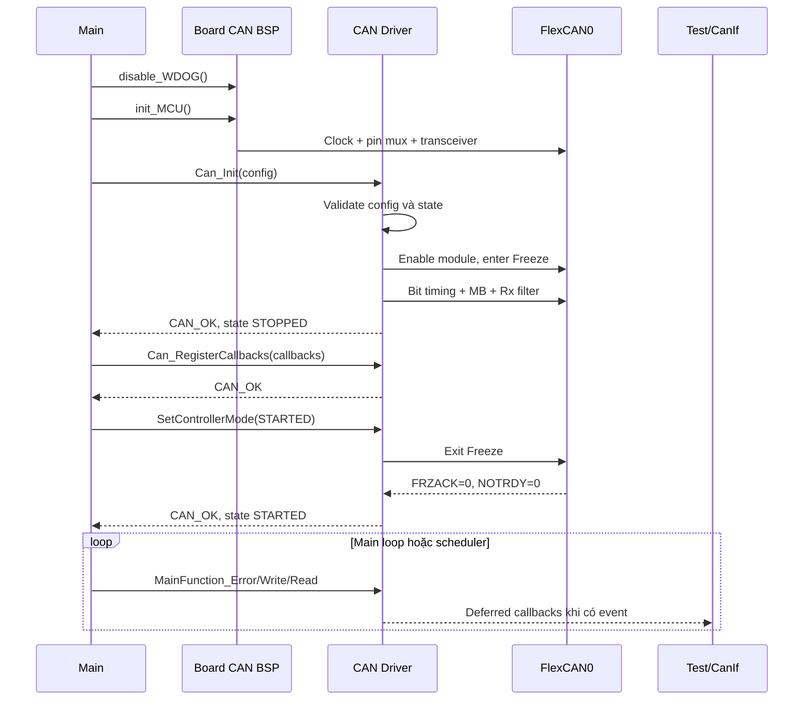
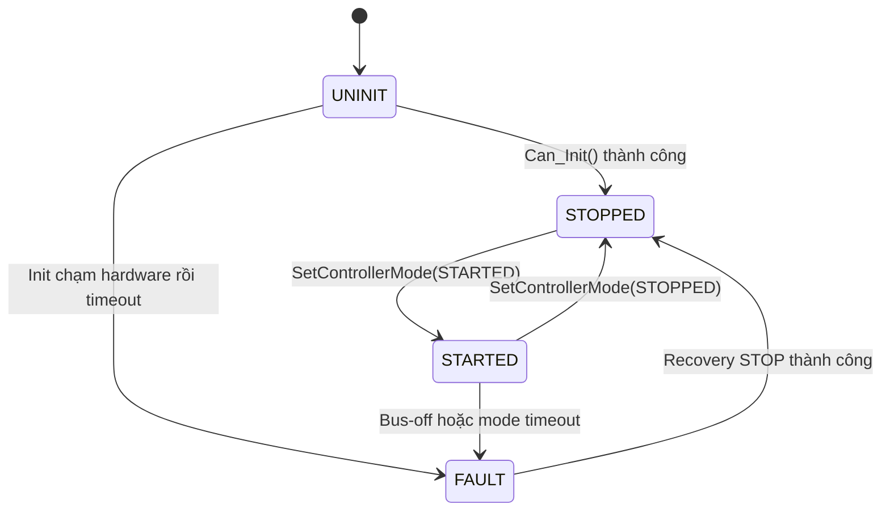

# Trình tự khởi tạo CAN

Cập nhật: 2026-09-14. Tài liệu này mô tả implementation hiện tại của CAN0 trong workspace, từ lúc CPU khởi động đến khi controller có thể truyền và nhận frame. Source chính: [`board_can.c`](../bsp/can/board_can.c), [`Can.c`](../drivers/can/driver/Can.c), [`Can_Internal.c`](../drivers/can/driver/Can_Internal.c) và [`Can_Cfg.c`](../drivers/can/config/can/Can_Cfg.c).

## 1. Thứ tự gọi ở mức hệ thống

```text
disable_WDOG()
    ↓
init_MCU()
    ↓
Can_Init(config)
    ↓
Can_RegisterCallbacks(callbacks)
    ↓
Khởi tạo các upper layer dùng CAN (CanIf/PduR/... khi đã có)
    ↓
Can_SetControllerMode(controllerId, CAN_CONTROLLER_STARTED)
    ↓
Gọi tuần hoàn Can_MainFunction_Error/Write/Read
```

`Can_Init()` chỉ cấu hình CAN Driver và kết thúc ở trạng thái `CAN_CONTROLLER_STOPPED`. Controller chỉ bắt đầu tham gia giao tiếp khi `Can_SetControllerMode(..., CAN_CONTROLLER_STARTED)` thoát Freeze Mode thành công.

## 2. Trách nhiệm trước `Can_Init()`

### 2.1 `disable_WDOG()`

Mở khóa và tắt watchdog để board không reset trong quá trình init hoặc debug. Đây là chức năng BSP, không thuộc CAN Driver.

### 2.2 `init_MCU()`

Hàm BSP chuẩn bị phần cứng mà CAN Driver cần:

1. Tắt SOSC trước khi thay đổi cấu hình.
2. Cấu hình external crystal oscillator 8 MHz.
3. Cấp clock 8 MHz ra `SOSCDIV2`.
4. Bật SOSC và chờ `SOSCVLD`.
5. Bật clock gate cho `PORTC`, `PORTE` và `FlexCAN0`.
6. Cấu hình `PTE4` thành `CAN0_RX` và `PTE5` thành `CAN0_TX`.
7. Đưa CAN transceiver về Normal Operation qua GPIO của board.
8. Khởi tạo LED xanh dùng để báo kết quả test.

`Can_Init()` không tự cấu hình clock, pin mux hoặc CAN transceiver. Nếu clock gate của FlexCAN0 chưa được bật, hàm trả `CAN_INVALID_STATE`.

> Giới hạn hiện tại: vòng chờ `SOSCVLD` trong BSP chưa có timeout. `hardwareTimeoutCount` của CAN Driver không giới hạn vòng chờ này.

## 3. Chọn cấu hình CAN

[`Can_Cfg.c`](../drivers/can/config/can/Can_Cfg.c) export hai cấu hình:

| Cấu hình | Loopback | Mục đích |
|---|---:|---|
| `Can_Config_Normal` | Tắt | Giao tiếp trên CAN bus vật lý |
| `Can_Config_Loopback` | Bật | Tự kiểm tra Tx → Rx bên trong FlexCAN0 |

Cả hai cấu hình hiện dùng:

- controller `0`;
- Classic CAN, standard ID 11-bit;
- bitrate `500000` bit/s với profile clock hiện tại 8 MHz;
- HTH `CAN_HTH_0` ánh xạ tới MB0 để truyền;
- HRH `CAN_HRH_0` ánh xạ tới MB1 để nhận chính xác CAN ID `0x123`;
- giới hạn chờ phần cứng `1000000` vòng poll.

## 4. Các bước bên trong `Can_Init()`

### Bước 1 — Chặn lời gọi từ callback

Nếu driver đang thực thi Tx/Rx/BusOff callback, `Can_Init()` trả `CAN_INVALID_STATE`. Việc này ngăn init lồng trong lúc driver đang dispatch một event.

### Bước 2 — Validate toàn bộ config

`Can_InternalValidateConfig()` kiểm tra config trước khi CAN Driver ghi thanh ghi phần cứng:

- `config` và `hohList` phải khác `NULL`;
- `hohCount` phải nằm trong `1..16`;
- chỉ controller `0` được hỗ trợ;
- bitrate phải bằng `500000`;
- `hardwareTimeoutCount` phải khác `0`;
- mỗi HOH phải thuộc đúng controller và có loại Tx hoặc Rx hợp lệ;
- mailbox index phải nhỏ hơn `16`;
- Rx CAN ID và mask không vượt quá `0x7FF`;
- không được trùng HOH ID hoặc mailbox index.

Validation thất bại trả `CAN_INVALID_PARAM`, tăng `invalidInput`, cập nhật `lastError` và giữ controller ở `UNINIT`.

### Bước 3 — Kiểm tra lifecycle

`Can_Init()` chỉ hợp lệ khi driver đang ở `CAN_CONTROLLER_UNINIT`. Gọi lại sau khi đã init trả `CAN_INVALID_STATE`; hàm không xóa cấu hình hoặc request đang tồn tại.

### Bước 4 — Kiểm tra clock gate

Driver kiểm tra `PCC_PCCn_CGC_MASK` của `PCC_FlexCAN0_INDEX`. Nếu BSP chưa bật clock, hàm trả `CAN_INVALID_STATE` mà không tiếp tục truy cập CAN0.

### Bước 5 — Khởi tạo state phần mềm

Driver lưu con trỏ config, sau đó:

- xóa các callback cũ;
- xóa trạng thái bus-off và callback guard;
- xóa tracking request của 16 Tx mailbox;
- reset toàn bộ diagnostic counters.

Config được truyền vào phải có lifetime ít nhất bằng thời gian CAN Driver hoạt động vì driver giữ con trỏ thay vì copy toàn bộ config.

### Bước 6 — Bật FlexCAN0 và yêu cầu Freeze Mode

Driver xóa `MCR[MDIS]`, sau đó set `MCR[FRZ]` và `MCR[HALT]`. Driver poll `MCR[FRZACK]` với giới hạn `hardwareTimeoutCount`.

Nếu `FRZACK` không được set đúng hạn:

- mode chuyển thành `CAN_CONTROLLER_FAULT`;
- tăng counter `hardwareTimeoutCount`;
- đặt `lastError = CAN_TIMEOUT`;
- trả `CAN_TIMEOUT`.

Freeze Mode dừng protocol engine để bit timing, mailbox và filter được cấu hình trong trạng thái ổn định. Nó không chỉ dành cho debugger.

### Bước 7 — Cấu hình chế độ controller

Trong `MCR`, driver:

- tắt Rx FIFO qua `RFEN = 0`;
- tắt CAN FD qua `FDEN = 0`;
- bật individual Rx masking qua `IRMQ = 1`;
- đặt `MAXMB = 15`, tương ứng MB0..MB15.

### Bước 8 — Cấu hình bit timing

Driver lập trình `CTRL1` theo profile duy nhất hiện được hỗ trợ:

```text
PRESDIV = 0
PROPSEG = 6
PSEG1   = 5
PSEG2   = 1
RJW     = 0
```

Driver xóa `CLKSRC` và chỉ chấp nhận config `500000` bit/s. Nếu cần clock hoặc bitrate khác, phải bổ sung profile bit timing tương ứng thay vì chỉ đổi giá trị trong config.

### Bước 9 — Bật hoặc tắt internal loopback

Nếu `config->loopbackEnable == true`, driver set `CTRL1[LPB]`. Nếu bằng `false`, bit này được giữ ở `0` để sử dụng CAN bus vật lý.

### Bước 10 — Chọn polling và xóa cờ cũ

Driver ghi:

```c
CAN0->IMASK1 = 0U;
CAN0->IFLAG1 = 0xFFFFFFFFUL;
```

`IMASK1 = 0` tắt interrupt mailbox vì baseline hiện dùng polling. Ghi `1` vào các bit `IFLAG1` xóa những event cũ theo cơ chế write-one-to-clear của FlexCAN.

### Bước 11 — Reset toàn bộ mailbox

Với mỗi MB0..MB15, driver:

- đặt CODE thành `RX_INACTIVE`;
- xóa word CAN ID;
- xóa hai data word;
- xóa individual Rx mask.

Bước này đưa các mailbox chưa được HOH sử dụng về trạng thái không hoạt động và loại dữ liệu còn lại từ lần chạy trước.

### Bước 12 — Áp dụng HOH configuration

Với mỗi HOH:

- Tx HOH: đặt mailbox thành `TX_INACTIVE`, sẵn sàng cho `Can_Write()`;
- Rx HOH: ghi standard CAN ID, ghi mask vào `RXIMR`, rồi đặt mailbox thành `RX_EMPTY` để sẵn sàng nhận.

Với config hiện tại:

| Mailbox | HOH | Trạng thái sau init | Giá trị lọc |
|---:|---|---|---|
| MB0 | `CAN_HTH_0` | `TX_INACTIVE` | CAN ID được ghi khi gọi `Can_Write()` |
| MB1 | `CAN_HRH_0` | `RX_EMPTY` | ID `0x123`, mask `0x7FF` |
| MB2..MB15 | Không dùng | `RX_INACTIVE` | Mask `0` |

### Bước 13 — Publish trạng thái STOPPED

Khi tất cả cấu hình hoàn tất, driver đặt:

```c
s_controllerMode = CAN_CONTROLLER_STOPPED;
s_lastError = CAN_OK;
```

Sau đó trả `CAN_OK`. Phần cứng vẫn ở Freeze/Halt, vì vậy chưa có frame nào được truyền hoặc dispatch.

## 5. Đăng ký callback

Sau khi `Can_Init()` thành công, upper consumer gọi `Can_RegisterCallbacks()` trong khi controller đang `STOPPED`.

Config hiện có cả Tx HOH và Rx HOH nên hai callback sau là bắt buộc:

- `txConfirmation`;
- `rxIndication`.

`controllerBusOff` là tùy chọn. Registration bị từ chối nếu controller không ở `STOPPED`, driver đang trong callback hoặc còn terminal Tx event chưa dispatch.

Hiện tại [`Can_LoopbackTest.c`](../drivers/can/test/Can_LoopbackTest.c) là upper consumer. Khi CanIf được triển khai, CanIf sẽ đăng ký callback của nó tại bước này.

## 6. Chuyển sang STARTED

Gọi:

```c
Can_SetControllerMode(CAN_CONTROLLER_0, CAN_CONTROLLER_STARTED);
```

Driver chỉ cho phép start khi:

- mode hiện tại là `STOPPED`;
- không có bus-off;
- không còn terminal Tx event;
- các callback bắt buộc đã được đăng ký.

Sau đó `Can_ExitFreezeMode()` xóa `MCR[HALT]` và `MCR[FRZ]`, rồi chờ có giới hạn đến khi:

- `FRZACK == 0`;
- `NOTRDY == 0`.

Thành công chuyển software mode sang `CAN_CONTROLLER_STARTED`. Timeout chuyển mode sang `CAN_CONTROLLER_FAULT` và trả `CAN_TIMEOUT`.

## 7. Xử lý tuần hoàn sau khi start

Baseline hiện dùng polling, vì vậy main loop hoặc scheduler phải gọi:

```c
Can_MainFunction_Error();
Can_MainFunction_Write();
Can_MainFunction_Read();
```

| Hàm | Công việc định kỳ |
|---|---|
| `Can_MainFunction_Error()` | Phát hiện/latch bus-off, cô lập controller và báo callback |
| `Can_MainFunction_Write()` | Thu Tx completion và dispatch confirmation theo `swPduHandle` |
| `Can_MainFunction_Read()` | Đọc, kiểm tra, unpack và dispatch frame Rx |

Nếu các hàm này không được gọi đủ thường xuyên, phần cứng vẫn có thể hoạt động nhưng upper layer không nhận event đúng hạn và mailbox có thể không được phục vụ.

## 8. Sơ đồ trình tự



## 9. Lifecycle



## 10. Các điểm kiểm tra khi init thất bại

| Kết quả | Kiểm tra đầu tiên |
|---|---|
| `CAN_INVALID_PARAM` | `config`, HOH count/list, controller, bitrate, timeout, ID/mask, HOH/MB trùng |
| `CAN_INVALID_STATE` trước ghi CAN0 | Có gọi từ callback, gọi init lần hai hoặc BSP chưa bật FlexCAN0 clock |
| `CAN_TIMEOUT` trong `Can_Init()` | `MCR[FRZACK]`, clock FlexCAN0, reset/module state |
| `CAN_INVALID_STATE` khi register callback | Controller không còn `STOPPED` hoặc còn terminal Tx event |
| `CAN_INVALID_STATE` khi start | Thiếu callback bắt buộc, bus-off, sai lifecycle hoặc còn terminal event |
| `CAN_TIMEOUT` khi start | `FRZACK` không clear hoặc `NOTRDY` không clear trước poll limit |

Không kết luận lỗi CAN Driver chỉ từ LED. Khi debug, đọc return value của từng bước và dùng `Can_GetControllerStatus()`/`Can_GetStats()` để xác định mode, `lastError` và counter liên quan.

## 11. Ví dụ init loopback hiện tại

```c
static const Can_CallbacksType callbacks =
{
    TxConfirmation,
    RxIndication,
    ControllerBusOff
};

disable_WDOG();
init_MCU();

if (Can_Init(&Can_Config_Loopback) != CAN_OK)
{
    /* Init failed. */
}

if (Can_RegisterCallbacks(&callbacks) != CAN_OK)
{
    /* Callback registration failed. */
}

if (Can_SetControllerMode(CAN_CONTROLLER_0,
                          CAN_CONTROLLER_STARTED) != CAN_OK)
{
    /* Start failed. */
}

for (;;)
{
    Can_MainFunction_Error();
    Can_MainFunction_Write();
    Can_MainFunction_Read();
}
```

Ví dụ đầy đủ đang được thực thi bởi [`Can_LoopbackTest_Run()`](../drivers/can/test/Can_LoopbackTest.c). Test truyền CAN ID `0x123` với payload `DE AD BE EF`; kết quả board chỉ được xác nhận khi `g_CanLoopbackTestResult == CAN_LOOPBACK_TEST_PASSED` sau khi flash.
