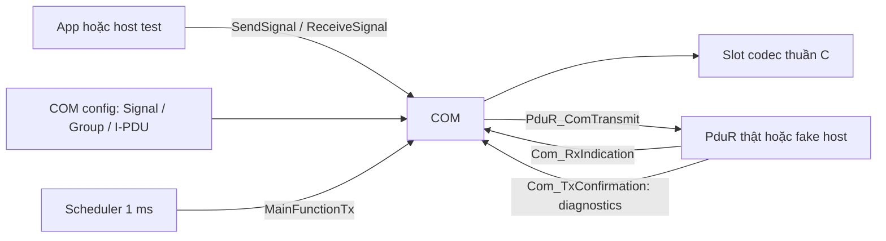

# Plan triển khai tầng COM — Assignment Part 1

Trạng thái: **ĐANG THỰC HIỆN**. Types/config và slot codec đang được viết trước; runtime COM và validation report chưa hoàn thành. Mục tiêu là triển khai theo từng giai đoạn có thể đọc, build và kiểm thử độc lập.

## 1. Căn cứ và phạm vi

Nguồn yêu cầu chính: [assignment_part1_com_signal.md](../../requirements/assignment_part1_com_signal.md), đặc biệt mục 2, 7–16, 25, 27, 31, 36–39. [part1_architecture_notes.md](../../requirements/part1_architecture_notes.md) giải thích lý do thiết kế, không thay thế assignment. Tip timing bổ sung của người giao bài ngày 2026-09-14 được áp dụng như profile cấu hình project: period Tx là bội của cửa sổ 10 ms, offset khác nhau trong 1..9 ms. [API_SPEC.md](../../requirements/assumptions/API_SPEC.md) và skeleton cũ cần được cập nhật theo assignment ở các điểm khác nhau.

**Hoàn thành COM:** model Signal/Group/I-PDU, validation, pack/unpack, Send/ReceiveSignal, scheduler 1 ms, bounded retry/drop, Update Bit, diagnostics và host tests với PduR giả.

**Hoàn thành tích hợp Part 1:** COM cộng PduR thật, CanIf thật, CAN Driver, scheduler, mapping hệ thống và bằng chứng Tx/Rx trên board. Đây là mốc riêng sau khi COM pass độc lập.

Không đưa CanTp, truyền ảnh/file, deadline monitoring, triggered Tx, signal-group shadow/commit API, priority/fairness scheduler hoặc multiplexed Global PDU vào COM Part 1. Signal Group ở đây là đơn vị nhóm/đóng gói, không mặc nhiên có semantics `Com_SendSignalGroup()` của một stack khác.

## 2. Phân tích hai tài liệu và chênh lệch với project

| Nội dung bắt buộc | Ý nghĩa triển khai | Hiện trạng / việc cần đổi |
|---|---|---|
| Signal → Group → I-PDU; mỗi quan hệ thuộc về đúng một đối tượng cha | Có model Group thật và kiểm tra ownership | `com_types.h` mới có ID, enum và forward declaration |
| Slot byte-aligned, U là bit 0, payload chiếm phần còn lại | Encode `(value << 1) \| U`, serialize byte tường minh | Chưa có codec |
| `SendSignal()` chỉ cập nhật dữ liệu | Không đặt pending vì SendSignal, không gọi PduR | Comment `com.h` hiện nói đánh dấu I-PDU cần phát: phải sửa |
| Tx PERIODIC, main function 1 ms | Lịch thuộc I-PDU, không thuộc signal | Header cũ có `nowMs` và periodic/triggered: cần thu hẹp |
| Một pending occurrence, latest value wins | Mỗi lần thử đọc buffer hiện tại, không queue snapshot cũ | Chưa có runtime |
| Thử tối đa một lần/PDU/mỗi invocation, theo thứ tự config | BUSY PDU A không ngăn PDU B | Chưa có scheduler |
| Tối đa `1 + max_retries` attempts | Drop occurrence, giữ data/U, không disable I-PDU | Chưa có retry/drop |
| Clear U khi PduR trả E_OK | Request accepted và physical completion là hai mốc | Không đợi TxConfirmation để clear U |
| GlobalPduId chung cho logical PDU | Lưu trong model/trace, không serialize vào payload | Shared header hiện chưa có type này |
| Rx route về I-PDU rồi decode Group/Signal | COM không nhìn HRH, CAN ID hoặc thanh ghi | Callback mới chỉ được khai báo |
| Direct Binding; multi-controller và training Rx API ở tầng dưới | PduR/CanIf/CanDrv phải xử lý khi tích hợp | Driver mới hiện CAN0-only và dùng `Can_HwType`; ghi thành gap tích hợp, không sửa trong task COM |

Architecture notes nhấn mạnh: buffer COM chứa **trạng thái mới nhất**, không phải lịch sử sự kiện; schedule danh nghĩa độc lập thời điểm PduR chấp nhận; GlobalPduId và local PduId có thể khác số; CanIf sở hữu mapping CAN ID, CanDrv sở hữu HOH/controller.

Hai ECU cùng gửi/nhận một logical message dùng cùng GlobalPduId cho message đó. Tính duy nhất nghĩa là không gán ID đó cho **hai message khác nhau**, không phải mỗi bản cấu hình ở mỗi ECU phải phát minh một GlobalPduId mới. Local SignalId/PduId/HTH/HRH vẫn có thể khác giữa ba firmware.

## 3. Các lựa chọn local cần ghi rõ trước khi code

Những lựa chọn dưới đây là đề xuất của plan ở nơi assignment chưa quy định đủ; không gán chúng thành yêu cầu của người giao bài.

| Điểm chưa chốt | Phương án A | Phương án B | Chọn cho plan và giới hạn |
|---|---|---|---|
| Byte order của slot nhiều byte | Little-endian, U ở byte đầu slot | Big-endian, U ở byte cuối slot | A cho host vectors; phải thống nhất wire profile với các ECU trước test bus |
| Software value type | Unsigned `uint8_t/16_t/32_t/64_t` | Thêm signed, float, scale/offset | A; đề chỉ minh họa unsigned. Từ chối type chưa hỗ trợ, không tự truncate |
| Slot width | Mọi bội số 8 trong 8..64 | Chỉ 8/16/24/32 | A vì assignment không giới hạn slot tối đa 32, I-PDU Classic CAN tối đa 8 byte |
| Rx U=0 | Giữ giá trị signal đã nhận trước đó | Luôn thay payload và chỉ đánh dấu U=0 | A; U=1 cập nhật, U=0 giữ giá trị. Đây là policy Rx đề xuất, cần xác nhận khi ghép ECU |
| Giá trị ban đầu | Init value cấu hình, U=0; mặc định 0 | U=1 ngay khi init | A; SendSignal luôn đặt U=1, kể cả giá trị không đổi |
| API tick | `Com_MainFunctionTx(void)`, đúng mỗi 1 ms | Giữ `nowMs`, thêm quy tắc missed ticks | A theo pseudocode assignment; host test gọi từng tick, caller chịu trách nhiệm cadence |
| Return code | Giữ `Comm_ReturnType` trong repo | Tạo thêm E_OK/E_NOT_OK types | A: `COMM_OK` tương đương E_OK; mọi mã khác là request không accepted |

Slot width và C type không cần bằng nhau: slot16/type uint16 chỉ nhận 0..32767; slot24/type uint32 chỉ nhận 0..8388607. Giá trị hợp lệ phải vừa cả software type lẫn payload width. Không có C type uint24; không dùng cast con trỏ payload sang integer.

Offset theo đúng thuật toán mục 13: `counter=offset`; mỗi invocation giảm nếu >0 rồi xét 0. Nếu invocation đầu ở t=1 ms, offset=1 hoặc offset=0 đều due ngay invocation đó; offset=0 không tự phát trong `Com_Init()`.

Profile timing bổ sung của project dùng `COMM_MATRIX_TX_PHASE_WINDOW_TICKS = 10`: mọi Tx period là bội của 10 và mỗi Tx I-PDU chọn một offset riêng trong 1..9. Ví dụ A `(20,1)` due tại 1,21,41…; B `(20,3)` tại 3,23,43…; C `(30,5)` tại 5,35,65…. Rule này phân tán nominal due time và giữ phase theo modulo 10. Nó không bảo đảm mọi **attempt** khác thời điểm, vì retry sau BUSY/NOT_OK diễn ra ngay tick kế tiếp và có thể chạm nominal slot của PDU khác.

COM core chỉ bắt buộc kiểm quy tắc tổng quát của assignment: main tick 1 ms, period hợp lệ và offset biểu diễn được. Rule cửa sổ 10 ms/offset 1..9/offset không trùng thuộc generated project config và validator hệ thống, tránh biến một tip profile thành giới hạn cứng của module COM có thể tái sử dụng.

Phạm vi counter đề xuất: `uint16_t` cho period/offset (period 1..65535 ticks, offset 0..65535), `uint8_t` cho retry (0..255). Tại retry max=255, số attempts tối đa là **256**, nên diagnostics/test tính số attempts bằng kiểu rộng hơn uint8.

## 4. Kiến trúc và ownership



- COM giữ payload buffer, runtime scheduling và signal data; không include `S32K144.h`, `Can.h`, GPIO, LED hoặc UART driver.
- PduR nhận source PDU handle rồi route; không hiểu slot/U. Trong contract này, source handle của `PduR_ComTransmit` là COM Tx I-PDU ID; PduR mapping nội bộ có thể dùng index khác.
- `PduR_ComTransmit` đồng bộ trả accepted/rejected. Nếu accepted, toàn bộ payload phải được copy/tiêu thụ trước khi return vì COM sẽ clear U ngay sau đó. Fake phải copy bytes tại lời gọi để kiểm tra đúng ownership.
- Public COM API chạy tuần tự ở main context. ISR chỉ cập nhật tick/event; không gọi SendSignal/RxIndication trong ISR. Lower call không được re-enter COM để thay buffer trong lúc COM transmit/clear U.
- TxConfirmation chỉ ghi nhận kết quả vật lý/diagnostics; không đặt lại pending, không clear U lần nữa, không dịch lịch hay tự retry request đã accepted.

## 5. Danh sách file và số lượng

**Baseline COM gồm 17 file code/test: 6 file có sẵn cần sửa và 11 file mới.** Chia thành 9 file production/contract và 8 file host test/runner. Không tạo lại `comm/` hoặc `config/` ở root.

### 5.1 Chín file production/contract

| # | Đường dẫn | Hiện trạng | Chức năng và phần code sẽ viết |
|---:|---|---|---|
| 1 | `drivers/can/comm/common/comm_types.h` | Sửa | Giữ PduIdType, PduInfoType, Comm_ReturnType; thêm GlobalPduIdType; không đưa CAN hardware type vào shared header |
| 2 | `drivers/can/comm/com/com_types.h` | Sửa | Config Signal/Group/I-PDU, value type, direction, module state, stats/event types |
| 3 | `drivers/can/comm/com/com.h` | Sửa | API init/send/receive/tick/Rx/confirmation/diagnostics và comment contract |
| 4 | `drivers/can/comm/com/com.c` | Sửa (`#include` skeleton) | Static storage, validate config, lookup, init, Send/Receive, periodic scheduler, retry/drop, Rx commit, diagnostics |
| 5 | `drivers/can/comm/com/com_codec.h` | Mới | Interface nội bộ encode/decode/clear U; không public cho app |
| 6 | `drivers/can/comm/com/com_codec.c` | Mới | Xử lý byte-aligned slot, range và endian; không gọi PduR hoặc giữ module state |
| 7 | `drivers/can/comm/pdur/pdur_com.h` | Mới | Contract do PduR sở hữu: prototype PduR_ComTransmit; chưa viết routing implementation ở giai đoạn COM |
| 8 | `drivers/can/config/com/com_cfg.h` | Sửa (rỗng) | Giới hạn static capacity, ID có tên, export const Com_Config |
| 9 | `drivers/can/config/com/com_cfg.c` | Sửa (rỗng) | Config mẫu Tx VehicleStatus; bảng signal/group/I-PDU, period/offset/maxRetries/GlobalPduId |

Không tách validation/scheduler/Rx thành nhiều module ngay từ đầu. Các helper private đặt static trong `com.c`; codec tách riêng vì có test vectors thuần byte độc lập. Nếu file trở nên khó đọc sau implementation mới đánh giá việc tách.

### 5.2 Tám file host test/runner

| # | Đường dẫn mới | Chức năng |
|---:|---|---|
| 10 | `tests/host/com/test_support.h` | Assertion chung, fixtures nhỏ, in case ID và expected/actual |
| 11 | `tests/host/com/fake_pdur.h` | API cấp chuỗi return codes, đọc call records, reset fake |
| 12 | `tests/host/com/fake_pdur.c` | Implement đúng PduR_ComTransmit, copy ID/length/bytes từng call; không link PduR thật |
| 13 | `tests/host/com/test_com_config.c` | Init, graph ownership, slot overlap/bounds, limits, invalid pointer/ID |
| 14 | `tests/host/com/test_com_codec.c` | Golden vectors encode/decode, endian, U, đủ width 8..64 và overflow |
| 15 | `tests/host/com/test_com_tx.c` | SendSignal, offset/period, static order, retry/drop/coalescing/latest value |
| 16 | `tests/host/com/test_com_rx.c` | Rx U policy, exact length, decode, default values, output capacity và buffer lifetime |
| 17 | `tests/host/com/run_tests.ps1` | Compile GCC, chạy case theo process riêng, giữ exit code, lưu log có chủ đích |

Mỗi test executable hỗ trợ chọn case bằng argv; runner chạy mỗi case trong process mới để static COM state bắt đầu UNINIT. Không thêm public `Com_ResetForTest()` hoặc làm init lặp âm thầm chỉ để tiện test.

### 5.3 Tài liệu và file tích hợp ngoài số đếm trên

- Plan hiện tại: `docs/implement/com-part1-plan.md`.
- Khi thực thi: tạo `docs/implement/com-part1-validation.md` chứa mapping test ID → yêu cầu → kết quả/log path/toolchain; không ghi PASS trước khi chạy.
- Giai đoạn đầu đồng bộ `requirements/assumptions/API_SPEC.md`, `docs/context.md`, `docs/codebase-map.md` với API đã chọn.
- `.cproject`: cấu hình build host không dùng source root firmware. Trong giai đoạn chỉ có COM và fake, exclude `drivers/can/comm/com/com.c` khỏi firmware build nếu chưa có PduR thật; compile object COM riêng. Chỉ enable lại khi đã có implementation PduR_ComTransmit để tránh undefined symbol.
- Giai đoạn tích hợp cần các file PduR/CanIf và config của chúng, scheduler trong `src/main.c`, cùng board harness riêng `drivers/can/test/Com_LoopbackTest.c/.h`. Đây là hạng mục phụ thuộc, không tính giả thành COM core đã hoàn thành.

## 6. Data model dự kiến

| Đối tượng | Fields chủ yếu | Quy tắc |
|---|---|---|
| Com_SignalConfigType | signalId, valueType, slotStartBit, slotLengthBits, initialValue | Không lưu trực tiếp IPduRef; vị trí tương đối đầu I-PDU |
| Com_SignalGroupConfigType | groupId, signalRefs, signalCount | Không rỗng; mỗi signal thuộc đúng một group |
| Com_IPduConfigType | ipduId, globalPduId, direction, length, groupRef, periodTicks, initialOffsetTicks, maxRetries | Đúng một group; Tx timing hợp lệ; Rx không dùng Tx schedule |
| Com_ConfigType | con trỏ/count các bảng config, optional event callback | const config có lifetime suốt hoạt động |
| Runtime private/PDU | currentBuffer[8], counter, pending, retryCount, stats | Buffer static; chỉ Tx dùng counter/pending/retry |
| Module state | UNINIT hoặc INIT | Không dùng COM_BUSY toàn module để diễn tả một PDU pending |

Nhóm references là local IDs có thể không liên tiếp; không coi public ID là array index. Init tạo lookup signal→group→PDU hoặc tra tuyến tính có giới hạn. Thứ tự Tx phải theo **bảng I-PDU**, không sort theo ID. Runtime array index là chi tiết nội bộ.

Rx dùng buffer đã commit của riêng PDU; ReceiveSignal decode slot trong buffer đó. U=0 ở frame đến giữ slot Rx đã commit; không cần duy trì thêm một bản scalar cho mỗi signal. Thao tác nhận validate toàn frame trước rồi mới commit để lỗi cuối frame không cập nhật nửa group.

Capacity local khởi đầu đề xuất: 8 I-PDU, 8 Group, 64 Signal, mỗi PDU dài 1..8 byte. Giới hạn này đủ tối đa 8 slot byte/PDU; đây là giới hạn implementation local, không phải yêu cầu của đề. Static assert/check kích thước, tránh heap.

Init validation phải kiểm tra pointer/count/capacity trước vòng lặp; duplicate IDs; enum; signal/group mồ côi hoặc được tham chiếu hai lần; group rỗng; exactly one group/PDU; slot alignment, length, overlap, bounds; initial value; period/offset/retry range. Dùng kiểu đủ rộng khi cộng start+length, validate trước khi nhân/shift. Validator profile kiểm thêm `periodTicks % 10 == 0`, offset trong 1..9 và offset không trùng giữa các Tx I-PDU.

GlobalPduId validation có hai cấp: local config không gán một ID cho hai logical PDU khác nhau; toàn hệ thống cần message matrix ba ECU. Unit test của một ECU không chứng minh uniqueness/binding toàn hệ thống. Tx-only và Rx-only của cùng message dùng cấu hình ở các test process khác nhau, không tạo hai logical message trùng ID để giả loopback.

## 7. API và hợp đồng cần viết ở giai đoạn 1

```c
Comm_ReturnType Com_Init(const Com_ConfigType *config);
Comm_ReturnType Com_SendSignal(Com_SignalIdType id,
                               const void *data, uint16_t size);
Comm_ReturnType Com_ReceiveSignal(Com_SignalIdType id,
                                  void *out, uint16_t capacity);
void Com_MainFunctionTx(void);
void Com_RxIndication(PduIdType rxIPduId, const PduInfoType *pdu);
void Com_TxConfirmation(PduIdType txIPduId, Comm_ReturnType result);
Comm_ReturnType Com_GetStats(PduIdType ipduId, Com_StatsType *out);

/* PduR-owned contract: COM links either real PduR or fake PduR. */
Comm_ReturnType PduR_ComTransmit(PduIdType sourceIPduId,
                                const PduInfoType *pdu);
```

- Giữ tham số size/capacity có sẵn để kiểm tra buffer caller: Send size đúng software type; Receive capacity ít nhất sizeof type. Đọc/ghi typed value bằng memcpy vào biến local để tránh lỗi alignment/aliasing.
- Send/Receive kiểm tra initialized, ID, direction và pointer trước ghi. Lỗi không làm đổi payload/U/schedule hoặc output của caller.
- API void nhận sai trạng thái/input tăng counter thích hợp và return; không truy cập hardware/log UART trực tiếp.
- `Com_MainFunctionRx(nowMs)` và deadline monitoring để ngoài Part 1; tìm caller trước khi bỏ declaration. Hiện tìm source chỉ thấy declaration COM, chưa có caller đang chạy.
- Init khi đã INIT trả INVALID_STATE và không reset hoạt động. Invalid init giữ UNINIT, không publish config đã validate một phần.
- `Com_TxConfirmation` không có vai trò trong scheduler Part 1; giữ làm điểm quan sát khi PduR thật nối về.

Diagnostics: per-PDU attempts, accepted, failed, dropped, rxAccepted/rxRejected, confirmations; module-level invalidInput nếu chưa thể resolve PDU. Optional event callback chạy main context, truyền record `{tick, event, ipduId, globalPduId, retryCount, result}`; cấm callback re-entry mutating COM. Host fake capture log, firmware có thể đọc counters bằng debugger. Callback không bắt buộc in UART.

## 8. Các giai đoạn viết code

Mỗi giai đoạn chỉ chuyển tiếp sau khi test liên quan pass. Không cần chờ PduR/CanIf thật để làm giai đoạn 1–6. Mọi hàm mới có comment nhiệm vụ, input/output, lifetime và điều kiện gọi theo yêu cầu người dùng.

### Giai đoạn 1 — Chốt types, contract và config mẫu

**Files:** #1–3, #7–9; khởi tạo #10–12, #17 cho test harness. Đồng bộ API_SPEC.

1. Định nghĩa các type/config/limit ở mục 6 và contract mục 7.
2. Đổi MainFunctionTx sang void/no timestamp; sửa comment SendSignal không đánh dấu pending, không dùng từ shadow nếu chưa có commit API.
3. Config mẫu: VehicleSpeed uint16 slot16 start0; Gear uint8 slot8 start16; AliveCounter uint8 slot8 start24; một group VehicleStatus; I-PDU Tx length8, GlobalPduId 0x0010, period10, offset1, maxRetries3. Khai báo rõ tick 1 ms và phase window 10 ms; I-PDU bổ sung sau này phải có period bội 10 và offset riêng trong 1..9.
4. Local IDs đặt tên; CAN ID 0x321 ở ví dụ assignment thuộc binding tích hợp, không đưa vào Com_IPduConfigType.
5. Fake PduR trả sequence có thể điều khiển và lưu bản copy payload từng attempt. Test record storage full phải fail rõ, không ghi ngoài mảng.

**Exit:** headers/config compile host và ARM object không cần header MCU; không duplicate typedef; bảng config có thể review. Chưa tuyên bố có runtime COM.

### Giai đoạn 2 — Viết slot codec

**Files:** #5–6, #14.

1. Validate slot width/buffer length/value trước ghi.
2. Encode numeric slot bằng unsigned uint64, serialize từng byte theo little-endian đã đề xuất; decode ngược lại.
3. Clear chỉ U, giữ nguyên payload. Padding ngoài slot giữ nguyên; zero padding khởi tạo ở Init.
4. Xử lý đúng width64: payload max 2^63−1, không tạo biểu thức shift 64. Test đầy đủ slot24 và các slot40/48/56, không tự phụ thuộc sizeof(C type).

**Exit:** zero/max/out-of-range/null/canary tests pass; hard-coded byte vectors độc lập, không chỉ round-trip encode bằng chính decode cùng lỗi.

### Giai đoạn 3 — Viết Init và SendSignal

**Files:** #4, #13, phần SendSignal của #15.

1. Validate toàn bộ graph và limits, sau đó mới publish state.
2. Init mỗi buffer từ initial values/U=0, padding=0; counter=offset, pending=false, retry=0.
3. SendSignal resolve Signal→Group→Tx I-PDU, validate software size/range, encode U=1 vào đúng slot.
4. SendSignal không đổi counter/pending/retry và không gọi PduR. Giá trị không đổi vẫn được set U=1 theo assignment.

**Exit:** init invalid không để module hoạt động một phần; multiple Send trước due chỉ còn giá trị cuối; fake PduR ghi nhận zero calls từ Init/Send.

### Giai đoạn 4 — Viết scheduler và bounded retry

**Files:** #4, #15; event records qua #10–12.

Code theo thứ tự mục 13 của assignment, cho từng Tx I-PDU theo config order:

1. Giảm counter nếu >0.
2. Nếu counter==0: nếu chưa pending thì đặt pending/reset retry; reload counter=period **dù đang pending**.
3. Nếu pending: gọi PduR một lần với current buffer.
4. COMM_OK: pending=false, retry=0, clear U toàn group; không đổi counter.
5. Thất bại và retryCount < maxRetries: tăng retryCount, giữ pending/U.
6. Thất bại khi đã hết budget: pending=false, retry=0; tăng dropped/phát event; giữ payload/U/counter.
7. Tiếp tục PDU kế, không vòng lặp chờ BUSY.

Điểm dễ sai: pseudocode đề tăng retryCount ngay sau attempt thất bại để chuẩn bị retry tiếp theo. Mô tả counter là “retries already consumed” ở mục 11 không hoàn toàn trùng thời điểm tăng trong pseudocode; implementation/test theo thuật toán mục 13 và invariant tối đa `1+maxRetries`, ghi comment rõ. Không reset retryCount khi period mới đến mà occurrence cũ vẫn pending.

**Exit:** tất cả COM-DYN-01..11 có test. Period luôn chạy độc lập accepted/drop; nhiều kỳ pending coalesce; BUSY không block PDU khác; maxRetries=0 và 255 không off-by-one/overflow.

### Giai đoạn 5 — Viết Rx và ReceiveSignal

**Files:** #4, #16.

1. RxIndication validate init, Rx ID/direction, pdu/data pointer, DLC **bằng đúng config length** trước decode.
2. Decode vào candidate buffer cục bộ tối đa 8 byte. Slot U=1 cập nhật; U=0 giữ giá trị đã commit theo policy mục 3. Reject toàn frame nếu có decoded value không vừa software type.
3. Chỉ commit khi tất cả slot hợp lệ; không giữ con trỏ vào payload caller.
4. ReceiveSignal trả typed latest/default value, không sửa Update Bit Tx và không tiêu thụ dữ liệu Rx mỗi lần đọc.
5. Before-first-frame trả initial value; không tự suy timeout/freshness vì deadline monitoring ngoài Part 1.
6. TxConfirmation chỉ diagnostics; test callback đến sau một SendSignal mới không làm mất U mới.

**Exit:** caller thay/ghi đè frame sau RxIndication không làm thay Rx state; U=0 và malformed frame giữ dữ liệu cũ; Receive capacity lỗi không đổi output.

### Giai đoạn 6 — Chứng minh COM hoàn chỉnh độc lập

**Files:** hoàn tất #10–17, tạo validation report.

1. Chạy từng deterministic case trong process sạch; fake tick là số lần gọi, không dùng sleep/hardware/real clock.
2. Scenario có ít nhất ba Tx PDU period/offset khác nhau, IDs không liên tiếp, order khác thứ tự ID, BUSY/NOT_OK xen kẽ.
3. Đối chiếu payload tại thời điểm lower nhận request với U của buffer sau accepted/drop.
4. Capture Tx golden frame, đưa vào Rx-only fixture process khác của cùng GlobalPduId; so sánh typed values và byte vector.
5. Compile C99 bằng GCC host với `-Wall -Wextra -Werror`; compile COM object/config bằng NXP ARM GCC. Full firmware link là mốc sau khi có PduR thật.
6. Kiểm tra symbol/include: COM chỉ phụ thuộc standard/shared/codec/PduR contract, không gọi Can_Write hoặc LED/UART.

**Exit:** COM core được đánh dấu COMPLETE khi các case mục 10 pass và report có log thật. Ghi rõ chưa chứng minh bus thật/ba ECU/toàn bộ 19 deliverables Part 1.

### Giai đoạn 7 — Tích hợp với tầng dưới và board

**Điều kiện vào:** PduR direct + CanIf thật có route Tx/Rx, accepted-copy contract, BUSY propagation, confirmation mapping và tests riêng.

1. Bỏ fake khỏi firmware; real PduR định nghĩa đúng symbol trong `pdur_com.h`. Không có weak stub trả OK hoặc COM gọi vòng qua PduR xuống CAN.
2. Chốt bảng system GlobalPduId ↔ CanIf L-PDU ↔ CAN ID, publisher/consumer, DLC, endian, U policy với nhóm. Ví dụ đề dùng 0x321; driver loopback cũ filter 0x123, phải cập nhật profile test tương ứng tại tầng config, không sửa COM để biết CAN ID.
3. Init BSP→CAN STOPPED→CanIf/register callbacks→PduR→COM→CAN STARTED; mốc bắt đầu tick COM sau khi các tầng sẵn sàng.
4. Tạo board harness COM riêng, chọn một main; không thay test CAN cũ thành “COM test” khi chưa đi qua route thật. Với loopback cần mapping Rx đưa về logical message cùng GlobalPduId và một cấu hình test phù hợp; nếu baseline local direction tách Tx/Rx, dùng hai node/firmware Tx-only và Rx-only để tránh phá uniqueness.
5. Scheduler mỗi 1 ms ở main: Can_MainFunction_Error, Can_MainFunction_Write, Can_MainFunction_Read, rồi Com_MainFunctionTx. SysTick ISR chỉ cập nhật tick. Super-loop hiện tại chưa bảo đảm cadence này.
6. Không gọi COM vô hạn theo tốc độ vòng for. Không chạy nhiều lần “catch up” trong cùng một ms khiến retry dồn thành burst. Trễ tick là lỗi scheduling phải đo/log, không coi counter model đã tự giữ đúng wall-clock khi caller bị trễ.
7. ARM full build/flash, ghi frame bytes và timing, test latest value/retry nếu có thể điều khiển tải; sau đó test liên ECU với local IDs khác nhau.

**Gap ngoài COM:** driver hiện chỉ CAN0 trong khi bài có model multi-controller; training CanIf Rx API khác callback hiện tại. Cần task adapter/driver riêng nếu nộp đầy đủ Part 1; COM không chứa workaround controller. Cần đo cadence bằng timebase và review deadline/clock wait tầng thấp trước đánh giá hệ thống.

**Exit:** validation report ghi build/config/node/bus setup, expected/actual payload/timing và kết quả nhận. LED chỉ là dấu hiệu debug; chưa có board log thì đánh dấu NOT RUN.

## 9. Golden vectors và timeline bắt buộc

Wire profile **đề xuất little-endian**, initial padding zero, slot theo config mẫu:

| Signal | Input | Slot numeric khi U=1 | Bytes |
|---|---:|---:|---|
| VehicleSpeed, slot16 | 100 | 0x00C9 | C9 00 |
| Gear, slot8 | 3 | 0x07 | 07 |
| AliveCounter, slot8 | 5 | 0x0B | 0B |

Frame PduR phải copy tại attempt: `C9 00 07 0B 00 00 00 00`. Sau COMM_OK, current COM buffer là `C8 00 06 0A 00 00 00 00`. BUSY/NOT_OK/drop giữ các U chưa accepted; không clear tất cả bit0 của mọi byte vì U chỉ ở đầu từng slot theo endian đã chọn.

Timeline offset=10, period=10, maxRetries=3; UpdateBit ban đầu từ SendSignal:

| Tick | Event | Kết quả/pending | Lịch kế |
|---:|---|---|---:|
| 10 | Attempt đầu, value100, BUSY | pending, retryCount=1 | 20 |
| 11 | Retry1, NOT_OK | pending, retryCount=2 | 20 |
| trước 12 | SendSignal(value120) | đổi buffer/U, không đổi retry/lịch | 20 |
| 12 | Retry2, OK | gửi value120; clear U/pending/retry | 20 |
| 20 | Nominal mới | gửi dù chưa có Send mới; U có thể bằng 0 | 30 |

Nếu cả attempts ở 10,11,12,13 đều fail: drop ở 13, U/data giữ nguyên, không retry ở 14, due lại ở 20. Nếu period=2, offset=2, maxRetries=3, BUSY liên tục: attempts 2,3,4,5 rồi drop; tick4 không reset budget dù có nominal mới; tick6 bắt đầu occurrence mới.

## 10. Ma trận kiểm thử và truy vết

| Case | Expected chính | Nguồn |
|---|---|---|
| COM-CFG-01 | Null/count/capacity/enum lỗi → fail init, UNINIT | Assignment §36 + input safety |
| COM-CFG-02 | Trùng/orphan Signal/Group/PDU, group rỗng, group dùng hai lần → reject | §2, §36 |
| COM-CFG-03 | Misaligned, overlap, out-of-bounds, zero slot, invalid width → reject | §7, §36 |
| COM-CFG-04 | Period=0, offset/period vượt limit, initial value vượt range → reject | §12, §36 |
| COM-CFG-05 | IDs không liên tiếp hoạt động; duplicate Global ID khác message reject local | §3.5, §36 |
| COM-CFG-06 | Init lặp không reset state; config const không bị ghi | Local contract |
| COM-ENC-01 | Golden vector slot8/16/24/32 và 40/48/56/64, zero/max | §7–8 |
| COM-ENC-02 | Max+1 reject trước shift/write; output canary giữ nguyên | §36 |
| COM-ENC-03 | Clear U không đổi payload, slot bên cạnh hoặc padding | §16 |
| COM-TX-01 | Send không gọi PduR/đặt pending; same value vẫn U=1 | §15 |
| COM-TX-02 | Chính xác ticks offset0/1/10, period10; chỉ Tx PDU được xét | DYN-01..03 |
| COM-TX-03 | BUSY thử lại tick kế, PDU khác vẫn xét static order | DYN-04..06 |
| COM-TX-04 | Pending nhận value mới và nhiều nominal, chỉ một attempt/tick | DYN-07 |
| COM-TX-05 | Accept trễ/drop không dịch nominal schedule | DYN-08 |
| COM-TX-06 | maxRetries=0 → 1 attempt; =3 → 4; =255 → 256 | DYN-09 |
| COM-TX-07 | Drop giữ U/data, không disable; kỳ sau gửi latest | DYN-10..11 |
| COM-TX-08 | Period mới khi pending không reset retryCount | §13 |
| COM-TX-09 | COMM_OK copy bytes trước clear; mọi non-OK giữ U theo budget | §16, §25 |
| COM-TX-10 | TxConfirmation đến sau Send mới không xóa U mới/đổi lịch | Notes §18–19 |
| COM-TX-11 | Profile A(20,1), B(20,3), C(30,5) | Nominal due giữ phase 1/3/5 modulo10; không collision nominal |
| COM-TX-12 | Retry của A chạm nominal slot B | Mỗi PDU vẫn được xử lý một lần theo config order; tip phase không làm mất retry semantics |
| COM-RX-01 | U=1 decode đúng, U=0 giữ default/latest | §31 + Rx policy đề xuất |
| COM-RX-02 | Null/unknown ID/wrong direction/short/long frame → không commit | Local input contract |
| COM-RX-03 | Slot cuối lỗi range → không update nửa frame | Local atomic commit |
| COM-RX-04 | Overwrite buffer input sau callback không đổi ReceiveSignal | Buffer ownership |
| COM-RX-05 | Wrong output capacity/null/Tx signal → reject không ghi output | Local API contract |
| COM-INT-01 | Fake Tx → Rx fixture: cùng Global ID, local IDs khác, bytes đúng | §3.5, §39 |
| COM-INT-02 | Board trace đúng CAN ID/DLC/U/data/timing theo mapping được chốt | §38–39; phụ thuộc tầng dưới |

Report ghi case ID, config, tick/input, expected/actual, PduR attempts/payload và kết quả. Board tests thêm firmware/build identity và wiring/bitrate. Host pass không thay thế COM-INT-02.

## 11. Thứ tự thực hiện ngắn để bắt đầu

1. Viết types + config + contract ở giai đoạn 1; review tên field/ID và profile endian/Rx.
2. Hoàn thành codec có golden vectors trước khi nối SendSignal.
3. Viết Init/SendSignal rồi mới scheduler, retry và Rx.
4. Pass COM độc lập với fake PduR, cập nhật report.
5. Tích hợp PduR/CanIf và test board bằng task tầng dưới riêng.

Định nghĩa hoàn thành: mọi COM-DYN case pass, mọi slot/config/API boundary có negative test, module không biết CAN hardware, comment đủ giải thích từng hàm, compile host/ARM object sạch, và tài liệu ghi đúng phần đã chạy/đang chờ. Full Part 1 chỉ hoàn thành khi các phụ thuộc và board/system deliverables cũng được kiểm chứng.
