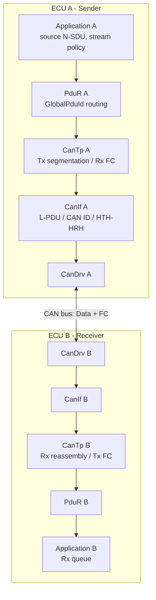
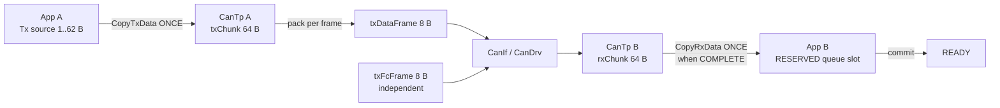
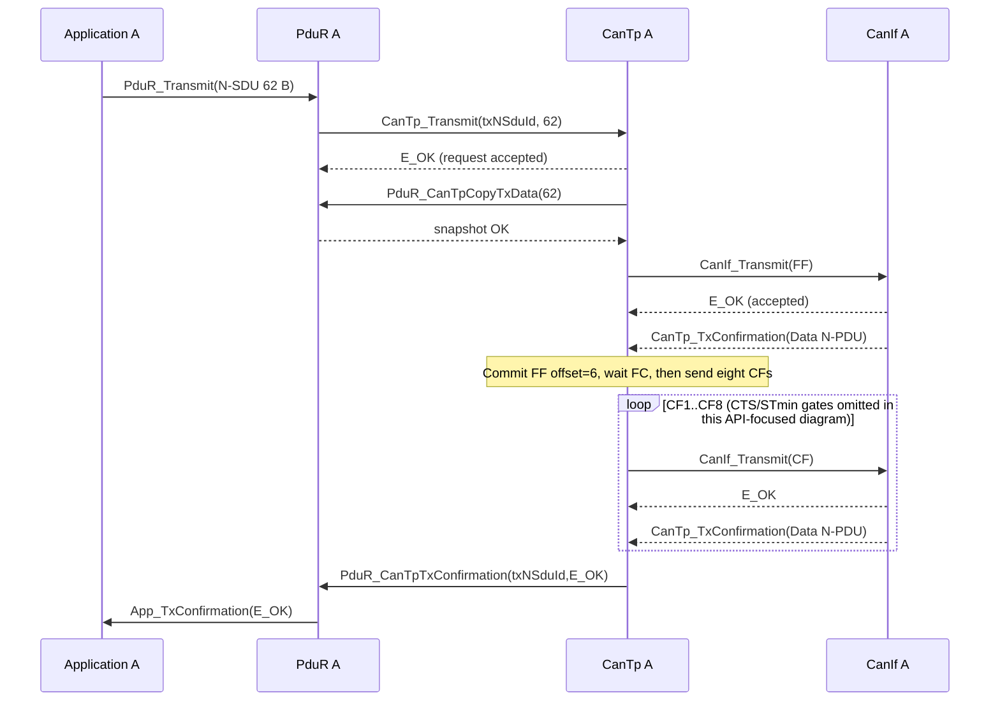
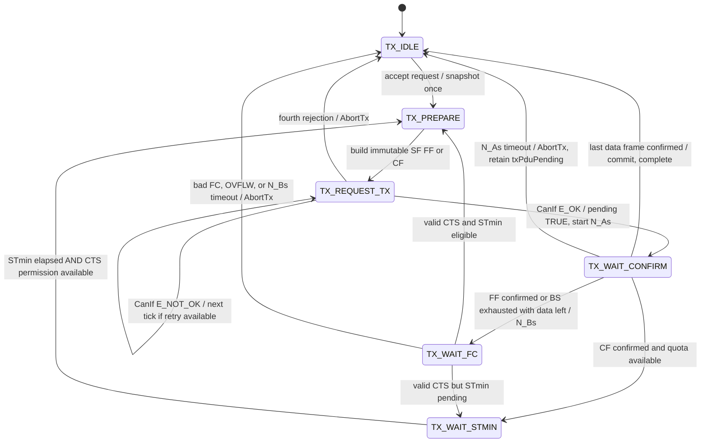
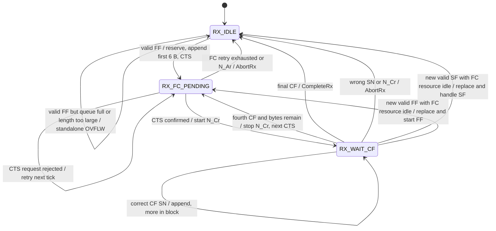
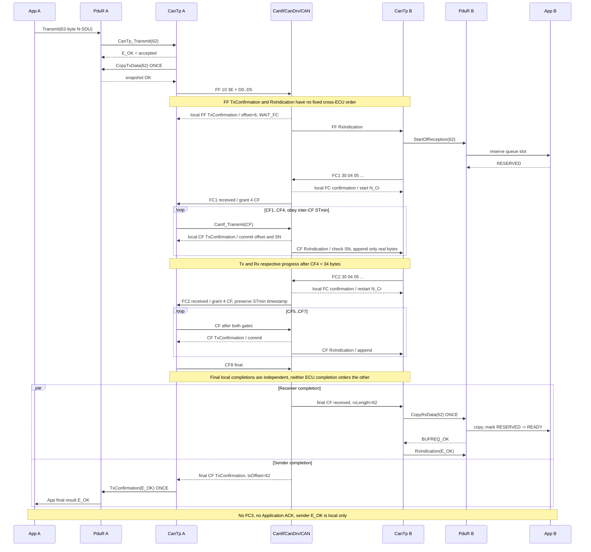
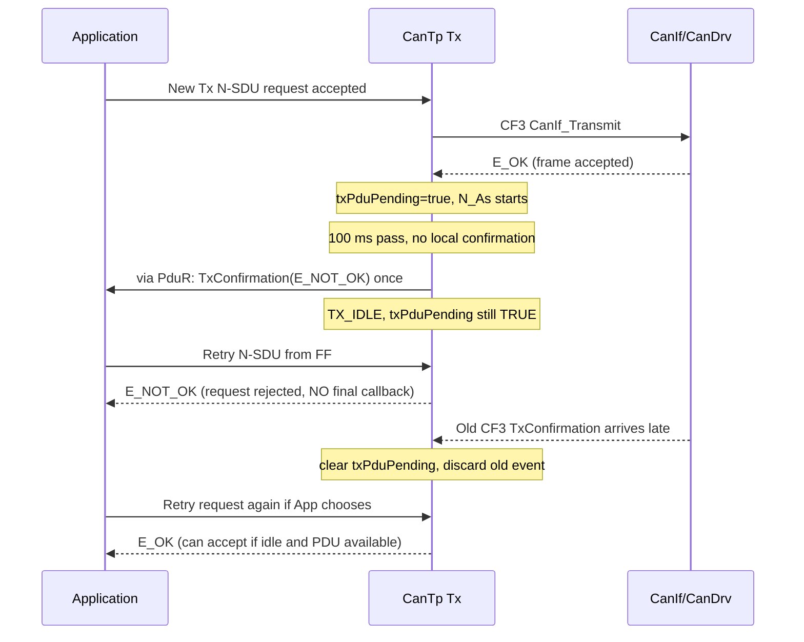
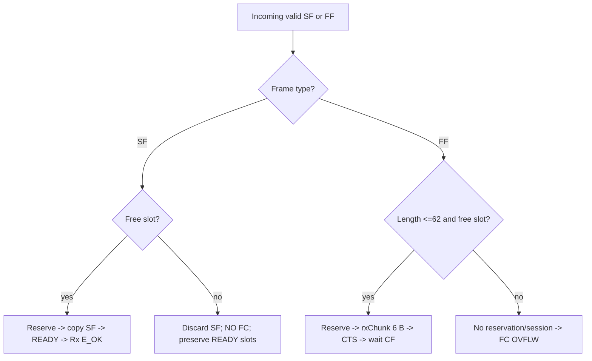

# MOCK CanTp — Hướng dẫn triển khai đầy đủ (Phase 1–3)

**Phiên bản:** Student Implementation Guide v2.0 · **Đối tượng:** nhóm đã hoàn thành mock COM/PduR/CanIf/CanDrv Part 1 · **Trạng thái:** tài liệu giao bài tổng hợp theo Architecture Baseline v1.0 đã duyệt.  
**Cách sử dụng:** đọc mục 1–7 trước khi code, triển khai theo mục 8 (Phase 1) → mục 9 (Phase 2) → mục 10 (Phase 3), nghiệm thu theo mục 11. **Chỉ có ba phase, không có Phase 4 trong phạm vi bài này.**

> Đây là **mock dành cho đào tạo**, mô phỏng những nguyên lý của CAN transport, không phải thư viện ISO-TP/AUTOSAR production-ready. Những đoạn C là *pseudo-C/khung interface* cần điều chỉnh với `Std_Types.h`, `PduInfoType`, quy ước ID và driver Part 1 đã có; không được coi là source code có thể build nguyên xi.

## 0. Bức tranh tổng thể: ba phase, một sản phẩm

| Phase | Xây dựng | Test phải đạt | Khi nào làm |
|---|---|---|---|
| **1 — Happy path** | SF, FF/CF, FC(CTS), SN, BS, STmin, Rx queue, hoàn tất N-SDU | **T01–T03** | Đầu tiên, bắt buộc |
| **2 — Retry & Timeout** | Retry Data/FC khi CanIf từ chối; `N_As/N_Ar/N_Bs/N_Cr`; abort và late confirmation | **T04–T08, T13**; chạy lại T01–T03 | Sau khi Phase 1 pass |
| **3 — Defensive behavior** | Sai SN/length, queue đầy, OVFLW, replacement cùng connection, bảo vệ FC pending | **T09–T12, T14**; regression tất cả | Sau Phase 2 |

T01–T14 là **14 test đã duyệt**; không bổ sung phase hoặc protocol mới. Nếu sát deadline: nộp Phase 1 với log rõ ràng, triển khai Phase 2 tiếp theo, ghi trung thực phần Phase 3 chưa hoàn tất; không ghi PASS khi chưa có evidence.

### 0.1 Định nghĩa thành công

- `CanTp_Transmit(...) == E_OK` **chỉ có nghĩa request được nhận**, không phải CAN message đã truyền xong.
- `CanTp_TxConfirmation(dataNPduId)` từ CanIf: **một Data frame** (SF/FF/CF) được xác nhận cục bộ.
- `PduR_CanTpTxConfirmation(txNSduId, result)` từ CanTp lên PduR: **toàn bộ N-SDU** đã hoàn tất hoặc abort, **một lần** cho mỗi Tx request được chấp nhận.
- `PduR_CanTpRxIndication(rxNSduId, E_OK)` chỉ phát **sau khi Application queue slot ở READY**.
- Không có Application ACK/NACK: `TxConfirmation(E_OK)` không chứng minh Application bên kia đã đọc hoặc xử lý block.

---

## 1. Kiến trúc & mapping: đừng nhầm N-SDU với N-PDU



**Large-message path:** `App → PduR → CanTp → CanIf → CanDrv → CAN` và chiều ngược lại. **Không truyền payload lớn qua COM**, COM scheduling 1 ms của Part 1 vẫn độc lập. PduR **không** thêm một full-message buffer hay adapter module mới.

### 1.1 Ví dụ mapping một dedicated connection

| Ý nghĩa | ECU A | ECU B |
|---|---|---|
| Data (SF/FF/CF) | Tx Data N-PDU → CanIf Tx L-PDU → CAN ID ví dụ `0x650` | CAN ID `0x650` → CanIf Rx L-PDU → Rx Data N-PDU |
| Flow Control | CAN ID ví dụ `0x658` → CanIf Rx L-PDU → Rx FC N-PDU | Tx FC N-PDU → CanIf Tx L-PDU → CAN ID `0x658` |
| Application | App Tx GlobalPduId → PduR route → Tx N-SDU ID | Rx N-SDU ID → PduR route → App Rx GlobalPduId |

`0x650`, `0x658` là **CAN ID minh họa**, không phải cấu hình bắt buộc. ID của `GlobalPduId`, N-SDU, N-PDU và L-PDU nằm ở **namespace khác nhau**, không được giả định số nguyên giống nhau. **Một Data Tx N-PDU** dùng chung cho FF và tất cả CF; **FC dùng N-PDU riêng**. Part 2 dùng GlobalPduId *implicit*, **không đóng gói GlobalPduId lên CAN payload**.

### 1.2 Configuration tối thiểu

```c
#define CANTP_MAX_NSDU        62U
#define CANTP_CHUNK_CAPACITY  64U
#define CANTP_FRAME_LENGTH     8U
#define CANTP_BS               4U
#define CANTP_STMIN_MS         5U
#define CANTP_MAX_RETRIES      3U  /* số RETRY, không tính initial */
#define CANTP_N_AS_MS        100U
#define CANTP_N_AR_MS        100U
#define CANTP_N_BS_MS        100U
#define CANTP_N_CR_MS        100U
```

- Classic CAN, Normal Addressing, **mọi CanTp N-PDU dài đúng 8 byte**; TX pad `00`; RX bỏ qua *giá trị* padding và chỉ copy số byte payload thực.
- CanIf kiểm tra `Length == 8` **chỉ với L-PDU đã map cho CanTp**, không áp ràng buộc này cho mọi COM PDU.
- SF: 1–7 byte; FF: 8–62 byte; mỗi CF tối đa 7 byte. Không cần truyền N-SDU >62 hay refill chunk.
- BS=4, STmin=5 ms cố định. Sender chỉ chấp nhận CTS có đúng BS/STmin này; OVFLW thì abort. Không triển khai FC(WAIT).
- Task/polling tick 1 ms. Các timer dùng cấu hình 100 ms **riêng ý nghĩa**, mặc dù có thể dùng một deadline cho mỗi state không chồng nhau.

---

## 2. Wire format và cách tự tính frame

Mỗi frame phát ra có 8 byte; cột PCI là các byte đầu của payload CAN trong Normal Addressing.

| Frame | Cấu trúc | Giải thích |
|---|---|---|
| SF | `[0x0L, D0..D(L-1), padding]` | `L=1..7`; 1 byte PCI |
| FF | `[0x10 \| ((L>>8)&0x0F), L&0xFF, D0..D5]` | `FF_DL` **12-bit** trải trên hai byte PCI |
| CF | `[0x20 \| SN, data≤7, padding]` | SN bốn bit; bắt đầu 1, modulo 16, **không reset sau FC** |
| FC CTS | `30 04 05 00 00 00 00 00` | FS=0, BS=4, STmin=5 ms |
| FC OVFLW | `32 00 00 00 00 00 00 00` | FS=2, receiver từ chối FF; byte còn lại trong ví dụ mock bằng 0 |

**Cách tính FF:** N-SDU dài 62 (`0x003E`) → byte 0 `0x10`, byte 1 `0x3E`, không được chỉ lưu độ dài trong một byte khi viết công thức. `FF_DL=8..62` mới là phân mảnh hợp lệ ở bài này.

**Ví dụ SF 5 byte** (`D=00 01 02 03 04`):

```text
CAN Data: 05 00 01 02 03 04 00 00
          ^^ length=5       ^^ ^^ padding
```

**Ví dụ FF của N-SDU 20 byte:** PCI `10 14`, rồi sáu byte `00 01 02 03 04 05`. Receiver lấy `20` từ `FF_DL`, **không** lấy `DLC=8` làm tổng message length.

**Ví dụ CF cuối chỉ còn 2 byte:** `2N DD DD 00 00 00 00 00`. Receiver phải dùng `min(7, totalLength - receivedLength)`, không append cả 7 byte padding.

---

## 3. Memory ownership & queue: ai cấp phát, ai được sửa?



| Buffer/flag | Owner | Khi nào được thay đổi? |
|---|---|---|
| Application Tx source | App A | Giữ nguyên đến final Tx success; nếu failure giữ lại để App tự quyết định retry. |
| `txChunkBuffer[64]` | CanTp A | Snapshot **một lần** cho N-SDU 1..62; không refill. |
| `txDataFrame[8]` | CanTp A | Build **một lần/frame**; bất biến qua các lần CanIf trả E_NOT_OK và lúc đang chờ confirmation. |
| `rxChunkBuffer[64]` | CanTp B | Nhận FF 6 B và append CF, chỉ nội bộ, không flush ở ranh giới BS. |
| Application Rx queue slot | App B | `FREE → RESERVED → READY` chỉ khi N-SDU hoàn chỉnh; lỗi `RESERVED → FREE`. |
| `txFcFrame[8]` | CanTp B | Buffer riêng cho CTS/OVFLW; không ghi đè nếu FC đang pending. |
| `txPduPending` / `fcTxPending` | CanTp | TRUE khi CanIf đã accept Data/FC nhưng chưa có matching confirmation. **Độc lập** logical session state. |

**PduR chỉ route và chuyển tiếp các buffer callbacks, không giữ bản copy full N-SDU.** `CopyRxData` một lần ở cuối, `CopyTxData` một lần ở đầu. Với SF, reserve/copy/READY có thể xảy ra trong một lần xử lý SF, không có FC.

Ví dụ queue hai slot:

```text
Trước FF:       slot0=READY   slot1=FREE
FF valid:       slot0=READY   slot1=RESERVED  (chỉ lưu FF vào rxChunk)
CF1..CF7:      slot0=READY   slot1=RESERVED  (App KHÔNG đọc partial)
CF final:      CopyRxData(62) -> slot1=READY -> RxIndication(E_OK)
Sai SN ở CF7:   slot1=FREE -> RxIndication(E_NOT_OK); slot0 không đổi
```

Chỉ một nơi được release reservation khi lỗi, ví dụ trong nhánh App/PduR được kích bởi `RxIndication(E_NOT_OK)`; **không release lại trong CanTp nếu callback đã release**.

---

## 4. API names, direction và contract bắt buộc

**Chữ ký gợi ý dành cho mock**, giữ type/header Part 1 nếu đã có; đừng tạo `Std_ReturnType`, `PduInfoType` phiên bản thứ hai. Các prototype callback là interface đào tạo, **không khẳng định giống nguyên văn AUTOSAR production**.

```c
/* App -> PduR: use the project's existing entry, e.g. */
Std_ReturnType PduR_Transmit(PduIdType appTxGlobalPduId,
                             const PduInfoType *request);

/* PduR -> CanTp: return E_OK = request accepted, NOT final success. */
Std_ReturnType CanTp_Transmit(PduIdType txNSduId,
                               const PduInfoType *request);

/* CanTp -> PduR -> App: ONE snapshot, exactly length bytes. */
BufReq_ReturnType PduR_CanTpCopyTxData(PduIdType txNSduId,
                                       uint8 *dst,
                                       PduLengthType length);

/* CanTp -> PduR -> App: ONE final result per ACCEPTED Tx request. */
void PduR_CanTpTxConfirmation(PduIdType txNSduId,
                               Std_ReturnType result);

/* CanTp -> PduR -> App: reserve one Rx queue slot. */
BufReq_ReturnType PduR_CanTpStartOfReception(PduIdType rxNSduId,
                                              PduLengthType totalLength);

/* CanTp -> PduR -> App: ONE complete N-SDU copy. */
BufReq_ReturnType PduR_CanTpCopyRxData(PduIdType rxNSduId,
                                        const uint8 *completeData,
                                        PduLengthType length);

/* CanTp -> PduR -> App: ONE final result per started Rx session. */
void PduR_CanTpRxIndication(PduIdType rxNSduId,
                             Std_ReturnType result);

/* CanIf -> CanTp: upper-layer N-PDU handle configured per Data/FC. */
void CanTp_RxIndication(PduIdType rxNPduId,
                         const PduInfoType *frame);
void CanTp_TxConfirmation(PduIdType txNPduId);

/* CanTp -> CanIf: Data or FC L-PDU handle; accepted != confirmed. */
Std_ReturnType CanIf_Transmit(PduIdType txLPduId,
                               const PduInfoType *frame);

void CanTp_MainFunction(void);  /* scheduling tick = 1 ms */
```

### 4.1 Mỗi API phải làm gì?

| API | Hành vi đúng | Sai lầm phổ biến |
|---|---|---|
| `CanTp_Transmit` | Reject ngay nếu len ngoài 1..62, active hoặc Data N-PDU locked; accepted request đi qua snapshot. | Trả `E_OK` nghĩa đã gửi hết. |
| `PduR_CanTpCopyTxData` | App copy chính xác `length` byte vào `txChunk`; một lần/N-SDU. | CanTp trỏ thẳng vào App buffer rồi App thay đổi. |
| `CanIf_Transmit` | Trả `E_OK`: *accepted* → pending TRUE, start `N_As`/`N_Ar`. | Commit offset/SN tại đây. |
| `CanTp_TxConfirmation` | Phân biệt **Data Tx N-PDU** và **FC Tx N-PDU**; giải quyết matching pending, gọi handler phù hợp. | Nhầm confirmation từng CF với final N-SDU. |
| `PduR_CanTpTxConfirmation` | Forward kết quả **một N-SDU** về đúng App/global route, một lần. | PduR tự retry hoặc tự chia CF. |
| `PduR_CanTpStartOfReception` | Reserve slot nếu đủ capacity; dùng cho FF (và primitive tương tự cho SF). | Đưa queue slot READY ngay sau FF. |
| `PduR_CanTpCopyRxData` | Copy **full complete** message vào reserved slot, set READY trước khi trả success. | Copy từng CF hoặc copy padding. |
| `PduR_CanTpRxIndication` | Inform final Rx success/failure; failure release reserved slot đúng một lần. | Báo E_OK trước khi slot READY. |

**Ranh giới return/callback:** reject *trước accept* → `CanTp_Transmit` trả `E_NOT_OK`, **không có final callback**. Sau khi request được accept, nếu snapshot/segmentation/retry/timeout lỗi → một `PduR_CanTpTxConfirmation(E_NOT_OK)`. Tương tự Rx chỉ báo final cho session đã bắt đầu, không gửi `RxIndication` cho SF/FF rác bị discard hoặc OVFLW standalone không mở session.

### 4.2 Minh họa vì sao cần hai confirmation



Tổng cộng **9 Data frame confirmations** cho FF+8 CF, nhưng **một** final `PduR_CanTpTxConfirmation` cho N-SDU. `App_TxConfirmation` là **callback App mock do nhóm đặt tên nhất quán**, không phải API bắt buộc cố định tên theo AUTOSAR.

---

## 5. Runtime data và state: đủ field, tránh overengineering

```c
typedef enum {
    TX_IDLE, TX_PREPARE, TX_REQUEST_TX,
    TX_WAIT_CONFIRM, TX_WAIT_FC, TX_WAIT_STMIN
} CanTp_TxState;

typedef enum {
    RX_IDLE, RX_FC_PENDING, RX_WAIT_CF
} CanTp_RxState;

typedef struct {
    CanTp_TxState state;
    uint8 txChunkBuffer[64];
    uint8 txDataFrame[8];
    PduLengthType totalLength;
    PduLengthType txOffset;      /* số byte Data đã TX CONFIRMED */
    uint8 nextSN;                /* CF đầu = 1; wrap modulo 16 */
    uint8 blockCount;            /* CF confirmed từ CTS gần nhất */
    uint8 retryCount;            /* đã thực hiện bao nhiêu retries sau initial */
    bool txPduPending;           /* Data accepted, chưa confirm */
    bool resultReported;         /* chống double final callback */
    bool priorCfExists;
    uint32 lastCfConfirmedMs;    /* STmin; KHÔNG reset khi CTS đến */
    uint32 dataAttemptDueMs;
    uint32 txTimerStartMs;       /* N_As hoặc N_Bs tùy state */
    uint8 preparedPayloadBytes;  /* commit SAU confirmation */
    uint8 preparedFrameType;     /* SF/FF/CF cho confirmation handler */
} CanTp_TxRuntime;

typedef struct {
    CanTp_RxState state;
    uint8 rxChunkBuffer[64];
    uint8 txFcFrame[8];
    PduLengthType totalLength, receivedLength;
    uint8 expectedSN;           /* reset 1 khi bắt đầu FF mới */
    uint8 blockCount;           /* số CF nhận trong block hiện tại */
    uint8 fcRetryCount;
    bool queueSlotReserved;
    bool fcRequestActive;       /* FC chờ request/retry/confirmation */
    bool fcTxPending;           /* FC accepted, chưa confirm; độc lập session */
    bool resultReported;
    uint32 fcAttemptDueMs, fcAcceptedAtMs, rxCrStartMs;
} CanTp_RxRuntime;
```

Đây là **field gợi ý**, không yêu cầu copy nguyên struct nếu Part 1 đã có abstraction phù hợp. `txPduPending` và `fcTxPending` không được tự động xóa khi `state=IDLE`. FC(OVFLW) có thể sở hữu `txFcFrame` khi **không có Rx session**.

**Pseudocode helper nên tách:** `CanTp_PrepareDataFrame()`, `CanTp_HandleDataTxConfirmation()`, `CanTp_AbortTx(reason)`, `CanTp_CompleteRx()`, `CanTp_AbortRx(reason)`, `CanTp_RequestFc()`, `CanTp_HandleFcTxConfirmation()`. Đây là chia việc để code dễ đọc, không phải thêm public API.

### 5.1 Main-loop contract

```c
void Scheduler_1ms(void)
{
    Can_MainFunction_Write();  /* dispatch local TxConfirmations FIRST */
    Can_MainFunction_Read();   /* dispatch received frames second */
    CanTp_MainFunction();      /* timeouts, retries, STmin eligible */
    Com_MainFunctionTx();      /* Part 1: independent COM scheduling */
}
```

- Đây là thứ tự polling mock đã chốt. Nếu event confirmation tới trong cùng tick timeout thì dispatch event trước khi xét timeout; không xử lý timeout cũ đã được stop.
- `CanTp_MainFunction()` không được gửi nhiều request retries cho cùng frame trong một tick.
- **Không suy ra thứ tự callback toàn cục giữa hai ECU.** Event timeline trong sequence diagram là logic dependency, không chứng minh receiver thành công trước sender hay ngược lại.

---

## 6. State machine đã chốt: Tx 6 state, Rx 3 state

### 6.1 Tx v1.1: snapshot / abort / complete là action, không phải state



**Guard quan trọng:** TX_WAIT_STMIN chỉ vào TX_PREPARE nếu *đã có FC permission*. Với CF1 sau FF chỉ cần CTS (không lấy FF TxConfirmation làm mốc STmin). Với CF5 sau CF4 cần **cả CTS2 và `lastCfConfirmedMs+5`**. Nếu session đã abort thì late Data confirmation chỉ clear pending, không commit offset hoặc phát final thành công.

**Sau matching Data confirmation**, xử lý theo thứ tự: (1) commit prepared bytes & SN; (2) nếu đủ `totalLength` thì complete; (3) nếu FF hoặc vừa xác nhận CF thứ tư mà còn data thì vào WAIT_FC; (4) còn quota thì chờ STmin hoặc gửi CF. **Không gửi FC thứ ba sau CF8 khi N-SDU 62 B kết thúc.**

### 6.2 Rx v1.0: ba state cho reassembly, FC ownership riêng



**Đừng hiểu sai sơ đồ:** `RX_IDLE` vẫn có thể có standalone FC(OVFLW) đang gửi; state `RX_FC_PENDING` dành cho **active Rx session và CTS**, nhưng `fcRequestActive/fcTxPending` sống riêng để bảo vệ `txFcFrame` ngay cả khi không có session. `N_Cr` chỉ chạy sau CTS local confirmation, sau mỗi CF hợp lệ nếu còn chờ CF trong cùng block; dừng khi đang cấp CTS tiếp hoặc hoàn tất.

### 6.3 Sequence: FF + 2 block, N-SDU 62 B



Sơ đồ mô tả quan hệ logic, **không ép thứ tự callback FF/CF xuyên hai ECU**. Việc FC1 nhận quá sớm so với FF confirmation ở sender không có session ID riêng; baseline không xây dựng recovery phức tạp cho race này. Trong fixture happy path phải log thứ tự thực tế; không khẳng định kiến trúc bảo đảm thứ tự toàn mạng.

---

## 7. Frame vectors: học sinh phải tự dựng và đối chiếu từng byte

Dùng payload tăng dần `D[i]=i` (hex), khởi tạo queue sạch. Data CAN ID ví dụ `0x650`, FC CAN ID ví dụ `0x658`.

### T01 — 5-byte SF

```text
App payload: 00 01 02 03 04
SF:          05 00 01 02 03 04 00 00
```

**Expected:** một Data frame, 0 FC, một `CopyTxData(5)`, một `CopyRxData(5)`, Rx slot READY chứa **đúng 5 byte**, một final Tx E_OK và một Rx E_OK. `00 00` cuối là padding, **không** có trong Rx message.

### T02 — 20-byte segmented message

```text
App payload: 00 01 02 ... 13  (20 bytes)
FF :         10 14 00 01 02 03 04 05
FC1:         30 04 05 00 00 00 00 00
CF1:         21 06 07 08 09 0A 0B 0C
CF2:         22 0D 0E 0F 10 11 12 13
```

**Giải thích tính toán:** FF mang 6, còn 14 → `ceil(14/7)=2` CF; vì <4 CF nên **không cần FC2**. Confirmed `txOffset`: `6 → 13 → 20`. Rx chỉ copy một lần `20` byte sau CF2; không copy từng CF.

### T03 — 62-byte segmented message

```text
App payload: 00 01 02 ... 3D (62 bytes)
FF : 10 3E 00 01 02 03 04 05
FC1: 30 04 05 00 00 00 00 00
CF1: 21 06 07 08 09 0A 0B 0C
CF2: 22 0D 0E 0F 10 11 12 13
CF3: 23 14 15 16 17 18 19 1A
CF4: 24 1B 1C 1D 1E 1F 20 21
FC2: 30 04 05 00 00 00 00 00
CF5: 25 22 23 24 25 26 27 28
CF6: 26 29 2A 2B 2C 2D 2E 2F
CF7: 27 30 31 32 33 34 35 36
CF8: 28 37 38 39 3A 3B 3C 3D
```

| Frame confirmed / received | FF | CF1 | CF2 | CF3 | CF4 | CF5 | CF6 | CF7 | CF8 |
|---|---:|---:|---:|---:|---:|---:|---:|---:|---:|
| Byte count ở **từng ECU sau event tương ứng** | 6 | 13 | 20 | 27 | 34 | 41 | 48 | 55 | 62 |

**Tính toán:** 62−6=56; 56/7=8 CF; BS4 → hai CTS, một sau FF và một sau CF4; **không có CTS thứ ba** khi CF8 cũng vừa đủ 4 CF vì N-SDU đã hoàn thành. `nextSN` sau CF8 confirmed là 9 (nếu giữ field đến cleanup), không reset sau FC2. SN chỉ wrap 15→0 khi message dài đủ; giới hạn 62 B hiện tại không chạm wrap, nhưng rule vẫn giữ.

### 7.1 Boundary sanity examples (không tạo test gate mới)

- SF dài 7: `07 D0 D1 D2 D3 D4 D5 D6`, **không** FC.
- FF dài 8: FF6, còn 2 → CF1 `[21 D6 D7 00 00 00 00 00]`, **một** CTS.
- FF dài 60: FF6 + 7 CF×7 + CF8 5 byte; padding hai byte cuối CF8; check `min(7, remaining)`.
- Malformed: `SF_DL=0`, `FF_DL=5` bị discard, không ảnh hưởng Rx session đang hoạt động.

---
## 8. Phase 1 — Hướng dẫn code HAPPY PATH theo thứ tự

**Gate:** T01–T03. Phase 1 làm trước retry/timeout; mock có thể cho CanIf luôn trả E_OK và callback đúng hạn, nhưng cách quản lý offset, ownership và state **phải đúng từ đầu** để Phase 2 không phải viết lại.

### Item P1.1 — Kết nối các route từ App đến CanIf

1. Tạo cấu hình `AppTxGlobalPduId → PduR Tx route → CanTp TxNSduId` và chiều nhận tương ứng.
2. Cấu hình `TxDataNPduId → CanIf Tx LPduId` cùng CAN ID Data; cấu hình riêng Tx FC / Rx FC N-PDU.
3. CanIf RxIndication tra CAN ID/L-PDU để gọi `CanTp_RxIndication(rxNPduId, pduInfo)`; `CanTp_TxConfirmation(txNPduId)` cũng route theo đúng Data hoặc FC N-PDU, **không dựa vào số nguyên ngẫu nhiên trùng nhau**.
4. Assert `Length == 8` cho CanTp-mapped L-PDUs tại CanIf. Không thay đổi rule chiều dài COM của Part 1.

**Debug dễ nhất:** log `GlobalId, NSduId, NPduId, LPduId, CAN ID` ở đầu mỗi API. Nếu nhận FC nhưng handler đọc thành Data TxConfirmation, kiểm tra lại mapping N-PDU, không sửa SN logic.

### Item P1.2 — Tx accept và snapshot N-SDU

```c
Std_ReturnType CanTp_Transmit(PduIdType txNSduId,
                               const PduInfoType *request)
{
    if (request == NULL_PTR || request->SduLength < 1U ||
        request->SduLength > CANTP_MAX_NSDU ||
        tx.state != TX_IDLE || tx.txPduPending) {
        return E_NOT_OK; /* rejected BEFORE accept: NO final callback */
    }

    /* Session is now accepted. Initialize counters, lengths and flags. */
    tx.totalLength = request->SduLength;
    tx.txOffset = 0U;
    tx.nextSN = 1U;
    tx.blockCount = 0U;
    tx.resultReported = false;
    tx.state = TX_PREPARE;

    if (PduR_CanTpCopyTxData(txNSduId, tx.txChunkBuffer,
                              tx.totalLength) != BUFREQ_OK) {
        CanTp_AbortTx(REASON_COPY_FAILED); /* final E_NOT_OK ONCE */
        return E_OK; /* accepted request; failure delivered via callback */
    }
    /* Build first SF or FF; MainFunction requests it, or schedule by policy. */
    CanTp_PrepareDataFrame();
    return E_OK;
}
```

Đây chỉ là khung về **thời điểm accept**; trong code thực tế, tránh tạo callback bất ngờ *đồng bộ ngay trong `CanTp_Transmit`* nếu tầng App không hỗ trợ callback re-entrant. Có thể đặt snapshot vào `CanTp_MainFunction()` tick kế tiếp sau khi accept, với cùng semantics: callback cuối đúng một lần. **Không** thay đổi nghĩa `CanTp_Transmit E_OK` thành “gửi thành công”.

**Ví dụ 20 B:** App source có `00..13`, `CopyTxData(20)` copy đủ 20 byte sang `txChunkBuffer[0..19]`. App giữ nguyên source. `txOffset` ban đầu 0 mặc dù snapshot đã chứa đủ 20 byte: offset này đếm **bytes đã confirmed trên CAN**, không phải bytes đã copy.

### Item P1.3 — Đóng gói SF/FF/CF với một hàm duy nhất

```c
void CanTp_PrepareDataFrame(void)
{
    PduLengthType left = tx.totalLength - tx.txOffset;
    uint8 payloadLen;
    memset(tx.txDataFrame, 0, 8U); /* always pad Tx to DLC 8 */

    if (tx.totalLength <= 7U) {
        tx.txDataFrame[0] = (uint8)tx.totalLength;
        memcpy(&tx.txDataFrame[1], tx.txChunkBuffer, tx.totalLength);
        payloadLen = (uint8)tx.totalLength;
        tx.preparedFrameType = FRAME_SF;
    } else if (tx.txOffset == 0U) {
        tx.txDataFrame[0] = 0x10U | ((tx.totalLength >> 8U) & 0x0FU);
        tx.txDataFrame[1] = (uint8)(tx.totalLength & 0xFFU);
        memcpy(&tx.txDataFrame[2], tx.txChunkBuffer, 6U);
        payloadLen = 6U;
        tx.preparedFrameType = FRAME_FF;
    } else {
        payloadLen = (uint8)((left < 7U) ? left : 7U);
        tx.txDataFrame[0] = 0x20U | (tx.nextSN & 0x0FU);
        memcpy(&tx.txDataFrame[1], &tx.txChunkBuffer[tx.txOffset], payloadLen);
        tx.preparedFrameType = FRAME_CF;
    }
    tx.preparedPayloadBytes = payloadLen;
    tx.retryCount = 0U;              /* reset ONLY for a different frame */
    tx.state = TX_REQUEST_TX;
}
```

**Chú ý:** `memcpy` chỉ lấy bytes thực. Với N-SDU 60 B, CF cuối có 5 bytes thực + 2 padding; `preparedPayloadBytes=5`, không phải 7. Không sửa `txOffset` hay `nextSN` trong hàm prepare. Kiểm tra buffer bounds dựa trên `totalLength ≤62`.

### Item P1.4 — Phát Data và COMMIT sau matching TxConfirmation

```c
/* TX_REQUEST_TX: Phase 1 fixture always returns E_OK. */
if (CanIf_Transmit(txDataLPduId, &dataPduInfo) == E_OK) {
    tx.txPduPending = true;
    tx.state = TX_WAIT_CONFIRM;
    /* Phase 2 starts N_As at this exact event. */
}

/* Called ONLY for Data Tx N-PDU. */
void CanTp_OnDataTxConfirmation(void)
{
    if (!tx.txPduPending) return;       /* unexpected duplicate */
    tx.txPduPending = false;
    if (tx.state != TX_WAIT_CONFIRM) return; /* late after abort */

    tx.txOffset += tx.preparedPayloadBytes;
    if (tx.preparedFrameType == FRAME_CF) {
        tx.nextSN = (tx.nextSN + 1U) & 0x0FU;
        ++tx.blockCount;
        tx.priorCfExists = true;
        tx.lastCfConfirmedMs = nowMs;  /* STmin starts HERE */
    }
    if (tx.txOffset == tx.totalLength) { CanTp_CompleteTx(); return; }
    if (tx.preparedFrameType == FRAME_FF || tx.blockCount == CANTP_BS) {
        tx.state = TX_WAIT_FC;         /* Phase 2 starts N_Bs HERE */
        return;
    }
    tx.state = TX_WAIT_STMIN;
}
```

**Không được commit khi `CanIf_Transmit` trả E_OK.** Ví dụ CF3 trước local confirmation: `txOffset=20`, `nextSN=3`, `blockCount=2`. Sau matching confirmation: `27, 4, 3`. `CanTp_CompleteTx()` báo `PduR_CanTpTxConfirmation(E_OK)` một lần, cleanup session, không tạo Application ACK.

### Item P1.5 — Rx SF và FF: validate rồi mới reserve

1. Kiểm tra CanIf đã lọc length 8, đọc high nibble `PCI[0] & 0xF0`.
2. SF: `length = frame[0]&0x0F`; chỉ nhận 1..7. Nếu queue đủ chỗ, reserve, copy `frame[1..length]`, set READY, RxIndication(E_OK). SF không đòi FC.
3. FF: `total = ((frame[0]&0x0F)<<8)|frame[1]`; nếu 8..62 và queue còn chỗ thì `StartOfReception(total)`, reserve slot, copy **6 bytes** từ `frame[2..7]` vào `rxChunk[0..5]`, `receivedLength=6`, `expectedSN=1`, `blockCount=0`, prepare CTS.
4. Phase 3 xử lý queue đầy và FF oversized bằng OVFLW, malformed bằng discard; **không để** những trường hợp đó vô tình được nhận như FF bình thường.

```c
/* Pseudocode; use real config route and queue API. */
if (isFF && totalLength >= 8U && totalLength <= 62U) {
    if (PduR_CanTpStartOfReception(rxNSduId, totalLength) != BUFREQ_OK) {
        /* Phase 3: FC(OVFLW) when no capacity; no active Rx session. */
        return;
    }
    rx.queueSlotReserved = true;
    memcpy(rx.rxChunkBuffer, &frame->SduDataPtr[2], 6U);
    rx.receivedLength = 6U;
    rx.expectedSN = 1U;
    rx.blockCount = 0U;
    CanTp_RequestFc(FC_CTS);
    rx.state = RX_FC_PENDING;
}
```

**Ví dụ 62 B:** FF `10 3E 00..05` → slot RESERVED, `receivedLength=6`. App chưa được nhìn 6 byte này. Sau FC1 local confirmation mới vào `RX_WAIT_CF`.

### Item P1.6 — FC(CTS) và điều kiện gửi CF

Receiver build FC1 **đúng** `30 04 05 00 00 00 00 00`, phát qua **FC Tx N-PDU → FC L-PDU**. CanIf `E_OK` = accepted. Sau local FC TxConfirmation, clear pending, vào `RX_WAIT_CF`; Phase 2 khởi động `N_Cr` tại đây.

Sender nhận FC qua **Rx FC N-PDU**, chỉ cho đi tiếp nếu `FS=CTS`, `BS=4`, `STmin=5`. Cấp tối đa 4 CF cho block. Nếu đang WAIT_FC thì dừng `N_Bs` (Phase 2). Nếu CF trước đã confirmed, điều kiện STmin vẫn đang chạy độc lập; CTS **không** reset đồng hồ. CF1 sau FF không cần STmin từ FF.

```c
/* Simplified eligibility predicate: tested before preparing next CF. */
bool CanSendNextCf(uint32 now)
{
    bool hasPermission = (tx.blockCount < CANTP_BS) && tx.fcPermissionGranted;
    bool timeReady = !tx.priorCfExists ||
                     ((uint32)(now - tx.lastCfConfirmedMs) >= CANTP_STMIN_MS);
    return hasPermission && timeReady;
}
```

**Lưu ý về `blockCount`:** ví dụ lưu số CF confirmed từ CTS gần nhất, reset về 0 khi CTS được accept hợp lệ. `fcPermissionGranted` là flag minh họa, có thể suy ra từ state/CTS grant trong implementation; cần tránh bug: đặt `blockCount=0` sau CTS2 nhưng vẫn để `priorCfExists=true` và không sửa `lastCfConfirmedMs`.

### Item P1.7 — Rx CF và completion một lần

```c
/* Only when RX_WAIT_CF, after CanIf DLC filter. */
uint8 sn = frame->SduDataPtr[0] & 0x0FU;
if (sn != rx.expectedSN) {
    CanTp_AbortRx(REASON_WRONG_SN); /* Phase 3 explicitly tests this */
    return;
}
PduLengthType remain = rx.totalLength - rx.receivedLength;
uint8 realBytes = (uint8)((remain < 7U) ? remain : 7U);
memcpy(&rx.rxChunkBuffer[rx.receivedLength], &frame->SduDataPtr[1], realBytes);
rx.receivedLength += realBytes;
rx.expectedSN = (rx.expectedSN + 1U) & 0x0FU;
++rx.blockCount;

if (rx.receivedLength == rx.totalLength) {
    CanTp_CompleteRx();       /* FIRST: no extra CTS even if blockCount==4 */
} else if (rx.blockCount == CANTP_BS) {
    CanTp_RequestFc(FC_CTS);  /* stop N_Cr until CTS confirmed */
    rx.state = RX_FC_PENDING;
} else {
    /* Phase 2: restart N_Cr after valid CF, waiting for next one. */
}
```

`CanTp_CompleteRx()` phải gọi `PduR_CanTpCopyRxData(rxNSduId, rx.rxChunkBuffer, rx.totalLength)` **đúng một lần**. App copy vào RESERVED slot, set READY **trước khi** callback trả `BUFREQ_OK`, rồi CanTp gọi `PduR_CanTpRxIndication(E_OK)`. Nếu copy thất bại, abort → release reserved slot → báo Rx `E_NOT_OK`; không được READY partial message.

### Phase 1 — Checklist debug trước khi chuyển Phase 2

- [ ] T01 SF 5 B: đúng 8 byte, không FC, queue payload 5 B.
- [ ] T02 20 B: FF+2 CF, đúng 1 CTS, offset 6→13→20.
- [ ] T03 62 B: FF+8 CF, đúng 2 CTS; CF4→CTS2→CF5; không CTS3.
- [ ] Tx `CopyTxData()` 1 lần; Rx `CopyRxData()` 1 lần mỗi N-SDU thành công; không có buffer refill.
- [ ] Tx offset/SN chỉ commit sau confirmation; App Rx slot READY trước final Rx E_OK.
- [ ] API names và mapping Data/FC N-PDU kiểm tra được qua log; COM Part 1 vẫn chạy bình thường.

---

## 9. Phase 2 — Retry, bốn timer, abort và late confirmation

**Gate:** T04–T08, T13, cộng regression T01–T03. Không bắt học sinh thực hiện queue-full, OVFLW hoặc replacement T09–T12/T14 ở Phase 2, nhưng đã có flag bảo vệ FC để Phase 3 không phải đổi kiến trúc.

### Item P2.1 — Retry một frame khi CanIf E_NOT_OK

**Policy mock kế thừa COM:** initial attempt + **tối đa 3 lần retry**, 1 attempt/frame/tick. Chỉ retry nếu `CanIf_Transmit(frame) == E_NOT_OK`. Giữ nguyên **tám byte** N-PDU, `txOffset`, `nextSN` và `blockCount` qua tất cả attempts. Hết 4 rejection → abort **toàn bộ N-SDU**, không chỉ drop frame hiện tại. App tự chọn có retry N-SDU mới từ FF hay không; không đặt số lần App retry cố định.

```c
/* In TX_REQUEST_TX, called no more than once per eligible 1-ms tick. */
if (now >= tx.dataAttemptDueMs) {       /* use wrap-safe scheduling in real code */
    Std_ReturnType ret = CanIf_Transmit(txDataLPduId, &dataPduInfo);
    if (ret == E_OK) {
        tx.txPduPending = true;
        tx.txTimerStartMs = now;        /* start N_As */
        tx.state = TX_WAIT_CONFIRM;
    } else if (tx.retryCount < 3U) {
        ++tx.retryCount;
        tx.dataAttemptDueMs = now + 1U;
    } else {
        CanTp_AbortTx(REASON_DATA_RETRY_EXHAUSTED);
    }
}
```

**Ví dụ T05, CF3 N-SDU 62 B:** `txOffset=20`, `nextSN=3`, frame `23 14 15 16 17 18 19 1A`.

```text
Tick t    request #1 -> E_NOT_OK | frame identical | offset=20, SN=3
Tick t+1  request #2 -> E_NOT_OK | frame identical | offset=20, SN=3
Tick t+2  request #3 -> E_OK     | start N_As   | offset STILL 20
Later matching Data TxConfirmation    | offset=27, nextSN=4, blockCount=3
```

**Ví dụ T06:** thêm request thứ tư ở `t+3 → E_NOT_OK` → abort, final `E_NOT_OK` **một lần**, không gửi CF4, App giữ source. Lưu ý `retryCount=3` nghĩa đã có ba retries, tổng attempts **4**; không mắc lỗi off-by-one.

**FC retry tương tự:** dùng `txFcFrame[8]` và `fcRetryCount` riêng; hết attempts cho CTS của active Rx → abort Rx/release slot. FC(OVFLW) standalone thất bại thì cleanup thao tác FC, **không phát RxIndication của một session chưa từng tồn tại**.

### Item P2.2 — Dùng đồng hồ monotonic 1 ms, bốn timer KHÁC NGHĨA

```c
/* Safe for unsigned short intervals with modulo counter arithmetic. */
static bool HasElapsed(uint32 nowMs, uint32 startMs, uint32 durationMs)
{
    return ((uint32)(nowMs - startMs) >= durationMs);
}
```

| Timer | Start chính xác khi nào? | Stop/reset | Khi >=100 ms và chưa có event |
|---|---|---|---|
| **N_As** | `CanIf_Transmit(Data)==E_OK` | matching Data TxConfirmation | Abort Tx, final E_NOT_OK một lần, **giữ `txPduPending=true`** |
| **N_Ar** | `CanIf_Transmit(FC)==E_OK` | matching FC TxConfirmation | Abort active Rx/release slot; **giữ `fcTxPending=true`**; không retransmit FC đã accept |
| **N_Bs** | FF TxConfirmed hoặc CF thứ 4 TxConfirmed **mà còn data** | CTS hợp lệ hoặc abort | Abort Tx; App quyết định retry N-SDU từ FF |
| **N_Cr** | FC(CTS) local TxConfirmed | CF hợp lệ → restart nếu tiếp tục chờ CF trong cùng block; stop để gửi FC mới / complete / abort | Abort Rx, release RESERVED, final Rx E_NOT_OK một lần |

**STmin không phải một trong bốn timeout.** Nó là gate 5 ms kể từ **CF TxConfirmation trước**, bao gồm CF4→CF5 qua FC2. Không có STmin tính từ FF cho CF1. `N_Bs` và STmin có thể đồng thời ảnh hưởng eligibility nhưng **FC không reset STmin**.

**Timeline N_Bs (T07):**

```text
t=200 ms: FF local TxConfirmation -> WAIT_FC; N_Bs start=200.
t=299 ms: elapsed=99 -> KHÔNG timeout.
t=300 ms: elapsed=100 -> nếu chưa nhận CTS hợp lệ, AbortTx(E_NOT_OK).
Nếu CTS được dispatch trong Can_MainFunction_Read ở cùng tick t=300,
handle CTS trước CanTp_MainFunction để stop timer; không bắn timeout cũ.
```

**Timeline N_Cr (T08):** CTS local confirmed ở t=100 → N_Cr starts; CF1 hợp lệ đến t=120 → start lại ở 120; CF2 vắng đến t=220 → abort, queue `RESERVED→FREE`, không có message READY.

**N_Ar ví dụ:** CTS được CanIf accept lúc t=40, không có matching FC confirmation tại t=140 → abort Rx/release reservation nhưng `fcTxPending=TRUE`. Late FC confirmation tại t=150 chỉ clear flag; **không** tái tạo session hay vào `RX_WAIT_CF`.

### Item P2.3 — `N_As` timeout: session abort KHÁC resource release



Không gửi lại CF3 sau `CanIf E_OK` dù thiếu confirmation; không tự clear pending do timer thứ hai. Nếu confirmation vĩnh viễn không tới, cần **external lower-layer recovery đã xác nhận mailbox trống**, không bắt học sinh viết abort mailbox/controller reset. T13 chứng minh flag và callback count, không yêu cầu sửa driver.

### Item P2.4 — Một abort helper Tx và Rx, chống double notification

```c
void CanTp_AbortTx(TxAbortReason reason)
{
    if (tx.state == TX_IDLE) return; /* no active accepted Tx session */
    if (!tx.resultReported) {
        tx.resultReported = true;
        PduR_CanTpTxConfirmation(txNsduId, E_NOT_OK);
    }
    tx.state = TX_IDLE;
    /* Clear logical timers and fields as needed, BUT DO NOT blindly
       clear txPduPending if an accepted Data frame is outstanding. */
}

void CanTp_AbortRx(RxAbortReason reason)
{
    if (rx.state == RX_IDLE) return; /* standalone OVFLW has no Rx session */
    if (!rx.resultReported) {
        rx.resultReported = true;
        PduR_CanTpRxIndication(rxNsduId, E_NOT_OK);
        /* PduR/App failure callback releases RESERVED slot exactly once. */
    }
    rx.state = RX_IDLE;
    rx.queueSlotReserved = false; /* mirror owner state after release */
    /* DO NOT blindly clear fcTxPending / overwrite txFcFrame. */
}
```

**Lưu ý pseudo-code:** Đặt callback và state cleanup theo quy tắc chống callback re-entrancy của project. Nếu App/PduR giải phóng slot qua `RxIndication(E_NOT_OK)`, CanTp chỉ đồng bộ flag; **không giải phóng lần hai**. `CopyTxData`/`CopyRxData` lỗi → abort ngay, không retry copy. Với `CanTp_Transmit` bị reject trước accept thì **không gọi** `AbortTx`, không gửi final callback.

### Item P2.5 — FC ownership & confirmation handler

```text
Prepare CTS / OVFLW in txFcFrame[8] ONCE
   -> FC CanIf_Transmit E_NOT_OK: retry next tick, at most 3 retries
   -> FC CanIf_Transmit E_OK: fcTxPending=TRUE, N_Ar starts
         -> matching FC TxConfirmation: clear pending;
              CTS + matching active Rx session => RX_WAIT_CF, start N_Cr
              OVFLW standalone => release FC operation, stay RX_IDLE
              session already aborted => clear pending only
         -> N_Ar timeout: abort active Rx if any; keep pending lock
```

Định tuyến FC TxConfirmation **theo Tx FC N-PDU ID**, không theo CAN ID Data hoặc `txDataFrame`. `fcRequestActive` có thể TRUE ngay từ giai đoạn request retry khi `fcTxPending` chưa TRUE; cần bảo vệ frame trong cả hai thời kỳ. Không ghi đè `txFcFrame` cho CTS mới nếu FC cũ vẫn unresolved.

### Phase 2 — Checklist debug

- [ ] T04: `nextCF_CanIfRequestMs - priorCF_TxConfirmationMs >= 5 ms` cho **tất cả CF liền kề**, kể cả CF4→CF5.
- [ ] T05: ba attempts CF3 ở ba ticks liên tiếp, 8 bytes giống nhau, offset/SN không commit sớm.
- [ ] T06: bốn rejected attempts → một Tx E_NOT_OK, không CF4, CanTp không retry cả N-SDU.
- [ ] T07: N_Bs expire đúng mốc; không CF khi chưa CTS.
- [ ] T08: N_Cr expire, release queue slot, không READY partial.
- [ ] T13: N_As expire → final fail một lần, reject Tx mới khi pending, late callback unlock mà không báo E_OK.
- [ ] FC retry và N_Ar check phụ: giữ `fcTxPending` đúng, không retransmit accepted FC, không double Rx final.
- [ ] Regression T01–T03 vẫn PASS với timeout/retry enabled.

---

## 10. Phase 3 — Defensive behavior (không phải Phase 4)

**Gate:** T09–T12, T14, cộng regression toàn bộ trước đó. Không phát triển retransmission app-level ACK, FC(WAIT), mailbox reset hay transport cho N-SDU >62.

### Item P3.1 — Kiểm tra PCI/length và padding

**Validation order:** CanIf chỉ giao CanTp length đúng 8; sau đó CanTp đọc frame type và các PCI fields. Các frame invalid **không thay thế Rx session cũ**.

| Input | Rx reaction | Ví dụ |
|---|---|---|
| SF_DL=0 | Discard, không reserve; không reset active Rx | `00 ...` |
| SF_DL=1..7 | SF hợp lệ; xử lý reserve/copy/READY nếu queue còn chỗ | `03 AA BB CC 00...` |
| FF_DL<8 | Discard, không CTS, không thay thế | `10 05 ...` |
| FF_DL=8..62 | FF định dạng hợp lệ; xử lý slot và replacement | `10 3E ...` |
| FF_DL>62 | FC(OVFLW), không reserve/session mới khi RX_IDLE | `10 64 ...` (100 B) |
| CanTp L-PDU `Length != 8` | CanIf reject | L-PDU CAN TP riêng, không ảnh hưởng COM |

**Padding:** Tx padding `00`; Rx không yêu cầu Rx padding phải 0 (chỉ ignore), `realBytes=min(7, remaining)` cho CF cuối. Nếu FF_DL=60, Rx nhận CF8 chỉ 5 data bytes, không copy hai padding bytes cuối.

### Item P3.2 — Queue full: SF khác FF



**T10 ví dụ:** queue có hai slot `READY/READY`, receiver nhận FF length62, `StartOfReception` báo no capacity → không tạo Rx session, không thay READY slots, phát `32 00 00 00 00 00 00 00` qua FC Tx N-PDU. Sender nhận OVFLW → abort và final Tx E_NOT_OK; **không** có Rx final callback nếu receiver chưa mở session.

**T11 ví dụ:** RX_IDLE, FF `[10 64 ...]` khai báo 100 B >62 → OVFLW, không reserve slot. Nếu đang có active session, frame oversized không được xem là **valid replacement** để vô tình abort session cũ; phạm vi T11 dùng RX_IDLE.

**Queue full SF:** discard SF, không tạo FC vì SF không có cơ chế FC. Nếu nhận SF hợp lệ khi active Rx đang chờ CF, thực hiện logic replacement trước (abort/release reserved old slot) rồi kiểm tra capacity mới; nếu vẫn đầy thì discard SF. Không làm ảnh hưởng những slot đã READY.

### Item P3.3 — Wrong SN: abort ngay trước append

**T09 ví dụ:** FF + CF1 + CF2 đã được append, `expectedSN=3`, `receivedLength=20`. Receiver nhận CF với PCI `0x24` (SN=4) thay vì `0x23`.

```text
Check SN (4 != 3) → AbortRx immediately → reserved slot FREE
                                  → RxIndication(E_NOT_OK) ONCE
                                  → NO append, NO CopyRxData, NO READY
```

`expectedSN` reset về 1 **chỉ khi bắt đầu FF N-SDU mới**. Nó không reset sau FC1/FC2. Trong bài max62 chỉ thấy SN1..8; vẫn viết `(sn+1)&0x0F` để đúng quy tắc modulo16.

### Item P3.4 — New valid SF/FF replaces Rx session hiện tại

**B10/B11 đã duyệt:** Valid new FF hoặc SF trên cùng connection thay thế Rx session đang hoạt động: abort old, release old queue reservation, thông báo old Rx E_NOT_OK một lần, rồi khởi tạo new N-SDU. Malformed SF/FF không thay thế. **Successful replacement chỉ test khi FC resource idle**, không bắt xử lý peer synchronization nếu FC cũ in-flight.

**T14 timeline mẫu:**

```text
Old session: FF20 -> CTS confirmed -> CF1 and CF2 received
             RX_WAIT_CF, receivedLength=20, expectedSN=3,
             old slot=RESERVED; fcTxPending=FALSE.
New FF62 arrives on SAME connection:
    1. validate new FF length (8..62)
    2. AbortRx(old), one old E_NOT_OK; release old reserved slot
    3. reserve new queue slot
    4. rxChunk[0..5] = NEW FF payload, receivedLength=6, expectedSN=1
    5. send NEW CTS; finish new CF1..CF8
Expected: exactly ONE new READY message with new payload; no mixing bytes.
```

T14 gốc có thể inject khi đang chờ CF3 thay vì CF2; logic không đổi. Với SF mới tương tự, sau abort old thì reserve/copy full SF/READY, **không phát CTS**. Nếu không đủ capacity sau khi giải phóng old slot, áp quy tắc queue full tương ứng.

### Item P3.5 — FC pending khi không có Rx session

Ví dụ FF62 bị queue-full → `FC(OVFLW)` được CanIf accept → `fcTxPending=true`, Rx state **vẫn RX_IDLE**. Trước confirmation, một FF khác tới: **không được overwrite `txFcFrame`** chỉ vì `RX_IDLE`. `fcRequestActive` bảo vệ cả giai đoạn frame đang đợi retry trước acceptance.

Nếu `N_Ar` timeout, không có Rx session để phát RxIndication; giữ pending cho đến late FC confirmation / external verified recovery. Late FC confirmation không tạo Rx session mới.

**Giới hạn cần ghi rõ:** B10/B11 quy định replacement ở mức logical Rx, nhưng khi CTS cũ đã in-flight, không có session ID on-wire để receiver chắc chắn peer không diễn giải CTS cũ cho session mới. Baseline **không bảo đảm successful replacement trong trường hợp này**. Bảo vệ buffer và pending là bắt buộc; không thêm cancel mailbox hay session ID. T14 chỉ yêu cầu successful replacement khi `fcTxPending==false` và FC request cũ đã giải quyết.

### Item P3.6 — FC invalid ở sender

- Sender nhận FC(CTS) `30 04 05 ...` → cấp block mới.
- Sender nhận FC(CTS) có BS khác 4 hoặc STmin khác 5 → abort Tx E_NOT_OK.
- Sender nhận FC(OVFLW) `32 ...` → abort Tx E_NOT_OK.
- FS không được hỗ trợ → error/abort; **không** bổ sung FC(WAIT) vào bài.

**Một điểm triển khai:** Sender chỉ xử lý FC của connection đang chờ FC; nhận FC không thuộc active Tx waiting window không được tự tạo hoặc đánh thức một Tx session khác.

### Phase 3 — Checklist debug

- [ ] T09 wrong SN abort trước append; reserved slot release một lần.
- [ ] T10 queue full FF → OVFLW, no Rx session, READY slots intact, Sender abort.
- [ ] T11 FF 100 B → OVFLW, no reserve; malformed short FF discard without replacement.
- [ ] T12 Rx CopyRxData(62) đúng một lần, READY trước RxIndication(E_OK), không copy padding.
- [ ] T14 valid FF replaces active Rx khi `fcTxPending=false`, old failure một lần, new session sạch và hoàn thành.
- [ ] SF full discard không FC; malformed SF_DL0 discard; FC CTS sai BS/STmin abort.
- [ ] `fcTxPending` giữ nguyên qua abort/IDLE đến khi matching confirmation hoặc verified recovery.
- [ ] Regression tất cả T01–T13 vẫn PASS; không bổ sung phase tiếp theo.

---
## 11. Acceptance Test Matrix T01–T14: cách chạy, expected, evidence

**Fixture khuyến nghị:** hai ECU S32K144 hoặc bus simulation xác định được thứ tự event; queue App có hai slot, mỗi slot ≥62 B; fault injection stub cho `CanIf_Transmit()`, callback suppression/delay, CF SN corruption, FC suppression và queue saturation. Stub để test **không phải feature bắt buộc của production code**. Reset fixture/session giữa các test độc lập; log timestamp độ phân giải ≤1 ms.

**Mỗi test chỉ PASS nếu dữ liệu, frame, state/queue và số callback đều đúng.** Dùng CAN IDs thực tế từ config (ví dụ minh họa Data=0x650, FC=0x658).

| ID | Phase | Setup / kích thích | Kết quả bắt buộc | Evidence cần nộp |
|---|---:|---|---|---|
| **T01** | 1 | Send payload `00..04` | Một SF `05 00 01 02 03 04 00 00`; 0 FC; Rx READY 5 B; 1 Tx/Rx E_OK | Frame trace, queue dump, callback counts |
| **T02** | 1 | Send 20 B `00..13` | FF+2 CF+1 CTS; offset 6/13/20; Rx copy 20 B một lần | 4 wire frames, app payload compare |
| **T03** | 1 | Send 62 B `00..3D` | FF+8 CF+2 CTS; không FC3; Tx snapshot/Rx copy mỗi loại 1 lần | 11 wire frames, offset log, full payload compare |
| **T04** | 2 | T03, log mỗi CF confirmation + next CF request | Từng pair CF liên tiếp có delta ≥5 ms, **kể cả CF4→CF5**; CTS gate đúng | Tick trace cho CF1–CF8 + hai CTS |
| **T05** | 2 | CF3: E_NOT_OK, E_NOT_OK, E_OK | Attempts t,t+1,t+2; bytes bất biến; offset=20/SN=3 trước confirmation; sau đó 27/4 | 3 request logs và confirmation log |
| **T06** | 2 | CF3: bốn E_NOT_OK | Đúng 4 requests; final Tx E_NOT_OK một lần; không CF4, không App retry tự động | Log attempt #1–#4 và callback count |
| **T07** | 2 | Sau FF confirmation, block CTS cho đến ≥100 ms | N_Bs abort; không CF; một Tx E_NOT_OK | Timer start/expiry tick, 0 CF |
| **T08** | 2 | CTS confirmed, nhận CF1 rồi chặn CF2 ≥100 ms | N_Cr abort; RESERVED→FREE; một Rx E_NOT_OK, 0 READY partial | Queue transition, timer tick, callback |
| **T09** | 3 | Rx đang expect SN=3, inject SN=4 | Abort Rx ngay trước append, release slot, một Rx E_NOT_OK | expectedSN, injected PCI, queue bytes/status |
| **T10** | 3 | Queue 2/2 READY, inject FF62 | No reserve/session, OVFLW `32...`; sender abort E_NOT_OK; READY cũ nguyên | Queue snapshot trước/sau, FC trace, sender result |
| **T11** | 3 | RX_IDLE, FF khai báo 100 B | OVFLW; không reserve/session, không deliver App | PCI `10 64`, FC trace, queue snapshot |
| **T12** | 3 | T03 + instrument App callbacks | SoR một lần, CopyRxData(62) **một lần**, READY trước RxIndication(E_OK), không padding | Ordered event log với queue state |
| **T13** | 2 | CF3 CanIf E_OK nhưng trì hoãn local confirmation >100 ms; sau đó trả late callback | Một Tx E_NOT_OK ở timeout; Data N-PDU locked; reject request mới không final; late callback unlock không double success | Timestamp, pending flag, reject, callback count |
| **T14** | 3 | RX_WAIT_CF, FC resource idle; inject FF mới hợp lệ | Old Rx E_NOT_OK + release; new session reserve và hoàn tất; không trộn payload | Old/new payload traces, slot transitions, result counts |

**T03 có 11 frame trên CAN bus = 9 Data + 2 FC.** Nếu chỉ log chiều Data sẽ thấy 9 frame, không được kết luận thiếu hai FC. T02 tổng 4 frame = 3 Data + 1 FC.

### 11.1 Bốn quy trình test lỗi mẫu chi tiết

**T05 — Data retry (tính bất biến):** chuẩn bị T03 đến khi FF/CF1/CF2 được locally confirmed; assert `txOffset=20`, `nextSN=3`; inject CanIf reject CF3 hai lần rồi accept lần thứ ba. So sánh `memcmp(frameAttempt1, frameAttempt2, 8)==0` và lần 3; assert offset/SN vẫn 20/3 **cho đến** TxConfirmation thứ ba. Sau callback assert 27/4; truyền tiếp đến success.

**T08 — N_Cr (không leak queue):** FF62 được nhận → App slot1 RESERVED; CTS1 confirmed → N_Cr start. Inject CF1 valid → receiver 13 B, start N_Cr lại; chặn CF2 đến timeout. Check App slot1 FREE; slot0 READY cũ vẫn nguyên; `CopyRxData` chưa từng gọi; Rx E_NOT_OK đúng một lần. Sender có thể không biết lỗi này ngay vì không có App ACK.

**T10 — OVFLW (no Rx session):** set slot0/slot1 READY; trigger sender FF62; receiver không reserve được, build `32 00 ...` và dùng FC Tx N-PDU. Khi sender nhận OVFLW, abort N-SDU; receiver không phát RxIndication(E_NOT_OK) nếu không có session. Nếu FC bị CanIf reject, test thêm retry FC riêng, không sửa frame bytes.

**T13 — late confirmation (lifecycle):** receiver/sender fixture xử lý bình thường tới CF3. `CanIf_Transmit(CF3)=E_OK`, giữ Data confirmation. Sau N_As timeout, assert `TX_IDLE`, `txPduPending=true`, final E_NOT_OK count=1. App gọi `CanTp_Transmit` → return E_NOT_OK, không final callback mới. Deliver old confirmation → pending=false, state vẫn IDLE, count vẫn 1; App có thể tạo request mới tùy chính sách riêng.

### 11.2 Checks phụ (không thêm acceptance gate)

Những kiểm tra này chứng minh implementation của chính các yêu cầu đã chốt:

- FC request bị từ chối bốn lần → abort active Rx; `N_Ar` sau accepted FC bị mất confirmation → pending FC vẫn locked; late callback không tái tạo Rx session.
- `SF_DL=0`, `FF_DL=5` discard, không thay thế session cũ; SF7, FF8 boundary; Rx bỏ qua padding.
- Queue full SF → discard không FC; FC CTS có BS≠4 hoặc STmin≠5 → Sender abort; OVFLW → abort; không viết FC(WAIT).
- New valid SF thay thế Rx đang WAIT_CF khi FC resource idle; old reservation được release một lần.
- App request Tx khi session đang active hoặc Data N-PDU locked → reject E_NOT_OK **không final callback**.
- `CopyTxData`/`CopyRxData` trả lỗi → abort đúng một lần; `CopyRxData` failure không tạo READY.

### 11.3 Test report template (copy cho T01..T14)

```markdown
### Txx — <test title>
- Phase / environment (hardware or mock):
- Config / PDU mapping / CAN IDs:
- App payload + queue state BEFORE:
- Injection (if any) + exact tick:
- Expected wire frames and state transitions:
- Actual 8-byte frame trace:
- Actual offset, SN, BS, pending, timer and queue logs:
- Expected final callback count / actual callback count:
- Payload byte comparison / padding behavior:
- Result: PASS / FAIL
- Evidence file or screenshot reference:
```

**Ví dụ log tối thiểu:**

```text
[t=0200] A CanTp DATA_CONF FF txOffset=6 SN=1 state=WAIT_FC N_Bs_start=200
[t=0202] B CanTp FC_CONF CTS rxLen=6 state=WAIT_CF N_Cr_start=202
[t=0204] A CanTp FC_RX CTS BS=4 STmin=5 blockCount=0
[t=0205] A CanIf TX_REQ Data CAN=0x650 data=[21 06 07 08 09 0A 0B 0C] E_OK
[t=0206] A CanTp DATA_CONF CF1 txOffset=13 SN=2 STmin_start=206
[t=0211] A CanIf TX_REQ CF2 (delta=5 ms, meets STmin)
```

Đây là **timeline giả lập minh họa**; timestamp thực tế tùy bus scheduler. Không hardcode giờ ví dụ vào unit test. Dùng log thực để chứng minh `nextReq−previousLocalConfirm≥5`.

---

## 12. Checklist nộp bài, Definition of Done và giới hạn trung thực

### 12.1 Thứ tự commit/code khuyến nghị

| Commit | Công việc | Bằng chứng |
|---|---|---|
| C1 | Config routes & SF, queue reserve/copy/READY | T01 |
| C2 | FF, CTS, CF, SN và một block | T02 |
| C3 | Hai block, STmin, N-SDU 62 B | T03 + chuẩn bị log T04 |
| C4 | Data retry, N_As/N_Bs và abort | T05, T06, T07, T13 |
| C5 | FC retry, N_Ar; N_Cr và release slot | T08 + FC phụ |
| C6 | Queue-full/OVFLW, malformed, wrong SN, replacement | T09–T12, T14 |
| C7 | Full regression và test report | T01–T14 |

### 12.2 Files học sinh phải nộp

1. **Code và static config:** CanTp + thay đổi PduR/CanIf và Application queue integration; không phá COM Part 1.
2. **Architecture Mermaid:** Tx 6 states, Rx 3 states, sequence FF+2 FC+8 CF, kèm memory ownership một trang nếu cần; sơ đồ phản ánh code thật.
3. **Test report:** từng T01–T14 có input, expected, actual, log/trace và PASS/FAIL; các phase chưa làm ghi NOT RUN, **không ghi PASS giả**.
4. **Limitations:** liệt kê dưới đây và chỉ rõ phần đã implement/chưa implement.

### 12.3 Definition of Done theo phase

- **Phase 1:** T01–T03 PASS; exact bytes; đúng CAN frame/FC counts; copy Tx/Rx mỗi loại một lần; đúng callback final; queue không thấy partial.
- **Phase 2:** T04–T08, T13 PASS + Phase 1 regression; retry không đổi frame; offset/SN commit sau matching confirmation; timeout đúng mốc; pending guard không double callback.
- **Phase 3 / Part 2 baseline hoàn tất:** T09–T12, T14 PASS + regression toàn bộ; invalid/queue-full/replacement không phá READY; FC pending vẫn được bảo vệ.

### 12.4 Những gì KHÔNG phải implement

- Không có **Phase 4** trong assignment này. Bài demo ứng dụng hoặc hướng đồ án tốt nghiệp là các dự án mở rộng *sau* baseline, không phải gate Phase 4.
- Không hỗ trợ N-SDU>62, chunk refill, dynamic allocation hay nhiều pending CanTp Tx request queue.
- Không FC(WAIT), không Application ACK/NACK, không bảo đảm receiver App nhận block chỉ từ sender E_OK.
- Không mailbox abort/restart; accepted Data/FC thiếu confirmation mãi thì PDU unavailable đến khi external verified recovery.
- Không bảo đảm full end-to-end session replacement khi FC cũ vẫn in-flight; T14 kiểm thử khi FC resource idle. Không thêm FC session identifier hay tự hủy mailbox.
- Không explicit GlobalPduId on-wire/shared-connection multiplexing trong Part 2A; COM stack không bị kéo vào CanTp scheduling.
- Không claim AUTOSAR/ISO-TP compliance đầy đủ từ mock assignment này.

**Ghi nhớ cuối:** `CanIf E_OK` = một *frame request được chấp nhận*; `CanTp_TxConfirmation(Data)` = một *frame locally confirmed*; `PduR_CanTpTxConfirmation(E_OK)` = một *N-SDU locally complete*; Rx READY = **Application đã có trọn N-SDU**, nhưng không có end-to-end Application ACK.

---


