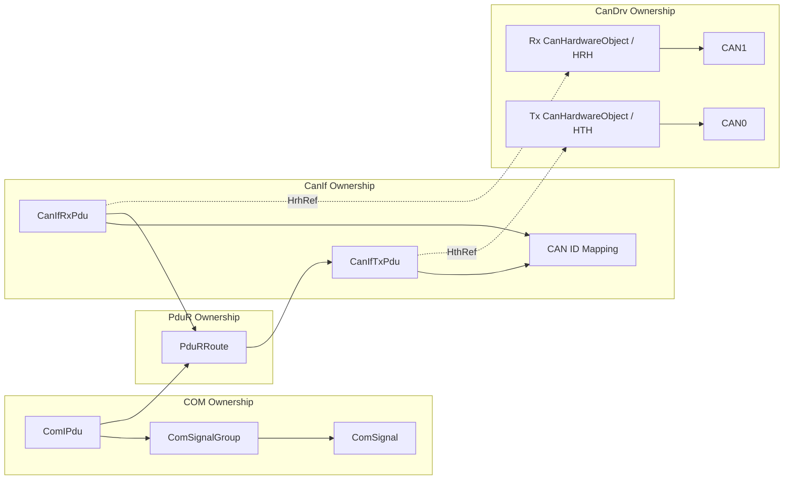
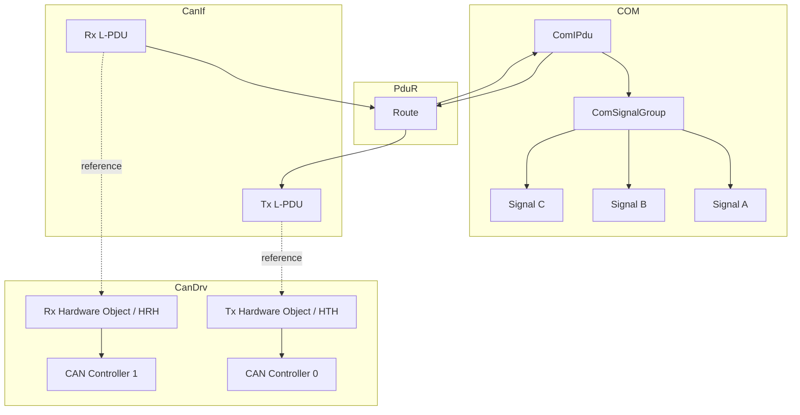
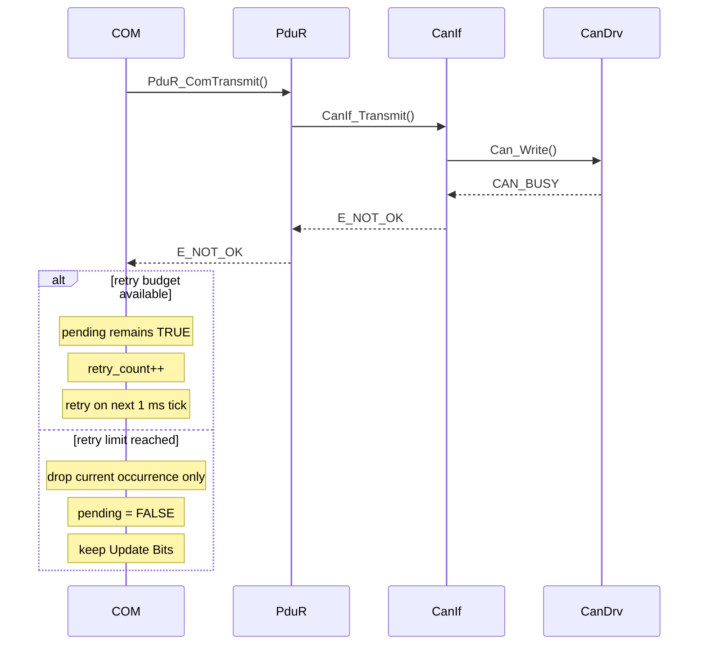
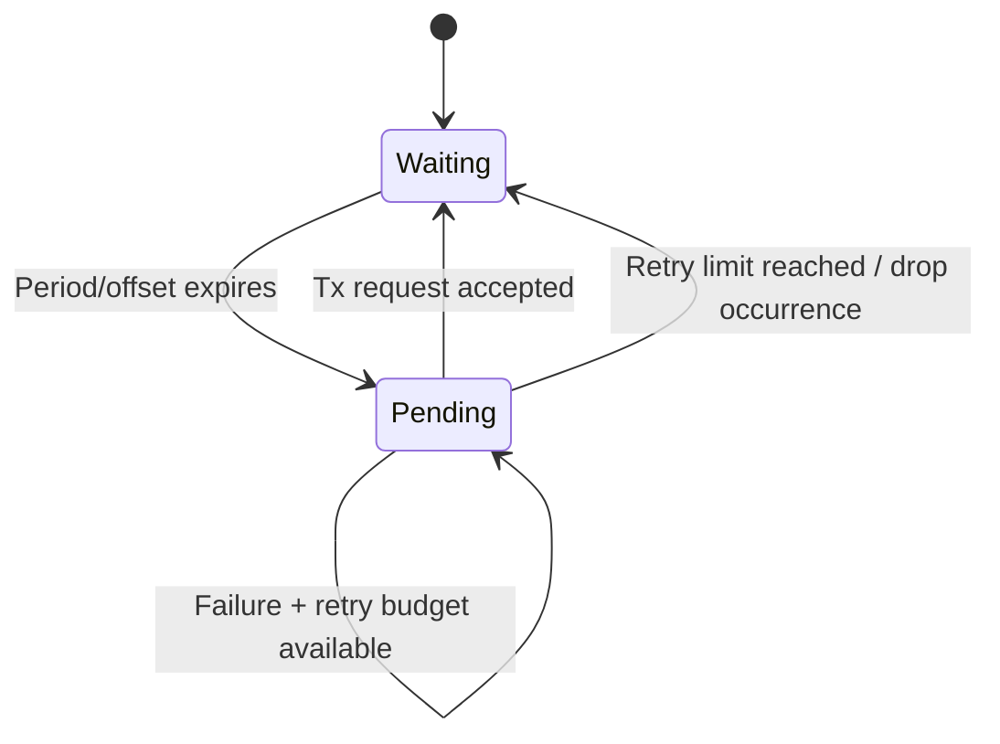
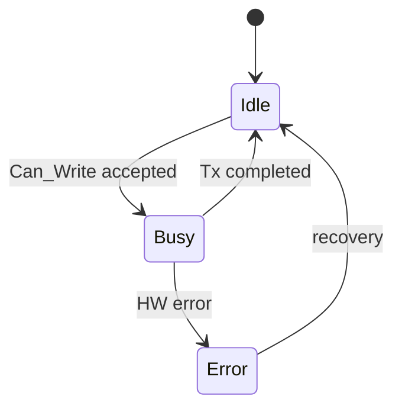
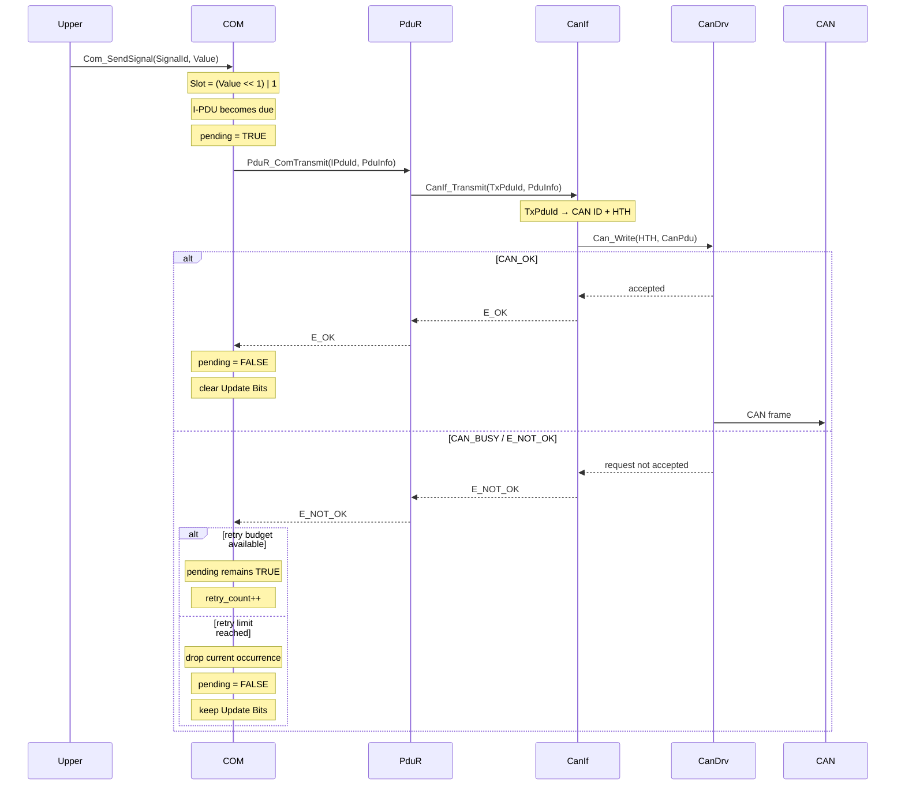
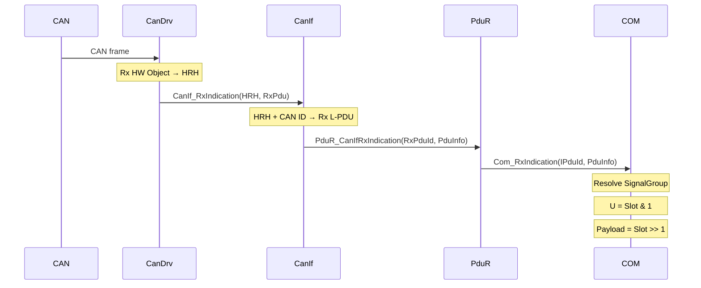
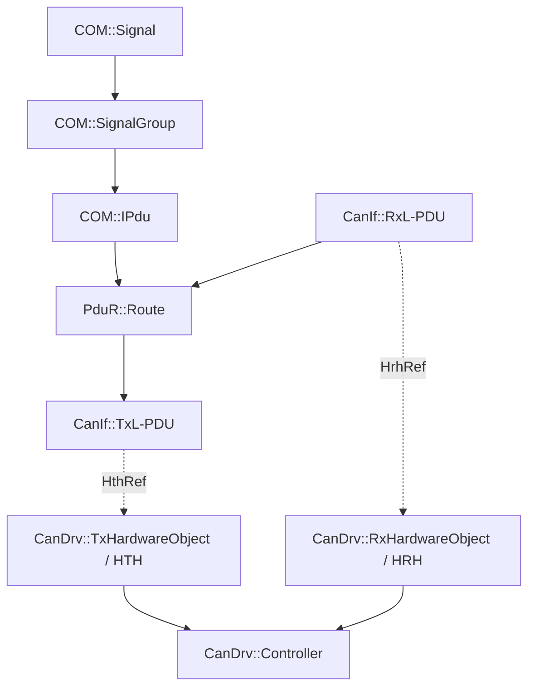

# Assignment Part 1 – AUTOSAR-like COM Signal Communication Model

## 1. Objective

Build a simplified AUTOSAR Classic-style communication model for **signal-oriented communication over CAN**.

Part 1 focuses on:

```text
Signal
   ↓
Signal Group
   ↓
I-PDU
   ↓
PduR Route
   ↓
CanIf L-PDU
   ↓
CAN ID + HOH
   ↓
CAN Driver
   ↓
CAN Controller
```

Students shall understand:

- how a Signal is encoded;
- how Update Bit is integrated into each Signal Slot;
- how Signals are organized into a Signal Group;
- why I-PDU is the scheduling/transmission unit;
- which module owns each configuration object;
- how PduR routes logical PDUs;
- how `GlobalPduId` provides a system-wide identity for tracing and routing;
- how Direct CAN Binding can make `GlobalPduId` implicit on the CAN wire;
- how CanIf maps logical CAN L-PDUs to CAN ID and HTH/HRH;
- how CanDrv owns HTH/HRH and CAN Controller mapping;
- how Rx identifies an Rx L-PDU using `HRH + CAN ID`;
- how Tx and Rx dynamic behavior differ.

CanTp and large-message communication are out of scope for Part 1.

---

## 2. Training Constraints

```text
N Signals
    ↓
1 Signal Group
    ↓
1 I-PDU
```

Mandatory rules:

1. One Signal belongs to exactly one Signal Group.
2. One Signal Group belongs to exactly one I-PDU.
3. One I-PDU contains exactly one Signal Group.
4. Each Signal is represented by one **Signal Slot**.
5. Bit 0 of each Signal Slot is the Update Bit.
6. The remaining bits contain Signal payload.
7. Signal Slot start position shall be byte aligned.
8. Signal Slot length shall be a multiple of 8 bits.
9. Tx I-PDUs use periodic transmission.
10. Baseline CAN mapping uses `1 logical L-PDU ↔ 1 CAN ID`.
11. One CanDrv instance may manage multiple CAN Controllers.
12. HTH and HRH share one common handle namespace and are unique within one CanDrv instance.
13. Tx I-PDUs are processed in static configuration order.
14. No priority or fairness scheduling is required in Part 1.
15. Every logical I-PDU shall have one system-wide unique `GlobalPduId`.
16. Part 1 mandatory CAN implementation uses **Direct CAN Binding**:

```text
1 GlobalPduId ↔ 1 CanIf L-PDU ↔ 1 CAN ID
```

17. In Direct CAN Binding, `GlobalPduId` is **implicit on the CAN wire** and shall not consume payload bytes.
18. Multiplexed Global PDU Binding, where several Global PDU IDs share one CAN channel and `GlobalPduId` is encoded on wire, is an architecture extension and is not mandatory to implement in Part 1.
19. Every Tx I-PDU shall define a bounded `max_retries`.
20. When all retries are exhausted, only the **current transmission occurrence** shall be dropped; the I-PDU remains active for future nominal periods.

These are training constraints, not general AUTOSAR Classic constraints.

---

## 3. Core Concepts

### 3.1 Signal

```text
Signal = UPDATE UNIT
```

Each Signal is encoded in a byte-aligned Signal Slot:

```text
bit N-1                          bit 1 bit 0
┌────────────────────────────────────┬───┐
│          Signal Payload            │ U │
└────────────────────────────────────┴───┘
```

Encoding:

```text
EncodedSignal = (Payload << 1) | UpdateBit
```

Decoding:

```text
UpdateBit = EncodedSignal & 1
Payload   = EncodedSignal >> 1
```

### 3.2 Signal Group

```text
Signal Group = GROUPING / PACKING UNIT
```

### 3.3 I-PDU

```text
I-PDU = SCHEDULING / TRANSMISSION UNIT
```

Timing belongs to the I-PDU, not to individual Signals.

### 3.4 L-PDU

A CanIf L-PDU is a logical CAN communication object.

Tx:

```text
Tx L-PDU → CAN ID + HTH
```

Rx:

```text
HRH + CAN ID → Rx L-PDU
```

An L-PDU is not a newly allocated payload buffer.

### 3.5 Global PDU ID

`GlobalPduId` is the canonical system-level identity of one logical PDU.

```text
GlobalPduId
=
SYSTEM-WIDE LOGICAL MESSAGE IDENTITY
```

It is different from module-local handles such as:

```text
ComIPduId
PduR local PduId
CanIfTxPduId
CanIfRxPduId
HTH / HRH
```

Local handles do not need to have the same numeric value as `GlobalPduId`.

For mandatory Direct CAN Binding:

```text
GlobalPduId
    ↓ configuration mapping
CanIf L-PDU
    ↓
CAN ID
```

The CAN ID identifies the message on the CAN wire, so `GlobalPduId` does not need to be serialized into the CAN payload.

---

## 4. Configuration Ownership

| Object | Owner |
|---|---|
| `ComSignal` | COM |
| `ComSignalGroup` | COM |
| `ComIPdu` | COM |
| `PduRRoute` | PduR |
| `GlobalPduId` | System communication model |
| `CanIfTxPdu` | CanIf |
| `CanIfRxPdu` | CanIf |
| CAN ID mapping | CanIf |
| `CanController` | CanDrv |
| `CanHardwareObject` | CanDrv |
| HTH | CanDrv |
| HRH | CanDrv |

A module may reference an object owned by another module, but it does not own that object.

```text
CanIfTxPdu
    │ HthRef
    ▼
CanDrv.CanHardwareObject
```

---

## 5. Ownership View



---

## 6. Building Block View



---

## 7. Signal Slot Model

```text
MSB                                      LSB
┌───────────────────────────────────────────┐
│             Payload               │ U     │
└───────────────────────────────────────────┘
                                          bit0
```

Mandatory rules:

```text
SlotStartBit % 8 == 0
SlotLength % 8 == 0
PayloadBitLength = SlotLength - 1
```

| Slot Length | Payload Capacity | Update Bit |
|---:|---:|---:|
| 8 bit | 7 bit | 1 bit |
| 16 bit | 15 bit | 1 bit |
| 24 bit | 23 bit | 1 bit |
| 32 bit | 31 bit | 1 bit |

---

## 8. Signal Configuration

```yaml
signals:
  - name: VehicleSpeed
    id: 0
    data_type: uint16
    slot_start_bit: 0
    slot_length: 16

  - name: Gear
    id: 1
    data_type: uint8
    slot_start_bit: 16
    slot_length: 8

  - name: AliveCounter
    id: 2
    data_type: uint8
    slot_start_bit: 24
    slot_length: 8
```

Derived values:

```text
UpdateBitOffset = 0
PayloadLength   = SlotLength - 1
```

---

## 9. Signal Group Model

```yaml
signal_groups:
  - name: VehicleStatusGroup
    id: 0
    signals:
      - VehicleSpeed
      - Gear
      - AliveCounter
```

Relationship:

```text
Signal → Signal Group → I-PDU
```

A Signal does not need a direct `IPduRef`.

---

## 10. I-PDU Model

```yaml
ipdus:
  - name: VehicleStatusPdu
    id: 0
    global_pdu_id: 0x0010
    direction: tx
    length: 8
    signal_group: VehicleStatusGroup
    period_ms: 10
    initial_offset_ms: 1
    max_retries: 3
```

An I-PDU shall contain at least:

```text
PduId
GlobalPduId
Direction
Length
SignalGroupRef
TransmissionPeriod
InitialOffset
MaxRetries
RuntimeBuffer
```

`PduId` is a module-local handle. `GlobalPduId` is the system-wide identity used for cross-layer correlation and tracing.

---

## 11. COM Tx Runtime State

Each Tx I-PDU shall have:

```c
typedef struct
{
    uint16 counter;
    boolean pending;
    uint8 retry_count;
} Com_TxIpduRuntimeType;
```

```text
counter     = time until next nominal transmission occurrence
pending     = this I-PDU shall be transmitted as soon as possible
retry_count = number of retries already consumed after the initial failed attempt
```

`max_retries` is configuration, not runtime state.

The initial attempt is not counted as a retry.

```text
max_retries = 3
→ 1 initial attempt + 3 retries
→ maximum 4 total attempts for one pending occurrence
```

---

## 12. COM Main Function Timing

Part 1 uses:

```text
Com_MainFunctionTx() period = 1 ms
```

Every Tx I-PDU period and initial offset shall be an integer multiple of this base tick.

Example:

| I-PDU | Period | Initial Offset |
|---|---:|---:|
| VehicleStatus | 10 ms | 1 ms |
| EngineStatus | 20 ms | 5 ms |
| ClimateStatus | 50 ms | 12 ms |
| DiagnosticStatus | 100 ms | 25 ms |

`initial_offset_ms` is used to statically distribute I-PDU transmission times.

---

## 13. I-PDU Scheduling Model

Runtime/configuration values:

```text
periodTicks
initialOffsetTicks
counter
pending
retryCount
maxRetries
```

Initialization:

```text
counter = initialOffsetTicks
pending = FALSE
retryCount = 0
```

On each `Com_MainFunctionTx()` call:

1. Decrement `counter` if greater than zero.
2. If `counter` reaches zero:
   - if the I-PDU is not already pending, set `pending = TRUE` and reset `retry_count = 0`;
   - reload `counter = periodTicks` regardless of retry state.
3. If the I-PDU is pending, attempt transmission exactly once.
4. On `E_OK`: clear `pending`, reset `retry_count`, and clear Update Bits.
5. On failure with retry budget left: increment `retry_count` and keep `pending = TRUE`.
6. On failure after all retries are consumed: drop only the current occurrence, clear `pending`, reset `retry_count`, and keep Update Bits set.
7. Continue processing the next I-PDU regardless of the result.

Conceptual implementation:

```c
void Com_MainFunctionTx(void)
{
    for (PduIdType id = 0; id < COM_NUM_TX_IPDU; id++)
    {
        if (Runtime[id].counter > 0U)
        {
            Runtime[id].counter--;
        }

        if (Runtime[id].counter == 0U)
        {
            if (Runtime[id].pending == FALSE)
            {
                Runtime[id].pending = TRUE;
                Runtime[id].retry_count = 0U;
            }

            Runtime[id].counter = Config[id].periodTicks;
        }

        if (Runtime[id].pending == TRUE)
        {
            if (Com_TransmitIPdu(id) == E_OK)
            {
                Runtime[id].pending = FALSE;
                Runtime[id].retry_count = 0U;
                Com_ClearUpdateBits(id);
            }
            else if (Runtime[id].retry_count < Config[id].maxRetries)
            {
                Runtime[id].retry_count++;
            }
            else
            {
                Runtime[id].pending = FALSE;
                Runtime[id].retry_count = 0U;
                Com_ReportTxDrop(id);
                /* Update Bits remain set. */
            }
        }
    }
}
```

---

## 14. COM Dynamic Behavior Requirements

### COM-DYN-01 — Base Tick

`Com_MainFunctionTx()` shall execute every 1 ms.

### COM-DYN-02 — Period and Offset

Each Tx I-PDU shall define:

```text
period_ms
initial_offset_ms
```

Both shall be integer multiples of the COM MainFunction period.

### COM-DYN-03 — Become Pending

When an I-PDU reaches its nominal transmission occurrence:

```text
pending = TRUE
```

### COM-DYN-04 — Early Retry

A pending I-PDU shall be retried at the **next `Com_MainFunctionTx()` invocation**, not at the next I-PDU period.

```text
t = 10 ms → due → CAN_BUSY
t = 11 ms → retry
t = 12 ms → retry if still busy
```

### COM-DYN-05 — Non-blocking Retry

A failed transmission attempt shall not block processing of other I-PDUs.

Forbidden:

```c
while (Can_Write(...) == CAN_BUSY)
{
}
```

Required behavior:

```text
PDU0 → BUSY → remains pending
PDU1 → still processed
PDU2 → still processed
```

### COM-DYN-06 — Static Processing Order

I-PDUs shall be processed in static configuration order.

No priority, round-robin, or fairness scheduler is required.

### COM-DYN-07 — Latest Value Wins

Multiple missed periodic occurrences shall not create multiple queued transmissions.

If an I-PDU is already pending, another period expiration keeps:

```text
pending = TRUE
```

The COM buffer continues to accept new Signal values. The latest buffer state is transmitted when the request is accepted.

### COM-DYN-08 — No Schedule Drift

A `CAN_BUSY` condition shall not shift the nominal periodic schedule.

```text
Period = 10 ms
Nominal occurrences = 10, 20, 30, 40, ...
```

If the first request is accepted at 12 ms, the next nominal occurrence remains 20 ms, not 22 ms.

### COM-DYN-09 — Bounded Retry

Each Tx I-PDU shall define `max_retries`.

The initial transmission attempt is not counted as a retry.

```text
max_retries = 3
→ 1 initial attempt + 3 retries
→ maximum 4 total attempts
```

### COM-DYN-10 — Drop Current Occurrence

If the initial attempt and all configured retries fail, the current transmission occurrence shall be dropped.

```text
pending = FALSE
retry_count = 0
```

The I-PDU remains enabled and returns to normal periodic scheduling at the next nominal occurrence.

> Drop one transmission occurrence, not the I-PDU.

### COM-DYN-11 — Preserve Latest Data After Drop

Dropping an occurrence shall not clear Signal Update Bits.

The COM buffer remains valid and may continue to receive newer Signal values. At the next nominal occurrence, the latest current COM buffer shall be used.

---

## 15. `Com_SendSignal()` Behavior

```text
SignalId
   ↓
SignalConfig
   ↓
SignalGroup
   ↓
I-PDU
   ↓
check value range
   ↓
EncodedSignal = (Value << 1) | 1
   ↓
write Signal Slot
```

`Com_SendSignal()` shall not directly trigger CAN transmission.

---

## 16. Update Bit Clear Policy

Part 1 uses:

> Clear Update Bits after the lower communication stack accepts the transmission request.

If:

```text
PduR_ComTransmit() == E_OK
```

COM shall clear bit 0 of all Signal Slots belonging to the I-PDU.

Payload data shall remain unchanged.

If the lower layer returns `E_NOT_OK`, Update Bits remain set.

If the current occurrence is dropped after exhausting `max_retries`, Update Bits also remain set. A dropped occurrence is not a successful transmission.

---

## 17. PduR Model

```yaml
pdur_routes:
  - name: VehicleStatusRoute
    global_pdu_id: 0x0010

    source:
      module: COM
      pdu_ref: VehicleStatusPdu

    destination:
      module: CANIF
      pdu_ref: VehicleStatusTx
```

For mandatory **Direct CAN Binding**, PduR routes using local PDU handles:

```text
Source local PDU handle
        ↓
PduR route
        ↓
Destination local PDU handle
```

`GlobalPduId` provides one canonical system identity for configuration correlation, logging, debug, and trace. It does not have to be passed unchanged through every runtime API.

Direct CAN Binding uses:

```text
GlobalPduId ↔ CanIf L-PDU ↔ CAN ID
```

Because this mapping is one-to-one, PduR does not need to inspect payload data to identify the message.

PduR shall not understand Signal, Signal Slot, Update Bit, HTH, HRH, or Controller information.

### Optional Multiplexed Global PDU Extension

A later/advanced extension may allow several Global PDU IDs to share one CAN channel:

```text
GlobalPduId A ─┐
GlobalPduId B ─┼─→ Generic CanIf L-PDU → one CAN ID
GlobalPduId C ─┘
```

In this mode, `GlobalPduId` becomes explicit on wire.

The Global-PDU mapping/demultiplexing behavior is considered an **internal PduR responsibility**, not a separate AUTOSAR-like module.

```text
Rx:
Generic CanIf Rx L-PDU
        ↓
PduR Global PDU Demux
        ↓ extract GlobalPduId
GlobalPduId → local route handle
        ↓
COM
```

```text
Tx:
COM / local route
        ↓
PduR Global PDU Mapping
        ↓ add GlobalPduId
Generic CanIf Tx L-PDU
```

This multiplexed mode is not mandatory to implement in Part 1.

---

## 18. CanIf Tx L-PDU Model

```yaml
canif_tx_pdus:
  - name: VehicleStatusTx
    id: 0
    can_id: 0x321
    hth_ref: HthCan1Tx
```

CanIf resolves:

```text
TxPduId → CAN ID + HTH
```

For Direct CAN Binding, generated/system configuration also provides:

```text
GlobalPduId ↔ TxPduId ↔ CAN ID
```

This allows the same logical identity to appear in cross-layer trace/debug information without adding `GlobalPduId` bytes to the CAN payload.

CanIf does not own the HTH.

---

## 19. CanDrv Tx Hardware Object Model

```yaml
can_hw_objects:
  - name: HthCan1Tx
    object_id: 2
    type: transmit
    controller_ref: CAN1
```

```text
HTH 2 → Tx CanHardwareObject → CAN1
```

When CanIf calls:

```c
Can_Write(HTH_2, &CanPdu);
```

CanDrv resolves the corresponding Controller and physical Tx resource.

---

## 20. Multiple Controller Model

```text
CanDrv
│
├── CAN0
│   ├── HTH 0
│   └── HRH 1
│
└── CAN1
    ├── HTH 2
    └── HRH 3
```

Since HOH IDs are unique within the CanDrv instance:

```text
HTH / HRH → CanHardwareObject → Controller
```

is uniquely resolvable.

---

## 21. Training Rx Interface

Part 1 uses:

```c
void CanIf_RxIndication(
    Can_HwHandleType Hrh,
    const Can_RxPduType *RxPdu
);
```

Example:

```c
typedef struct
{
    Can_IdType      CanId;
    PduLengthType   Length;
    uint8           *DataPtr;
} Can_RxPduType;
```

Meaning:

```text
Hrh                = which Rx Hardware Object?
RxPdu.CanId        = which CAN identifier?
DataPtr + Length   = what payload?
```

---

## 22. CanDrv Rx Hardware Object Model

```yaml
can_hw_objects:
  - name: HrhCan0Basic
    object_id: 1
    type: receive
    controller_ref: CAN0

  - name: HrhCan1Basic
    object_id: 3
    type: receive
    controller_ref: CAN1
```

Therefore:

```text
HRH 1 → CAN0
HRH 3 → CAN1
```

No separate `ControllerId` parameter is required in the training API.

---

## 23. BasicCAN Rx Identification

```text
HRH 3 / CAN1
│
├── CAN ID 0x100 → RxPduA
├── CAN ID 0x200 → RxPduB
└── CAN ID 0x321 → VehicleStatusRx
```

CanIf lookup:

```text
HRH + CAN ID → Rx L-PDU
```

---

## 24. CanIf Rx L-PDU Model

```yaml
canif_rx_pdus:
  - name: VehicleStatusRx
    id: 0
    can_id: 0x321
    hrh_ref: HrhCan1Basic
```

CanIf owns the CAN-specific Rx mapping:

```text
HRH + CAN ID → Rx L-PDU
```

For Direct CAN Binding:

```text
HRH + CAN ID
      ↓
CanIf Rx L-PDU
      ↓ configuration mapping
GlobalPduId
```

Therefore `GlobalPduId` is recoverable for trace/debug even though it is not serialized on the CAN wire.

CanDrv owns the referenced HRH and Controller relationship.

---

## 25. `CAN_BUSY` Behavior

If:

```text
Can_Write() == CAN_BUSY
```

then CanIf returns `E_NOT_OK` and PduR propagates the failure upward.

COM shall:

```text
keep Update Bits
keep pending = TRUE
retry at next Com_MainFunctionTx()
continue processing other I-PDUs
```

Each failed attempt consumes retry budget according to `max_retries`.

If the retry budget is exhausted:

```text
drop current transmission occurrence
pending = FALSE
retry_count = 0
keep Update Bits
wait for the next nominal period
```

The I-PDU itself is not disabled.



---

## 26. CAN Driver Main Function

If the training CAN Driver uses polling for Tx completion:

```text
Can_MainFunction_Write()
```

shall detect completed Tx requests.

```text
Can_Write()
   ↓
request accepted
   ↓
hardware transmitting
   ↓
Can_MainFunction_Write()
   ↓
Tx complete detected
   ↓
CanIf_TxConfirmation()
```

Important:

```text
Can_Write() accepted ≠ physical Tx completed
TxConfirmation      ≠ remote acknowledgement
```

---

## 27. Recommended 1 ms Main Loop Order

For a polling-based CAN Driver:

```text
1 ms scheduler tick
   │
   ├── Can_MainFunction_Write()
   ├── Can_MainFunction_Read()    // if Rx polling is used
   └── Com_MainFunctionTx()
```

This allows completed CAN Tx resources to be released before COM retries pending I-PDUs.

---

## 28. Tx Dynamic State



`Pending` means:

> This I-PDU shall be transmitted as soon as possible.

There is no persistent `Dropped` state. A drop is an event: the current occurrence is abandoned and the I-PDU returns to `Waiting`.

No queued occurrences are created.

---

## 29. CAN Hardware Tx State



COM scheduling state and CAN hardware state are independent.

---

## 30. Complete Tx Runtime View



---

## 31. Complete Rx Runtime View



---

## 32. Tx vs Rx Mapping

```text
TX = logical → hardware
RX = hardware/network → logical
```

Tx:

```text
Tx L-PDU → CAN ID + HTH → CanDrv → Controller
```

Rx:

```text
Controller/HW → HRH + CAN ID → CanIf → Rx L-PDU
```

---

## 33. HOH Namespace Rule

`CanObjectId` / HOH shall be unique within one CanDrv instance.

HTH and HRH share the same ID range.

Valid:

```text
CAN0
├── HTH 0
└── HRH 1

CAN1
├── HTH 2
└── HRH 3
```

This allows:

```text
HOH → unique CanHardwareObject → unique Controller
```

---

## 34. Static Model View



Dotted arrows represent cross-module references, not ownership.

---

## 35. Runtime Object vs Configuration Object

### Configuration Objects

```text
ComSignal
ComSignalGroup
ComIPdu
PduRRoute
CanIfTxPdu
CanIfRxPdu
CanHardwareObject
CanController
```

### Runtime Objects / Parameters

```text
PduInfoType
Can_PduType
Can_RxPduType
TxPduId
RxPduId
HTH
HRH
Com_TxIpduRuntimeType
```

---

## 36. Model Validation Requirements

### COM

- `SlotStartBit % 8 == 0`
- `SlotLength % 8 == 0`
- `SlotLength >= 8`
- Signal Slots shall not overlap.
- Signal Slots shall remain within I-PDU length.
- Signal value shall fit within `SlotLength - 1` payload bits.

### Signal Group

- A Signal Group shall not be empty.
- One Signal shall belong to only one Signal Group.
- One Signal Group shall belong to only one I-PDU.

### I-PDU

- An I-PDU shall contain exactly one Signal Group.
- Every I-PDU shall have one `GlobalPduId`.
- `GlobalPduId` shall be unique within the complete system communication model.
- Tx I-PDU period shall be valid.
- `period_ms` shall be a multiple of the COM MainFunction period.
- `initial_offset_ms` shall be a multiple of the COM MainFunction period.
- `max_retries` shall be a non-negative integer supported by the runtime counter type.

### PduR

- Source PDU shall exist.
- Destination PDU shall exist.
- Each route shall be traceable to exactly one `GlobalPduId`.
- In mandatory Direct CAN Binding, one `GlobalPduId` shall resolve to exactly one CanIf L-PDU/CAN ID mapping.

### CanIf Tx

- CAN ID shall be valid.
- `HthRef` shall exist.
- Referenced Hardware Object shall be Tx type.

### CanIf Rx

- CAN ID shall be valid.
- `HrhRef` shall exist.
- Referenced Hardware Object shall be Rx type.
- `HRH + CAN ID` shall uniquely identify one Rx L-PDU.

### CanDrv

- `CanObjectId` shall be unique in one CanDrv instance.
- HTH and HRH shall share one common ID range.
- Every Hardware Object shall reference exactly one Controller.
- HOH shall uniquely resolve a Hardware Object and Controller.

---

## 37. Training Model vs AUTOSAR Classic

| Topic | Part 1 Training Model | AUTOSAR Classic |
|---|---|---|
| Signal hierarchy | Signal → Signal Group → I-PDU | More general |
| I-PDU contents | Exactly 1 Signal Group | Not restricted this way |
| Signal representation | Byte-aligned Signal Slot | Flexible bit-level mapping |
| Update Bit | bit0 of Signal Slot | Configurable |
| Slot Start | Byte aligned | Flexible |
| Slot Length | Multiple of 8 | Flexible |
| Tx Mode | PERIODIC only | Multiple Tx modes |
| I-PDU scheduling | Period + InitialOffset | Richer configuration |
| Global logical identity | Mandatory system-wide `GlobalPduId` for model/trace | AUTOSAR uses configured PDU identities/handles; no identical training rule is required |
| Direct CAN optimization | `GlobalPduId ↔ L-PDU ↔ CAN ID`; Global ID implicit on wire | CAN configuration can identify PDUs without a generic global-ID payload header |
| Multiplexed Global PDU mode | Optional architecture extension; PduR may add/strip GlobalPduId | Not the Part 1 AUTOSAR baseline |
| Retry | next COM MainFunction tick | More complete stack behavior possible |
| Retry limit | bounded by `max_retries`; current occurrence may be dropped | Depends on configured modules/features |
| Missed periods | coalesced | Depends on configured behavior |
| Scheduler order | static config order | Not limited to this training policy |
| CanIf Tx mapping | CAN ID + HTH ref | More general configuration |
| CanHardwareObject owner | CanDrv | CanDrv |
| Controller owner | CanDrv | CanDrv |
| Multiple Controllers | Supported | Supported |
| Tx Controller selection | HTH → Controller | Same core concept |
| Training Rx API | `RxIndication(HRH, RxPdu)` | `Can_HwType + PduInfoType` |
| Rx Controller identity | derived from unique HRH | explicit ControllerId available |
| Rx CAN ID | `RxPdu.CanId` | `Can_HwType.CanId` |
| BasicCAN lookup | `HRH + CAN ID → L-PDU` | Same core concept |
| CanIf Tx buffering | Not supported | May be supported |
| CanTp | Out of scope | Supported |
| Deadline monitoring | Out of scope | Supported |

---

## 38. Required Deliverables

1. Signal model.
2. Signal Slot model.
3. Signal Group model.
4. I-PDU model including `GlobalPduId`.
5. Direct CAN Binding map: `GlobalPduId ↔ CanIf L-PDU ↔ CAN ID`.
6. I-PDU period, initial offset, and `max_retries` configuration.
7. COM Tx runtime state model including `retry_count`.
8. PduR route model.
9. CanIf Tx L-PDU model.
10. CanIf Rx L-PDU model.
11. CanDrv Hardware Object model.
12. Multiple Controller model.
13. Configuration Ownership View.
14. Building Block View.
15. Tx Dynamic Behavior View.
16. Rx Runtime View.
17. `CAN_BUSY` bounded retry and drop behavior.
18. End-to-End Tx/Rx Trace View using `GlobalPduId`.
19. Validation report.

---

## 39. Acceptance Criteria

Students shall be able to explain:

```text
Who owns ComSignal?
Who owns ComIPdu?
Who owns CanIfTxPdu?
Who owns CAN ID mapping?
Who owns HTH/HRH?
Who owns CanController?
Why does CanIf reference HTH but not own it?
How does HTH identify the Tx Controller?
How does HRH identify the Rx Controller?
Why is ControllerId not required in the training API?
Why does HRH + CAN ID identify an Rx L-PDU?
Why does Com_SendSignal() not directly transmit?
Why is I-PDU the scheduling unit?
What is the difference between GlobalPduId and module-local PduId handles?
Why can GlobalPduId be implicit on the CAN wire in Direct CAN Binding?
How can HRH + CAN ID be mapped back to GlobalPduId for tracing?
Why is retry performed at the next MainFunction tick?
Why must retry be non-blocking?
Why is retry bounded by max_retries?
What exactly is dropped when the retry limit is reached?
Why are Update Bits preserved when an occurrence is dropped?
Why do missed occurrences not create a queue?
Why does CAN_BUSY not shift the nominal periodic schedule?
```

Tx shall resolve:

```text
Signal
 ↓
Signal Group
 ↓
I-PDU
 ↓
PduR
 ↓
CanIf Tx L-PDU
 ↓
CAN ID + HTH
 ↓
CanDrv Hardware Object
 ↓
Controller
```

Rx shall resolve:

```text
Controller
 ↓
Rx Hardware Object / HRH
 ↓
HRH + CAN ID
 ↓
CanIf Rx L-PDU
 ↓
PduR
 ↓
I-PDU
 ↓
Signal Group
 ↓
Signal
```

---

## 40. Architecture Summary

```text
                STATIC OWNERSHIP

COM
├── Signal
├── SignalGroup
└── I-PDU
       │
       ▼
PduR
└── Route
       │
       ▼
CanIf
├── Tx L-PDU ────────┐
├── Rx L-PDU ───────┐│
└── CAN ID Mapping  ││
                     ││ refs
                     ▼▼
CanDrv
├── HTH / Tx HW Object
├── HRH / Rx HW Object
└── Controllers
```

Dynamic Tx:

```text
Com_SendSignal()
      ↓
update current COM buffer
      ↓
I-PDU nominal time reached
      ↓
pending = TRUE
      ↓
try once per Com_MainFunctionTx()
      │
      ├── E_OK
      │     ↓
      │   pending = FALSE
      │   clear Update Bits
      │
      └── BUSY / E_NOT_OK
            ↓
          keep pending
          retry next 1 ms tick
```

Global identity policy:

```text
GlobalPduId
=
CANONICAL SYSTEM-WIDE PDU IDENTITY
```

```text
Mandatory Direct CAN Binding
=
GlobalPduId ↔ CanIf L-PDU ↔ CAN ID
```

```text
GlobalPduId is implicit on the CAN wire in Direct Binding
but remains available through configuration for trace/debug.
```

Core dynamic policy:

```text
EARLY RETRY
+
NON-BLOCKING
+
BOUNDED RETRY
+
DROP CURRENT OCCURRENCE AFTER RETRY LIMIT
+
LATEST VALUE WINS
+
NO SCHEDULE DRIFT
```
